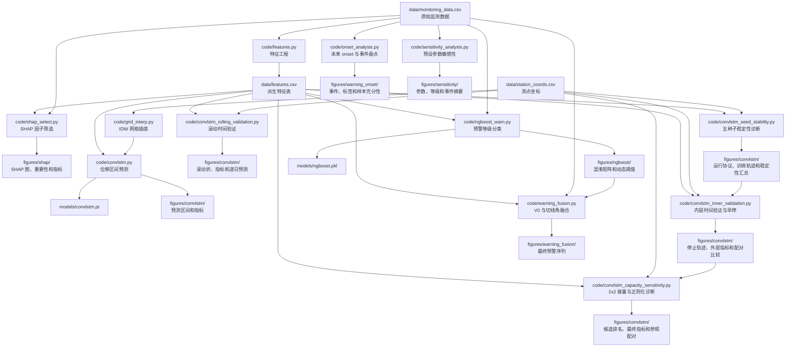

# Landslide-Warning

基于机器学习与多指标融合的滑坡位移预测及预警研究项目。当前代码以三峡库区藕塘滑坡日尺度监测数据为输入，完成特征工程、SHAP 模型贡献分析、ConvLSTM 位移区间预测、NGBoost 当日状态分类和 V0/切线角融合。

> 说明：本 README 只描述当前实现。研究终点、验证规则和证据边界见 `framework.md`，代码模块边界见 `design.md`。当前 NGBoost 预测动态 V0 当日状态；未来 1/3/7 日 onset 标签已实现，但仅有 3 个可预测事件，尚未开展正式模型调参与性能评价。

Framework 指标覆盖、当前模型结果和改进优先级见 `docs/framework_status.md`；外部科研工具的适配判断、风险和采用状态见 `docs/research_tools.md`。

## 目录结构

```text
.
├── main.py                         # 完整管线入口，支持阶段选择、跳过和 dry-run
├── pyproject.toml                  # Python 3.10 + 依赖声明
├── uv.lock                         # uv 锁定文件
├── design.md                       # 当前代码架构、模块边界和运行顺序
├── framework.md                    # 研究终点、验证和报告协议
├── code/
│   ├── features.py                 # 管线第 1 段:特征工程
│   ├── tangent_angle.py            # 等速阶段估计、改进切线角和持续性判级
│   ├── warning_thresholds.py       # 测点动态 V0 阈值和四级判级
│   ├── warning_events.py           # 未来 onset 标签与事件级评价工具
│   ├── onset_analysis.py           # 管线第 2 段:1/3/7 日标签和事件盘点
│   ├── shap_select.py              # 管线第 3 段:SHAP 候选指标解释
│   ├── grid_interp.py              # 测点坐标读取 + IDW 网格插值
│   ├── block_bootstrap.py           # 连续日期块重采样与百分位区间
│   ├── convlstm.py                 # 管线第 4 段:ConvLSTM 位移区间预测
│   ├── convlstm_rolling_validation.py # 管线第 5 段:ConvLSTM 滚动时间验证
│   ├── convlstm_seed_stability.py  # 管线第 6 段:固定协议多种子诊断
│   ├── convlstm_inner_validation.py # 管线第 7 段:内层时间验证与早停
│   ├── convlstm_capacity_sensitivity.py # 管线第 8 段:有限容量/正则化诊断
│   ├── ngboost_warn.py             # 管线第 9 段:NGBoost 预警分类
│   ├── warning_fusion.py           # 管线第 10 段:V0 主判 + 切线角复核
│   ├── sensitivity_analysis.py     # 管线第 11 段:预设参数稳健性分析
│   └── tangent_stage_review.py     # 管线第 12 段:等速阶段专家复核
├── config/
│   └── tangent_reference_stages.csv # 人工等速阶段配置接口 (当前均为候选状态)
├── data/
│   ├── monitoring_data.csv         # 原始日尺度监测数据
│   ├── monitoring_data.xlsx        # 原始数据 Excel 版本
│   ├── station_coords.csv          # 8 个位移测点平面坐标
│   └── features.csv                # features.py 生成的派生特征表
├── models/
│   ├── convlstm.pt                 # ConvLSTM 模型权重
│   └── ngboost.pkl                 # NGBoost 分类模型
└── figures/
    ├── README.md                   # 逐文件用途、性质和保留规则
    ├── convlstm/
    │   ├── forecast_interval.png   # 位移预测区间图
    │   ├── forecast_metrics.csv    # 各测点预测指标
    │   ├── forecast_period_metrics.csv # 连续测试时段指标
    │   ├── forecast_calibration_metrics.csv # 校准前后审计表
    │   ├── forecast_bootstrap_ci.csv # 配对日期块 95% 置信区间
    │   ├── rolling_validation_folds.csv # 滚动折边界和参数
    │   ├── rolling_validation_metrics.csv # 逐折和逐测点指标
    │   ├── rolling_validation_predictions.csv # 逐日滚动预测
    │   ├── seed_stability_runs.csv # 五种子运行协议和参数审计
    │   ├── seed_stability_metrics.csv # 逐种子、折和测点指标
    │   ├── seed_stability_summary.csv # 跨种子汇总与方向一致性
    │   ├── seed_stability_training.csv # 每轮损失和梯度诊断
    │   ├── inner_validation_runs.csv # 内层验证边界、停止原因和所选轮数
    │   ├── inner_validation_selection_history.csv # 内层逐轮训练/验证轨迹
    │   ├── inner_validation_refit_history.csv # 完整拟合期重训轨迹
    │   ├── inner_validation_metrics.csv # 早停版本逐种子外层指标
    │   ├── inner_validation_summary.csv # 早停版本跨种子汇总
    │   ├── inner_validation_predictions.csv # 早停版本逐日预测
    │   ├── inner_validation_comparison.csv # 与固定 120 轮的配对比较
    │   ├── capacity_candidates.csv # 2x2 候选逐种子选择结果
    │   ├── capacity_selection_summary.csv # 仅按内层 loss 的候选排名
    │   ├── capacity_selection_history.csv # 全候选逐轮轨迹
    │   ├── capacity_selected_runs.csv # 每折所选配置最终运行协议
    │   ├── capacity_selected_refit_history.csv # 所选配置重训轨迹
    │   ├── capacity_selected_metrics.csv # 所选配置外层指标
    │   ├── capacity_selected_summary.csv # 所选配置跨种子汇总
    │   ├── capacity_selected_predictions.csv # 所选配置逐日预测
    │   └── capacity_selected_comparison.csv # 与当前早停参照配对
    ├── shap/
    │   ├── shap_reg_summary.png    # NGBoost 回归 SHAP 因子贡献图
    │   ├── shap_cls_summary.png    # NGBoost 预警分类 SHAP 因子贡献图
    │   ├── shap_reg_importance.csv # 回归 mean absolute SHAP 排序
    │   ├── shap_cls_importance.csv # 分类 mean absolute SHAP 排序
    │   ├── shap_model_metrics.csv  # SHAP 阶段 NGBoost 验证指标
    │   └── shap_binary_cv_metrics.csv # 二分类扩展窗口评价
    ├── tangent_angle/
    │   ├── uniform_rates.csv       # 训练期等速候选段与参考速率
    │   └── review/
    │       ├── MJ9_stage_review.png
    │       ├── MJ1_stage_review.png
    │       ├── MJ3_stage_review.png
    │       └── candidate_stage_comparison.csv  # 15/30/60 日候选阶段对比
    ├── warning_onset/
    │   ├── onset_events.csv        # 连续黄色及以上事件清单
    │   ├── onset_targets.csv       # 1/3/7 日 at-risk 未来标签
    │   └── onset_inventory.csv     # 正负日期与可预测事件数量
    ├── ngboost/
    │   ├── confusion_matrix.png    # 预警分类混淆矩阵
    │   ├── warning_metrics.csv     # 四级预警指标与各级支持数
    │   └── warning_probabilities.csv # 测试段逐日等级概率
    ├── thresholds/
    │   └── v0_thresholds.csv       # 三个阶段共享的 8 测点动态 V0
    ├── sensitivity/
    │   ├── v0_sensitivity.csv      # 9 组 V0 参数的等级与事件摘要
    │   ├── v0_parameters.csv       # 各组合的测点 V0 参数
    │   ├── tangent_sensitivity.csv # 27 组切线角参数的融合摘要
    │   └── tangent_parameters.csv  # 不同候选窗口的等速段参数
    └── warning_fusion/
        └── warning_fusion.csv      # 最终等级、融合原因和 NGBoost 旁证
```

## 数据结构

### 原始数据

`data/monitoring_data.csv`

- 行数:1461 行。
- 时间范围:2016-07-01 到 2020-06-30。
- 频率:日尺度。
- 核心列:
  - `Date`:日期。
  - `MJ9/mm`, `MJ1/mm`, `MJ3/mm`, `ATU1/mm` 到 `ATU5/mm`:8 个累计位移测点。
  - `Rainfall/mm`:降雨量。
  - `RWL/m`:库水位。
  - `GWT/m`, `aveT/℃`, `minT/℃`, `maxT/℃`, `DP`, `RH`:其他环境因子。

### 测点坐标

`data/station_coords.csv`

- `station`:测点名。
- `disp_col`:与 `data/features.csv` 中位移列对应的列名。
- `x_m`, `y_m`:平面坐标,单位 m。
- `elev_m`:高程,单位 m。

`code/convlstm.py` 会调用 `code/grid_interp.py` 读取坐标,并按 `DISP_COLS` 顺序对齐位移列和测点坐标。

### 派生特征

`data/features.csv`

- 行数:1432 行。
- 由 `code/features.py` 生成。
- 每个位移测点生成:
  - `*_disp`:累计位移。
  - `*_v`:位移速率。
  - `*_a`:位移加速度。
  - `*_alpha_raw`, `*_alpha_smooth`:原始/因果平滑改进切线角。
  - `*_alpha_raw_level`:按许强等（2009）原始角和严格边界得到的阶段等级。
  - `*_alpha_daily_level`, `*_alpha_level`:按平滑角得到的逐日等级和 5 日持续性工程等级。
  - `*_alpha`:与 `*_alpha_smooth` 相同的兼容列。
- 候选环境指标:
  - `RWL`:库水位。
  - `RWL_rate`:库水位变化速率。
  - `Rain`:当日降雨。
  - `Rain_cum7`, `Rain_cum15`, `Rain_cum30`:7/15/30 日累计降雨。

## 模块职责

| 文件 | 输入 | 输出 | 主要职责 |
| --- | --- | --- | --- |
| `code/features.py` | `data/monitoring_data.csv` | `data/features.csv`, `figures/tangent_angle/uniform_rates.csv` | 计算位移速率、加速度、可审计改进切线角、库水位速率和多窗口累计降雨 |
| `code/warning_thresholds.py` | 原始累计位移 | 动态 V0 阈值和逐日四级标签 | 使用训练期 30 天月速率、90% 分位加速月剔除和 `V0 = 1.5 V_bar + 2 sigma` 计算测点独立阈值 |
| `code/warning_events.py` | 日期和逐日等级 | 内存中的事件与未来标签 | 提取连续预警事件，生成 at-risk 未来 onset 标签并评价固定阈值报警 |
| `code/onset_analysis.py` | `data/monitoring_data.csv` | `figures/warning_onset/*`, `figures/thresholds/v0_thresholds.csv` | 使用当前固定 V0 输出回顾性的 1/3/7 日标签、事件清单和可评价样本盘点 |
| `code/shap_select.py` | `data/monitoring_data.csv` | `figures/shap/*`, `figures/thresholds/v0_thresholds.csv` | 构造 5 天滞后样本，用 NGBoost 回归/分类并通过 SHAP 解释模型对位移增量和动态 V0 当日状态的依赖 |
| `code/grid_interp.py` | `data/station_coords.csv` | 内存中的 `H x W` 网格 | 读取 8 个测点坐标,构建规则网格,提供 IDW 插值函数 |
| `code/block_bootstrap.py` | 日期数、块长和随机数生成器 | 连续日期索引、百分位区间 | 实现非循环重叠 moving-block bootstrap 基础操作 |
| `code/convlstm.py` | `data/features.csv`, `data/station_coords.csv` | `models/convlstm.pt`, `figures/convlstm/*` | 将 8 测点位移插值为 `4 x 7` 网格，训练 ConvLSTM 输出 P10/P50/P90 位移预测区间并估计条件性时间块置信区间 |
| `code/convlstm_rolling_validation.py` | `data/features.csv`, `data/station_coords.csv` | `figures/convlstm/rolling_validation_*.csv` | 保持模型结构不变，以三个非重叠 287 日测试折执行扩展窗口验证并保存逐日预测 |
| `code/convlstm_seed_stability.py` | `data/features.csv`, `data/station_coords.csv` | `figures/convlstm/seed_stability_*.csv` | 固定全部模型与时间协议，运行预设种子 0-4，保存训练轨迹、逐种子指标和汇总，不选择最佳种子 |
| `code/convlstm_inner_validation.py` | 特征、坐标、固定 120 轮指标 | `figures/convlstm/inner_validation_*.csv` | 在每折拟合期内部按时间选择训练轮数，再重训、校准并与固定轮数逐项配对；不选择最佳种子 |
| `code/convlstm_capacity_sensitivity.py` | 特征、坐标、当前早停运行与指标 | `figures/convlstm/capacity_*.csv` | 比较预注册的 2x2 隐藏通道/权重衰减矩阵，仅按折内五种子验证 loss 选配置，再执行最终重训与参照配对 |
| `code/ngboost_warn.py` | `data/features.csv`, `data/monitoring_data.csv` | `models/ngboost.pkl`, `figures/ngboost/*`, `figures/thresholds/v0_thresholds.csv` | 按 8 测点动态 V0 标签训练 NGBoost 输出预警等级概率 |
| `code/warning_fusion.py` | 特征表、原始位移、NGBoost 概率 | `figures/warning_fusion/warning_fusion.csv` | V0 主判，切线角只升级不降级，NGBoost 概率仅作旁证 |
| `code/sensitivity_analysis.py` | 原始累计位移 | `figures/sensitivity/*` | 按 `framework.md` 的预设组合评价 V0 与切线角规则稳健性，不在留出结果上选优 |
| `code/tangent_stage_review.py` | 原始累计位移 | `figures/tangent_angle/review/*` | 为 MJ9/MJ1/MJ3 生成候选阶段复核图，并审计参数、切线角等级及融合影响，不自动推荐阶段 |

## 执行流程



推荐按下面顺序运行:

1. `features.py` 先从原始数据生成统一特征表。
2. `onset_analysis.py` 生成 1/3/7 日未来标签并核对独立事件数量。
3. `shap_select.py` 基于原始监测表构造 5 天滞后样本，用 NGBoost + SHAP 分析位移增量和动态 V0 当日状态的模型贡献。
4. `convlstm.py` 基于特征表中的 8 测点位移和测点坐标,训练位移区间预测模型。
5. `convlstm_rolling_validation.py` 保持同一模型结构，在三个连续且互不重叠的 287 日测试折上执行扩展窗口验证。
6. `convlstm_seed_stability.py` 在同一三折协议下运行种子 0-4，诊断初始化、训练轨迹和时序响应，不选取最佳种子。
7. `convlstm_inner_validation.py` 在每折拟合期内部按时间选择 epoch，用完整拟合期重训后再校准和评价，并与固定 120 轮结果配对。
8. `convlstm_capacity_sensitivity.py` 比较预注册的隐藏通道 `8/16` 与权重衰减 `0/1e-4`，每折仅按内层验证 loss 选择配置。
9. `ngboost_warn.py` 基于 8 测点独立动态 V0 阈值生成四级标签,训练概率分类模型。
10. `warning_fusion.py` 保留 V0 主判结果，用关键测点持续切线角进行升级复核。
11. `sensitivity_analysis.py` 独立重算预设 V0/切线角组合，用于稳健性审计，不改写默认参数。
12. `tangent_stage_review.py` 为关键测点生成等速阶段复核图，供专家独立确定等速阶段，不得根据预警结果反向选择。

## 运行方式

项目使用 `uv` 管理依赖,Python 版本为 3.10。

首次准备环境:

```bash
uv sync
```

运行完整管线:

```bash
uv run python main.py
```

查看阶段、检查命令或只运行部分阶段:

```bash
uv run python main.py --list
uv run python main.py --dry-run
uv run python main.py --stage features --stage onset
uv run python main.py --skip shap --skip convlstm --skip convlstm-rolling --skip convlstm-seeds --skip convlstm-inner-validation --skip convlstm-capacity
```

`--stage` 只执行明确选中的阶段，并按标准流程顺序去重；它不会自动补跑上游阶段，因此单独运行模型或融合阶段前应确认所需中间文件已存在。各 `code/*.py` 仍可独立执行，便于调试和核对中间结果。任一阶段失败时，管线立即停止并返回该脚本的错误码。

实际执行会把提交哈希、执行源码 SHA-256 指纹、Python 版本、各阶段状态、退出码和耗时写入 `figures/pipeline/latest_run.json`。失败时也会保留已完成阶段和失败点；`--dry-run` 不写清单。使用 `--manifest <path>` 可指定其他清单路径。

每个阶段还声明必需输入和预期输出。管线会在执行前拒绝缺失输入，并在脚本退出后检查所有预期产物是否确实新建或更新；仅返回退出码 0 但没有更新产物仍视为失败。通过检查的产物大小和 SHA-256 会写入运行清单。

运行测试：

```bash
uv run --with pytest pytest -q
```

如果已经使用仓库内 `.venv`,也可以直接运行:

```bash
.venv/bin/python main.py
```

## 各阶段关键逻辑

### 1. 特征工程

`code/features.py` 的配置集中在文件顶部:

- `DATA_CSV`:原始数据路径。
- `OUT_CSV`:派生特征输出路径。
- `DISP_COLS`:8 个累计位移列。
- `RWL_COL`, `RAIN_COL`:库水位与降雨列。
- `RAIN_WINDOWS`:累计降雨窗口,当前为 7/15/30 天。

处理步骤:

1. 读取原始监测数据,按 `Date` 排序。
2. 仅使用前 80% 训练期为每个测点自动选择 30 日等速候选段。
3. 计算原始/因果平滑切线角、逐日等级和 5 日 3 次命中的持续等级。
4. 计算库水位速率和多窗口累计降雨。
5. 删除差分和滑窗造成的头部不完整行。
6. 输出特征表和 `figures/tangent_angle/uniform_rates.csv` 审计参数。

### 2. SHAP 候选指标解释

`code/shap_select.py` 参考论文中的 5 天滑动窗口,对 8 个测点构造位移和环境因子的滞后样本。模型按 `framework.md` 使用 NGBoost。

回归目标为每日位移增量。分类目标为测点 30 天月速率是否达到自身动态 `V0`，即黄色及以上预警状态。

候选指标包括 5 天历史位移、位移速率、位移加速度、日降雨、7/15/30 日累计降雨、库水位、库水位变化率、地下水位、地下水位变化率、气温、露点、相对湿度和测点 one-hot 标识。

处理步骤:

1. 从 `data/monitoring_data.csv` 读取原始监测数据。
2. 用训练期前 80% 数据计算各测点 `V0 = 1.5 V_bar + 2 sigma`，并生成 30 天月速率动态标签。
3. 训练 `NGBRegressor` 预测位移增量。
4. 训练 `NGBClassifier` 预测预警状态概率。
5. 使用模型无关 SHAP permutation explainer 计算模型贡献值；结果不用于因果推断。
6. 输出 SHAP 图、重要性、单次留出指标、5 折扩展窗口指标和公共 V0 审计表。
7. 在终端打印回归和分类的 mean absolute SHAP top10。

### 3. IDW 网格插值

`code/grid_interp.py` 为 ConvLSTM 提供空间输入:

1. `load_coords()` 读取 `data/station_coords.csv`。
2. `build_grid()` 按测点包围盒构建规则网格,当前大小为 `4 x 7`。
3. `make_interpolator()` 预计算 IDW 权重。
4. 插值函数将形状为 `(T, N)` 的测点位移序列转换为 `(T, H, W)` 的网格序列。

### 4. ConvLSTM 位移区间预测

`code/convlstm.py` 的核心目标是预测未来位移增量,再还原为绝对位移区间。

关键配置:

- `THESIS_WINDOWS = {"MJ1": 2, "MJ9": 7, "MJ3": 2}`:参考论文中的测点预测窗口。
- `LOOKBACK = 7`:当前 ConvLSTM 使用论文窗口中的最大值作为统一输入窗口。
- `HORIZON = 1`:预测未来 1 天。
- `TRAIN_FRAC = 0.8`:前 80% 时间序列作为训练段。
- `CAL_FRAC = 0.2`:从训练窗口末尾保留 20% 连续日期作独立校准，不随机打乱。
- `QUANTILES = [0.1, 0.5, 0.9]`:输出 P10/P50/P90 区间。
- `GRID_H = 4`, `GRID_W = 7`:来自 `grid_interp.py`。

处理步骤:

1. 读取 `data/features.csv` 中 8 个测点位移。
2. 读取测点坐标并构建 IDW 插值器。
3. 将原训练窗口按时间切为 911 个拟合窗口和 227 个校准窗口；标准化和增量尺度只使用拟合期。
4. 将测点位移插值为规则网格序列。
5. 构造滑动窗口,目标为未来位移增量。
6. 用 pinball loss 训练 ConvLSTM 分位数预测模型。
7. 在独立校准期按测点计算对称 split-conformal 扩张量，再应用到测试段 P10-P90 区间；P50 不变。
8. 保存模型到 `models/convlstm.pt`,保存图到 `figures/convlstm/forecast_interval.png`。
9. 将各测点校准前后指标保存到 `figures/convlstm/forecast_metrics.csv`。
10. 按日期连续切分三个测试块，将校准前后同组指标保存到 `figures/convlstm/forecast_period_metrics.csv`。
11. 将拟合/校准/测试边界、测点 `qhat` 及校准前后覆盖率、宽度和评分保存到 `figures/convlstm/forecast_calibration_metrics.csv`。
12. 以日期为单位执行非循环重叠 moving-block bootstrap，将 7/14/30 日块长下的 95% 置信区间保存到 `figures/convlstm/forecast_bootstrap_ci.csv`。
13. 打印总体误差、持久性基线、区间质量和分位数交叉统计。

R2 与 NSE 在当前平方误差定义下数值相同。累计位移具有强时间趋势，两者可能接近 1，因此只作补充指标；模型增量价值主要依据 MAE/RMSE 相对持久性基线的变化，区间质量同时依据 pinball loss、覆盖率、宽度和 interval score 判断。

当前校准是时间有序、按测点独立估计的探索性 split-conformal 校准。监测序列存在自相关和分布漂移，不满足经典 exchangeability 假设，因此 80% 是评价目标而不是有限样本覆盖保证；禁止根据测试集反向调整校准比例或 `qhat`。

时间块区间固定已拟合模型和 `qhat`，每次同步抽取同一连续日期上的 8 个测点，并在同一重采样内比较 ConvLSTM 与持久性基线、校准与原始区间。主分析块长为输入窗口两倍的 14 日，7 日和 30 日只作预设敏感性分析，均执行 1000 次重采样。该区间只量化当前测试样本在局部平稳假设下的条件性抽样不确定性，不包括训练、调参或未来分布漂移的不确定性。

`code/convlstm_rolling_validation.py` 另外执行三个扩展窗口折。每折测试长度固定为与现有留出段相同的 287 日，三个测试段互不重叠；训练历史逐折扩展，训练末 20% 独立用于测点级区间校准。第一至第三折的 RMSE 分别为 2.123/0.492/0.318 mm，持久性基线为 0.245/0.120/0.340 mm。模型只在第三折超过基线，因此当前不能声称具有稳定的跨时期增量价值。

`code/convlstm_seed_stability.py` 保持上述协议和全部超参数不变，对预设种子 0-4 分别重训。折 1/2 的 5 个种子均未超过持久性基线；折 3 的总体 RMSE 均略低于基线，但预测日增量标准差平均仅为实际值的 16.4%，相关系数均值为 -0.048。该结果支持“折 3 点误差较低”，不支持“模型稳定捕捉了加速和减速过程”。

`code/convlstm_inner_validation.py` 不改变模型结构和学习率。它将每折原拟合期前 80% 用作内层训练、后 20% 用作内层验证，以预注册的 pinball loss、300 轮上限、30 轮耐心和 0.1% 最小相对改进选择 epoch；随后用同一种子在完整拟合期重训，再使用原独立校准段和外层测试段。该阶段保留所有五个种子，并与固定 120 轮结果逐项配对，不把已查看的外层测试折重新定义为确认性证据。

早停相对固定 120 轮在三个外层折分别有 5/5、5/5、4/5 个种子的 RMSE 改善，但折 1/2 仍为 0/5 超过持久性基线。第三折覆盖率接近 80% 的同时区间宽度约翻倍、interval score 恶化。因此当前证据支持保留内层停止规则，不支持声称 ConvLSTM 已获得稳定的跨时期增量价值。

`code/convlstm_capacity_sensitivity.py` 进一步执行结果产生前锁定的 2x2 小型敏感性矩阵：隐藏通道 `8/16` 与 Adam `weight_decay=0/1e-4`。四个配置保留相同数据、折、种子、学习率、窗口和早停规则；每折只按五种子的最小内层验证 pinball loss 均值选择配置，外层测试不参与排名。

三个折分别选择 `h16_wd0`、`h08_wd0` 和 `h16_wd1e4`，但第一/二名内层差距均小于种子波动的 5%。最终只有折 3 同时达到多数种子的 RMSE/MAE 正 skill，折 1/2 仍为 0/5；折 2 的小模型在外层还弱于当前早停参照。该结果触发预注册停止扩搜规则，当前数据上不再继续增加 ConvLSTM 参数组合。

### 5. NGBoost 预警等级分类

`code/ngboost_warn.py` 对 8 个测点分别计算动态 V0，并按 30 天月速率判级:

| 等级 | 名称 | 条件 |
| --- | --- | --- |
| 0 | `green` | `V < V0` |
| 1 | `yellow` | `V0 <= V < 5V0` |
| 2 | `orange` | `5V0 <= V < 10V0` |
| 3 | `red` | `V >= 10V0` |

当天整体预警等级取 8 个测点中的最高等级。每个测点的 V0 只使用训练期数据计算。

来源边界：`V0 = 1.5 V_bar + 2 sigma` 及稳定月筛选是导师指定的本研究规则；Chen et al.（2024）采用 GPD/POT 和 VaR 确定一级阈值，并建议高等级阈值默认使用一级阈值的 5 倍和 10 倍。当前代码参考其速率分级与倍数设置，但不是对该文 VaR 方法的完整复现。参数审计表会记录两部分来源。

模型输入特征包括:

- 8 测点位移速率的均值和最大值。
- 8 测点加速度的均值和最大值。
- `RWL`, `RWL_rate`, `Rain_cum7`, `Rain_cum15`, `Rain_cum30`。

处理步骤:

1. 读取 `data/features.csv` 和 `data/monitoring_data.csv`。
2. 计算 8 测点独立动态 V0，并生成每日整体最高预警等级。
3. 构造运动学统计特征和候选环境指标特征。
4. 按时间顺序切分训练段和探索性留出段。
5. 训练 `NGBClassifier`。
6. 输出模型、混淆矩阵、公共 V0 审计表、完整四级指标和逐日等级概率。
7. 打印各等级样本数、测试集准确率和分类报告。

## 当前注意事项

- `README.md` 描述当前代码状态,不是论文最终方案。
- `main.py` 是统一编排入口；各模型、规则融合、onset 盘点和敏感性分析仍保留独立脚本，支持局部重跑。
- `data/features.csv`, `models/*`, `figures/*` 都是可再生成产物。
- `figures/README.md` 说明每个 PNG/CSV 的生成脚本、科研用途和保留原则。
- 如果更换数据集,优先修改各脚本顶部的 CONFIG 区,尤其是列名、数据路径和测点坐标。
- ConvLSTM 依赖 `data/station_coords.csv`;坐标列和 `DISP_COLS` 顺序必须对齐。
- 全样本含绿/黄/橙/红四级，但测试段仅含绿/黄，不得声称已验证橙/红召回能力。
- 现有后 20% 数据已参与多轮检查，结果属于探索性内部验证，不得称为完全独立的最终测试。
- 当前当日状态 NGBoost 未超过昨日状态持续性基线，后续应先完成未来 onset 任务和滚动时间验证，再重新调参。
- 当前只有 3 个具有有效前置窗口的独立 onset，代码已生成标签，但暂停正式滚动调参与性能宣称。
- 预设敏感性结果表明切线角融合主要受自动等速阶段窗口影响；专家复核 `v_eq` 前，不应将默认 30 日窗口写成已验证最优参数。
- `code/tangent_stage_review.py` 为三个关键测点生成复核图和 15/30/60 日候选阶段参数对比表，是供专家复核的辅助材料，不是文献原始方法。
- `config/tangent_reference_stages.csv` 是人工等速阶段配置接口；`features.py` 每次正式重建特征时读取该文件。当前所有条目均为 `status=candidate`，没有任何阶段被自动批准。
- 同一测点只能有一个 `approved` 阶段。配置表和直接传入的人工范围都必须完全位于训练期内、测点名有效且 `v_eq > 0`；违反任一条件将明确报错。
- `candidate_stage_comparison.csv` 同时记录参数来源、速率统计、切线角等级分布、相对 30 日配置一致率和融合影响，供审计而非选优。
- 最终等速阶段确定后，需更新该配置文件并将状态改为 `approved`，之后冻结 `v_eq` 再进行确认性切线角事件级评价。
