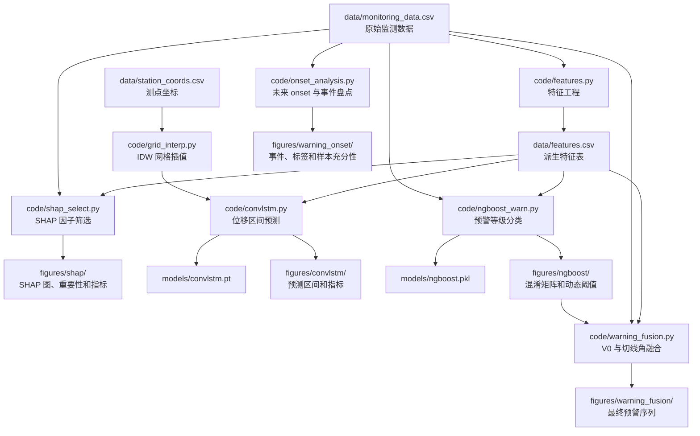

# Landslide-Warning

基于机器学习与多指标融合的滑坡位移预测及预警研究项目。当前代码以三峡库区藕塘滑坡日尺度监测数据为输入，完成特征工程、SHAP 模型贡献分析、ConvLSTM 位移区间预测、NGBoost 当日状态分类和 V0/切线角融合。

> 说明：本 README 只描述当前实现。研究终点、验证规则和证据边界见 `framework.md`，代码模块边界见 `design.md`。当前 NGBoost 预测动态 V0 当日状态；未来 1/3/7 日 onset 标签已实现，但仅有 3 个可预测事件，尚未开展正式模型调参与性能评价。

Framework 指标覆盖、当前模型结果和改进优先级见 `docs/framework_status.md`。

## 目录结构

```text
.
├── main.py                         # uv 初始化生成的模板入口,当前未编排业务管线
├── pyproject.toml                  # Python 3.10 + 依赖声明
├── uv.lock                         # uv 锁定文件
├── design.md                       # 当前代码架构、模块边界和运行顺序
├── framework.md                    # 研究终点、验证和报告协议
├── code/
│   ├── features.py                 # 管线第 1 段:特征工程
│   ├── tangent_angle.py            # 等速阶段估计、改进切线角和持续性判级
│   ├── warning_thresholds.py       # 测点动态 V0 阈值和四级判级
│   ├── warning_events.py           # 未来 onset 标签与事件级评价工具
│   ├── onset_analysis.py           # 1/3/7 日标签和事件充分性盘点
│   ├── shap_select.py              # 管线第 2 段:SHAP 候选指标解释
│   ├── grid_interp.py              # 测点坐标读取 + IDW 网格插值
│   ├── convlstm.py                 # 管线第 3 段:ConvLSTM 位移区间预测
│   ├── ngboost_warn.py             # 管线第 4 段:NGBoost 预警分类
│   └── warning_fusion.py           # 管线第 5 段:V0 主判 + 切线角复核
├── data/
│   ├── monitoring_data.csv         # 原始日尺度监测数据
│   ├── monitoring_data.xlsx        # 原始数据 Excel 版本
│   ├── station_coords.csv          # 8 个位移测点平面坐标
│   └── features.csv                # features.py 生成的派生特征表
├── models/
│   ├── convlstm.pt                 # ConvLSTM 模型权重
│   └── ngboost.pkl                 # NGBoost 分类模型
└── figures/
    ├── convlstm/
    │   ├── forecast_interval.png   # 位移预测区间图
    │   └── forecast_metrics.csv    # 各测点预测指标
    ├── shap/
    │   ├── shap_reg_summary.png    # NGBoost 回归 SHAP 因子贡献图
    │   ├── shap_cls_summary.png    # NGBoost 预警分类 SHAP 因子贡献图
    │   ├── shap_reg_importance.csv # 回归 mean absolute SHAP 排序
    │   ├── shap_cls_importance.csv # 分类 mean absolute SHAP 排序
    │   ├── shap_model_metrics.csv  # SHAP 阶段 NGBoost 验证指标
    │   ├── shap_binary_cv_metrics.csv # 二分类扩展窗口评价
    │   └── v0_thresholds.csv       # SHAP 阶段 8 测点动态 V0
    ├── tangent_angle/
    │   └── uniform_rates.csv       # 训练期等速候选段与参考速率
    ├── warning_onset/
    │   ├── onset_events.csv        # 连续黄色及以上事件清单
    │   ├── onset_targets.csv       # 1/3/7 日 at-risk 未来标签
    │   ├── onset_inventory.csv     # 正负日期与可预测事件数量
    │   └── v0_thresholds.csv       # 本次盘点使用的动态 V0
    ├── ngboost/
    │   ├── confusion_matrix.png    # 预警分类混淆矩阵
    │   ├── warning_metrics.csv     # 四级预警指标与各级支持数
    │   ├── warning_probabilities.csv # 测试段逐日等级概率
    │   └── v0_thresholds.csv       # 最终分类阶段 8 测点动态 V0
    └── warning_fusion/
        └── warning_fusion.csv      # 最终等级、融合原因和 NGBoost 旁证
```

## 数据结构

### 原始数据

`data/monitoring_data.csv`

- 行数:1461 行。
- 时间范围:2016-07-01 到 2020-06-30。
- 频率:日尺度。
- 核心列:
  - `Date`:日期。
  - `MJ9/mm`, `MJ1/mm`, `MJ3/mm`, `ATU1/mm` 到 `ATU5/mm`:8 个累计位移测点。
  - `Rainfall/mm`:降雨量。
  - `RWL/m`:库水位。
  - `GWT/m`, `aveT/℃`, `minT/℃`, `maxT/℃`, `DP`, `RH`:其他环境因子。

### 测点坐标

`data/station_coords.csv`

- `station`:测点名。
- `disp_col`:与 `data/features.csv` 中位移列对应的列名。
- `x_m`, `y_m`:平面坐标,单位 m。
- `elev_m`:高程,单位 m。

`code/convlstm.py` 会调用 `code/grid_interp.py` 读取坐标,并按 `DISP_COLS` 顺序对齐位移列和测点坐标。

### 派生特征

`data/features.csv`

- 行数:1432 行。
- 由 `code/features.py` 生成。
- 每个位移测点生成:
  - `*_disp`:累计位移。
  - `*_v`:位移速率。
  - `*_a`:位移加速度。
  - `*_alpha_raw`, `*_alpha_smooth`:原始/因果平滑改进切线角。
  - `*_alpha_daily_level`, `*_alpha_level`:逐日和 5 日持续性预警等级。
  - `*_alpha`:与 `*_alpha_smooth` 相同的兼容列。
- 候选环境指标:
  - `RWL`:库水位。
  - `RWL_rate`:库水位变化速率。
  - `Rain`:当日降雨。
  - `Rain_cum7`, `Rain_cum15`, `Rain_cum30`:7/15/30 日累计降雨。

## 模块职责

| 文件 | 输入 | 输出 | 主要职责 |
| --- | --- | --- | --- |
| `code/features.py` | `data/monitoring_data.csv` | `data/features.csv`, `figures/tangent_angle/uniform_rates.csv` | 计算位移速率、加速度、可审计改进切线角、库水位速率和多窗口累计降雨 |
| `code/warning_thresholds.py` | 原始累计位移 | 动态 V0 阈值和逐日四级标签 | 使用训练期 30 天月速率、90% 分位加速月剔除和 `V0 = 1.5 V_bar + 2 sigma` 计算测点独立阈值 |
| `code/warning_events.py` | 日期和逐日等级 | 内存中的事件与未来标签 | 提取连续预警事件，生成 at-risk 未来 onset 标签并评价固定阈值报警 |
| `code/onset_analysis.py` | `data/monitoring_data.csv` | `figures/warning_onset/*` | 使用当前固定 V0 输出回顾性的 1/3/7 日标签、事件清单和可评价样本盘点 |
| `code/shap_select.py` | `data/monitoring_data.csv` | `figures/shap/shap_reg_summary.png`, `figures/shap/shap_cls_summary.png` | 构造 5 天滞后样本，用 NGBoost 回归/分类并通过 SHAP 解释模型对位移增量和动态 V0 当日状态的依赖 |
| `code/grid_interp.py` | `data/station_coords.csv` | 内存中的 `H x W` 网格 | 读取 8 个测点坐标,构建规则网格,提供 IDW 插值函数 |
| `code/convlstm.py` | `data/features.csv`, `data/station_coords.csv` | `models/convlstm.pt`, `figures/convlstm/forecast_interval.png`, `figures/convlstm/forecast_metrics.csv` | 将 8 测点位移插值为 `4 x 7` 网格,训练 ConvLSTM 输出 P10/P50/P90 位移预测区间 |
| `code/ngboost_warn.py` | `data/features.csv`, `data/monitoring_data.csv` | `models/ngboost.pkl`, `figures/ngboost/*` | 按 8 测点动态 V0 标签训练 NGBoost 输出预警等级概率 |
| `code/warning_fusion.py` | 特征表、原始位移、NGBoost 概率 | `figures/warning_fusion/warning_fusion.csv` | V0 主判，切线角只升级不降级，NGBoost 概率仅作旁证 |

## 执行流程



推荐按下面顺序运行:

1. `features.py` 先从原始数据生成统一特征表。
2. `onset_analysis.py` 生成 1/3/7 日未来标签并核对独立事件数量。
3. `shap_select.py` 基于原始监测表构造 5 天滞后样本，用 NGBoost + SHAP 分析位移增量和动态 V0 当日状态的模型贡献。
4. `convlstm.py` 基于特征表中的 8 测点位移和测点坐标,训练位移区间预测模型。
5. `ngboost_warn.py` 基于 8 测点独立动态 V0 阈值生成四级标签,训练概率分类模型。
6. `warning_fusion.py` 保留 V0 主判结果，用关键测点持续切线角进行升级复核。

## 运行方式

项目使用 `uv` 管理依赖,Python 版本为 3.10。

首次准备环境:

```bash
uv sync
```

依次运行完整管线:

```bash
uv run python code/features.py
uv run python code/onset_analysis.py
uv run python code/shap_select.py
uv run python code/convlstm.py
uv run python code/ngboost_warn.py
uv run python code/warning_fusion.py
```

运行测试：

```bash
uv run --with pytest pytest -q
```

如果已经使用仓库内 `.venv`,也可以直接运行:

```bash
.venv/bin/python code/features.py
.venv/bin/python code/onset_analysis.py
.venv/bin/python code/shap_select.py
.venv/bin/python code/convlstm.py
.venv/bin/python code/ngboost_warn.py
.venv/bin/python code/warning_fusion.py
```

当前 `main.py` 只会打印模板文本,不会执行上述管线。

## 各阶段关键逻辑

### 1. 特征工程

`code/features.py` 的配置集中在文件顶部:

- `DATA_CSV`:原始数据路径。
- `OUT_CSV`:派生特征输出路径。
- `DISP_COLS`:8 个累计位移列。
- `RWL_COL`, `RAIN_COL`:库水位与降雨列。
- `RAIN_WINDOWS`:累计降雨窗口,当前为 7/15/30 天。

处理步骤:

1. 读取原始监测数据,按 `Date` 排序。
2. 仅使用前 80% 训练期为每个测点自动选择 30 日等速候选段。
3. 计算原始/因果平滑切线角、逐日等级和 5 日 3 次命中的持续等级。
4. 计算库水位速率和多窗口累计降雨。
5. 删除差分和滑窗造成的头部不完整行。
6. 输出特征表和 `figures/tangent_angle/uniform_rates.csv` 审计参数。

### 2. SHAP 候选指标解释

`code/shap_select.py` 参考论文中的 5 天滑动窗口,对 8 个测点构造位移和环境因子的滞后样本。模型按 `framework.md` 使用 NGBoost。

回归目标为每日位移增量。分类目标为测点 30 天月速率是否达到自身动态 `V0`，即黄色及以上预警状态。

候选指标包括 5 天历史位移、位移速率、位移加速度、日降雨、7/15/30 日累计降雨、库水位、库水位变化率、地下水位、地下水位变化率、气温、露点、相对湿度和测点 one-hot 标识。

处理步骤:

1. 从 `data/monitoring_data.csv` 读取原始监测数据。
2. 用训练期前 80% 数据计算各测点 `V0 = 1.5 V_bar + 2 sigma`，并生成 30 天月速率动态标签。
3. 训练 `NGBRegressor` 预测位移增量。
4. 训练 `NGBClassifier` 预测预警状态概率。
5. 使用模型无关 SHAP permutation explainer 计算模型贡献值；结果不用于因果推断。
6. 输出 SHAP 图、重要性、单次留出指标、5 折扩展窗口指标和 V0 阈值。
7. 在终端打印回归和分类的 mean absolute SHAP top10。

### 3. IDW 网格插值

`code/grid_interp.py` 为 ConvLSTM 提供空间输入:

1. `load_coords()` 读取 `data/station_coords.csv`。
2. `build_grid()` 按测点包围盒构建规则网格,当前大小为 `4 x 7`。
3. `make_interpolator()` 预计算 IDW 权重。
4. 插值函数将形状为 `(T, N)` 的测点位移序列转换为 `(T, H, W)` 的网格序列。

### 4. ConvLSTM 位移区间预测

`code/convlstm.py` 的核心目标是预测未来位移增量,再还原为绝对位移区间。

关键配置:

- `THESIS_WINDOWS = {"MJ1": 2, "MJ9": 7, "MJ3": 2}`:参考论文中的测点预测窗口。
- `LOOKBACK = 7`:当前 ConvLSTM 使用论文窗口中的最大值作为统一输入窗口。
- `HORIZON = 1`:预测未来 1 天。
- `TRAIN_FRAC = 0.8`:前 80% 时间序列作为训练段。
- `QUANTILES = [0.1, 0.5, 0.9]`:输出 P10/P50/P90 区间。
- `GRID_H = 4`, `GRID_W = 7`:来自 `grid_interp.py`。

处理步骤:

1. 读取 `data/features.csv` 中 8 个测点位移。
2. 读取测点坐标并构建 IDW 插值器。
3. 只用训练段统计量做标准化,避免时序泄漏。
4. 将测点位移插值为规则网格序列。
5. 构造滑动窗口,目标为未来位移增量。
6. 用 pinball loss 训练 ConvLSTM 分位数预测模型。
7. 在测试段输出 P10/P50/P90 区间。
8. 保存模型到 `models/convlstm.pt`,保存图到 `figures/convlstm/forecast_interval.png`。
9. 保存各测点指标到 `figures/convlstm/forecast_metrics.csv`。
10. 打印 RMSE、MAE、persistence 基线、P10-P90 区间覆盖率和分位数交叉统计。

### 5. NGBoost 预警等级分类

`code/ngboost_warn.py` 对 8 个测点分别计算动态 V0，并按 30 天月速率判级:

| 等级 | 名称 | 条件 |
| --- | --- | --- |
| 0 | `green` | `V < V0` |
| 1 | `yellow` | `V0 <= V < 5V0` |
| 2 | `orange` | `5V0 <= V < 10V0` |
| 3 | `red` | `V >= 10V0` |

当天整体预警等级取 8 个测点中的最高等级。每个测点的 V0 只使用训练期数据计算。

模型输入特征包括:

- 8 测点位移速率的均值和最大值。
- 8 测点加速度的均值和最大值。
- `RWL`, `RWL_rate`, `Rain_cum7`, `Rain_cum15`, `Rain_cum30`。

处理步骤:

1. 读取 `data/features.csv` 和 `data/monitoring_data.csv`。
2. 计算 8 测点独立动态 V0，并生成每日整体最高预警等级。
3. 构造运动学统计特征和候选环境指标特征。
4. 按时间顺序切分训练段和探索性留出段。
5. 训练 `NGBClassifier`。
6. 输出模型、混淆矩阵、V0、完整四级指标和逐日等级概率。
7. 打印各等级样本数、测试集准确率和分类报告。

## 当前注意事项

- `README.md` 描述当前代码状态,不是论文最终方案。
- `main.py` 当前不是项目入口；当前有 5 个模型/融合阶段脚本和 1 个 onset 审计脚本。
- `data/features.csv`, `models/*`, `figures/*` 都是可再生成产物。
- 如果更换数据集,优先修改各脚本顶部的 CONFIG 区,尤其是列名、数据路径和测点坐标。
- ConvLSTM 依赖 `data/station_coords.csv`;坐标列和 `DISP_COLS` 顺序必须对齐。
- 全样本含绿/黄/橙/红四级，但测试段仅含绿/黄，不得声称已验证橙/红召回能力。
- 现有后 20% 数据已参与多轮检查，结果属于探索性内部验证，不得称为完全独立的最终测试。
- 当前当日状态 NGBoost 未超过昨日状态持续性基线，后续应先完成未来 onset 任务和滚动时间验证，再重新调参。
- 当前只有 3 个具有有效前置窗口的独立 onset，代码已生成标签，但暂停正式滚动调参与性能宣称。
