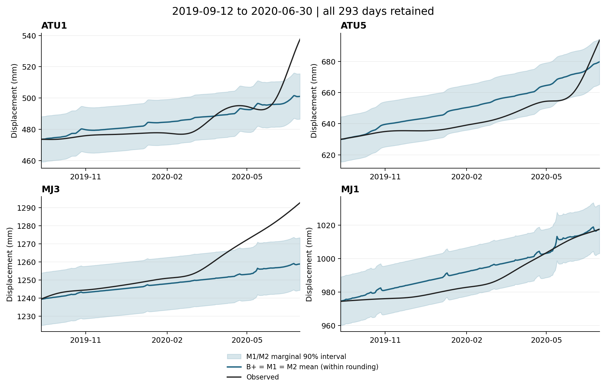
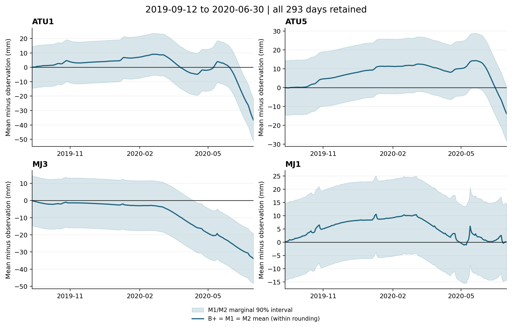

# 藕塘 293 日已有预测复核与当前方向

日期：2026-09-11。来源快照：`e48d3e1b08f596bd571475b9872735db65e33ac2`。
本报告是按用户要求完成的一次已有产物复核，使用 academic-research-suite 辅助结果解释；不是新实验版本。

**结论：冻结产物足以评价导师的 293 日任务；M1、M2 选中的均值和尺度均为 e0，
没有神经均值增益。导师允许末端局部偏差，不要求指定截点；当前报告无需等待尾段日期。**
本次保留完整窗口和逐日误差，未分段、拟合、训练、重新选模或运行力学积分。
原 v2.1 及四参数力探针继续暂缓。原早期窗口的负结果不改判，整体研究目标仍未完成。

## 1. 最新要求与补审的处理

导师原话由用户转述：“像尾部的这个地方是很难预测的，可以不管。”
用户在本次执行中进一步明确：

> 他的意思就是，如果尾段预测不准确就先不管，仅仅是圈出来，没有指明

据此，**尾段容忍是优化优先级的说明，不是一个待补齐的排除日期清单**。
当前不再反复请求截点，也不把它作为报告、讨论方法或其他独立准备的前置条件。
原图已定位为 PDF 第 13 页图 5 的 ATU1/MJ3；这只定位了圈出位置，不能推断其他点也适用同一日期。
本次全窗评分保留全部四点、全部 293 日；主体/尾段评分、尾段贡献和新数值验收门槛均未定义。
若未来确需把分段指标作为选模或主要判据，仍须先说明范围及依据，不能按模型胜负选日期。

用户提供的第二次 6pro 补审是咨询证据。本次采纳“先复核导师 1168/293 日任务”的优先级，
不将其中讨论过的探针、容差或训练预算自动变成执行指令。以下修订一并保留：

| 补审要点 | 本次处理及证据边界 |
| --- | --- |
| 两个早期 180 日窗与导师 293 日窗不同 | 不混排成绩，不用 2020 年尾段解释 2017–2018 年的失败 |
| `Day.backward` 只给 old/end 梯度 | 不据此宣称原 v2.1 张量残差对力断梯度；当前未作新的梯度实验 |
| 当前局部施力输入未必表达完整扰动历史 | 保留为 v2.1 的条件性结构问题，本次没有运行历史冲突反例或可辨识性验证 |
| 时间步长差异与独立求解器一致性是不同量 | 不据 PDF 的 0.282/0.142 mm 或低于 1e−10 mm 的不同检查任意修改神经近似容差 |
| 常数力偏差可与既有净应力储备重估等价 | 撤回其当前优先级；±25%、5%、80 次均不成为默认配置，本次没有执行该探针 |

原 [v2.2](ootang_tail_scope_and_direction.v2.2.md) 保留形成时记录，后续实施顺序以本报告和
[当前进度](progress.md) 为准。补审包未附完整数组，不等于仓库没有数组；本次在本地找到并核对了它们。

## 2. 来源、参数与日期对齐

以下路径均相对仓库根目录。ZIP 内根目录为
`section2d_v4/work/delivery_final/outang_repro/`，下表 ZIP 路径在该根目录内。

| 对象 | 冻结来源及使用方式 | 日期/参数 |
| --- | --- | --- |
| 观测 | `data/monitoring_data.csv`，与 ZIP `section2d_v4/results/curves.npz` 的 observed 核对 | 2016-07-01—2020-06-30，1461 日；点序 ATU1/ATU5/MJ3/MJ1 |
| 最终 B+ 参数 | ZIP `section2d_v4/results/calibrated.json`，由原 provenance 哈希核对；不重新估计 | 54 参数、64 子步；拟合 2016-07-01—2019-09-11，共 1168 日 |
| B+ 输出 | 原运行 `frozen_reference.npz` 的 mu，对照 ZIP `results/curves.npz` 的 predicted 和 `output/future_prediction.csv` | 连续预测，无分界日重置；2019-09-12—2020-06-30，共 293 日 |
| M1 ConvLSTM | 原运行 `final/M1/selected_predictions.npz` 和选模记录 | 三种子 0/1/2 等权；均值、尺度均 e0 |
| M2 方程内混合模型 | 原运行 `final/M2/selected_predictions.npz` 和选模记录 | 三种子 0/1/2 等权；均值、尺度均 e0，不改称经典 PINN |
| 选模依据 | 原运行 `selection.json`，final 标签未参与轮数选择 | 在 792 日拟合/376 日开发预测协议中选中 e0，不在 293 日上重选 |
| 评分 | 原运行 source_snapshot 下的纯概率评分模块；与原 `metrics_final.csv`、`predictions_final.csv` 比较 | 三组使用相同的 293 日、相同点序；不搬用早期 P0 |

“原运行”统一指 `results/ootang_bplus_v1_1/20260910_implementation/`。
原 `prefix_calibrated.json` 属于 792 日前缀，不是本次使用的最终 1168 日参数。
1168 日拟合范围与 v1.1 拟合评分排除首 30 日后的 **1138 个有效日**也须区分。
M1 的预热缺失仅出现在原排除范围，本次 293 日预测没有缺失值。

[来源表](../results/ootang_293day_audit/20260911/sources.csv)记录 13 份 Git 文件及 18 个 ZIP 成员的哈希；
[核验记录](../results/ootang_293day_audit/20260911/audit.json)记录日期、选模状态、数值差及评分脚本哈希。
完整日期掩码 SHA-256：`59a810e3912d7811629873ef32d42e8d0da1912706ec164cfd5659f86baf2071`。

## 3. 全窗均值与概率结果

三组的均值仅有不超过 2.28e−13 mm 的浮点差异，下表 RMSE、MAE 适用于三组。
概率列只属于 M1/M2 的已有分布；**M0 的 CRPS、覆盖率、宽度、区间评分全部不适用**。
下表不表示 B+ 原模型拥有概率区间。

| 测点 | RMSE / mm | MAE / mm | M1/M2 CRPS / mm | 90% 覆盖率 | 90% 宽度 / mm | 90% 区间评分 / mm |
| --- | ---: | ---: | ---: | ---: | ---: | ---: |
| ATU1 | 8.0682 | 5.4318 | 4.1599 | 93.86% | 29.0469 | 42.6575 |
| ATU5 | 9.1150 | 8.1080 | 5.3955 | 100.00% | 29.0469 | 29.0469 |
| MJ3 | 13.0163 | 8.7791 | 7.1005 | 72.70% | 29.0469 | 76.1455 |
| MJ1 | 6.2972 | 5.2879 | 3.7301 | 100.00% | 29.0469 | 29.0469 |
| 四点算术平均 | **9.1242** | **6.9017** | **5.0965** | **91.64%** | **29.0469** | **44.2242** |

把 293×4 个点日误差先合并再开平方的 **合并 RMSE 为 9.4506 mm**，不等于四点 RMSE 的平均 9.1242 mm。
这两个统计量分别输出，不用其中一个替代另一个。覆盖率等非 RMSE 指标在四点天数相同时，其四点平均等于点日平均。

| M1/M2 名义区间 | 四点平均覆盖率 | 平均宽度 / mm | 平均区间评分 / mm |
| --- | ---: | ---: | ---: |
| 80% | 83.45% | 22.6313 | 33.7967 |
| 90% | 91.64% | 29.0469 | 44.2242 |
| 95% | 92.92% | 34.6115 | 56.3831 |

三种子的均值相同，尺度均为 **8.8296369067 mm**，等于原拟合有效日合并 RMSE 的初始化值。
因此该混合分布退化为同一个固定尺度高斯分布；没有学到随日期或测点变化的尺度。
91.64% 的总体覆盖不代表每点都达到 90%，MJ3 的 72.70% 是完整保留的限制。
现有区间可以被评分，但没有本窗独立概率参照可证明“优于 M0”；不补造 M0 概率指标。

均值相同意味着在任何共同日期子集上也没有实质神经增益，不能靠截去末端重新宣布 e0 成功。
这是选中产物的结果，不是 ConvLSTM/PINN 整个家族无效的证据。

## 4. 四点完整曲线与逐日误差



蓝线为三组重合的均值，黑线为观测；蓝带只表示 M1/M2 的逐点逐日 90% 边际区间。
四个测点均保留到 2020-06-30，纵轴按各点数据独立设置，没有框选或删除困难时段。



误差定义为预测均值减观测；蓝带为原区间减去当天观测后的上下界，不是均值估计的置信区间。
曲线显示 ATU5/MJ1 在窗口中部也有持续高估，MJ3 后期低估逐渐扩大；这是已有预测的描述，
没有据此定义“尾段”、估计尾段贡献，或证明偏差能由某种物理修正学到。

[逐日表](../results/ootang_293day_audit/20260911/daily_predictions.csv)共有 3516 行，即三组×四点×293 日；
保留观测、均值、有符号/绝对/平方误差及已有分布的分位数、覆盖标记、宽度、区间评分和 CRPS。
M0 的概率字段为空。宽度、区间评分、CRPS 的单位为 mm，平方误差为 mm²，覆盖标记为 0/1。
[指标表](../results/ootang_293day_audit/20260911/metrics.csv)包含四点、四点平均及单列合并 RMSE，共 183 行。

## 5. 核验、限制与复现

**Verification status: VERIFIED，仅限冻结输出的重评分。** 没有重载神经权重、运行前向、
原生积分或重现历史训练，也没有验证 v2.1 的历史可辨识性。

- 当前输入与 `e48d3e1` 原字节相同，原运行 manifest 与 ZIP provenance 匹配。
  观测与原 curves 的差为 0，B+ 与原 curves 最大差约 6.82e−13 mm。
- 从保存数组重算全部三组指标及 M1/M2 分位数，与原 CSV 的指标最大差为 1.42e−14，
  均值/分位数最大差为 2.28e−13 mm。核验容差用于文件与浮点一致性，不是新效果门槛。
- 图表与逐日导出使用同一数组；检查 293 日×四点键完整、无重复，逐日平方误差可回算两种 RMSE。
  两张图已目视核对；生成文件哈希在 audit.json 内，audit.json 不自包含自己的哈希。
- 脚本 Ruff 检查通过。实施、图表导出和来源核验完成；研究效果未达目标，导师未作方法验收。

从仓库根目录执行，只核对而不写产物：

```bash
PYTHONDONTWRITEBYTECODE=1 .venv/bin/python scripts/audit_ootang_293day_predictions.py --check-only
```

如需重新导出，使用尚不存在的目录；命令拒绝覆盖已存在目录，固定输入无需重训：

```bash
PYTHONDONTWRITEBYTECODE=1 .venv/bin/python scripts/audit_ootang_293day_predictions.py --output tmp/ootang_293day_recheck
```

按 academic-research-suite 检查 11/11 项解释风险：

| 检查项 | 本次边界 |
| --- | --- |
| 辛普森悖论、生态谬误（2） | 同报逐点和平均；91.64% 不外推为四点分别达标，也不推广到整座滑坡 |
| Berkson 选择偏差、碰撞变量偏差（2） | 固定单案例/四点非随机样本；不据条件样本推断总体关联或因果 |
| 基率忽略（1） | 不做预警分类或灾害事件概率，覆盖率不是滑坡发生概率 |
| 回归均值（1） | 不按极端误差挑选子集，没有前后干预收益主张 |
| 幸存者偏差（1） | 全部原选中模型、三种子和完整日期保留；历史失败继续可查 |
| 多重寻找、分析分叉（2） | 不重选轮数、种子或日期；本窗已暴露，不宣称盲测或显著性 |
| 相关不等于因果、反向因果（2） | 曲线偏差不识别物理原因；模型输入依赖不是机制因果证据 |

原始日值 as-of 未知、当前 h 预处理、给定未来实测降雨/库水位、历史窗口反复暴露的限制保持。
区间是边际分布，不保证整条轨迹同时覆盖；三种子/四点/日期不是独立现场重复。

## 6. 当前停止点与后续方向

本次“现有产物能否支持目标评价”的问题已回答，报告完成即停止。原 [v2.0](ootang_convlstm_direct_results.v2.0.md)
和[历史路线](ootang_route_review_2026-09-11.md)继续按各自完整窗口保留负结果，不与本表作跨窗模型排名。

用户的最新澄清取消了“先获得尾段日期才能继续任何工作”的前置条件；
它没有指定新的数值通过标准，也没有令原零修正达标。后续主模型仍限定 ConvLSTM/PINN，保留 B+。
若后续另立 PINN 候选，应先明确主要变化过程的修正依据、随机状态如何表达施力历史、
神经近似误差的独立验收，以及均值/概率改善如何评价；不能直接恢复原 v2.1 或只放宽力学容差。
这属于后续候选需要回答的问题，本轮没有形成或启动一个新训练方案。

预算沿用原额度：[progress](progress.md)记录上轮只读复核 10 分钟及本轮整理、导出、核验和提交的扣减。
剩余时间不自动用于探针、诊断版本或训练。实现提交 `785a2b4`，产物提交 `963ecb2`。
