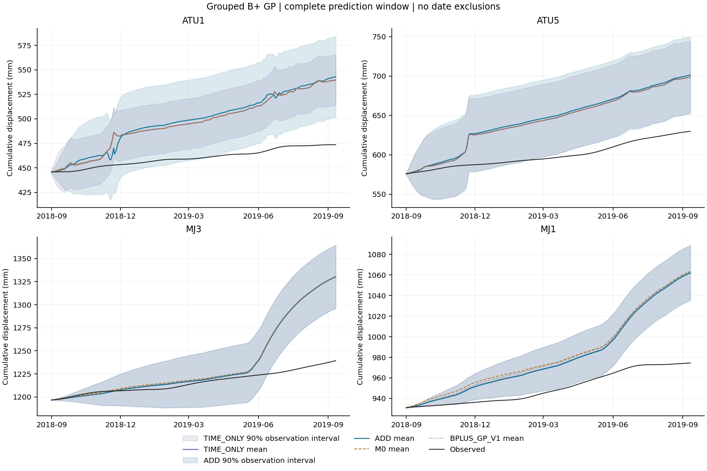
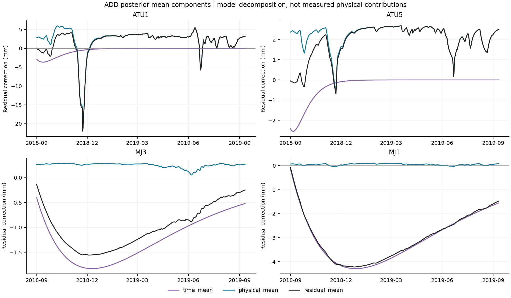

# B+ 分组加性 GP v2：配对实验结果

日期：2026-09-13（北京时间）。**已完成并停止；ADD效果未通过，保留B+。**

## 1. 结论与审查意见的落实

已按用户“根据plan，一步步进行”的要求执行[冻结计划](ootang_bplus_additive_gp_plan.v2.md)。
ADD联合学习时间残差与物理条件残差，TIME_ONLY独立拟合纯时间残差。
旧GP v1“四点均值小幅改善、平均概率评分改善，但逐点概率失败”的结论保持。

完整376日预测四点平均RMSE为 **ADD 41.7343、TIME_ONLY 40.7863、B+ 41.3684 mm**。
ADD平均MAE 33.2878 mm，也高于B+的33.2651和TIME_ONLY的32.3998。
当前配置不支持加入物理条件分量的额外均值预测价值；即使不要求0.5 mm实质增益，平均均值方向仍失败。

概率结果有部分改善：ADD平均CRPS 25.2531 mm，优于e0的28.1156；
90%区间评分229.6315 mm，优于e0的388.4387和TIME_ONLY的267.9921。
但对TIME_ONLY的CRPS改善不足事前1%门槛，平均MAE、RMSE、CRPS也未保留旧GP v1成绩。
14项聚合门槛通过6项，4个点均未同时通过所有逐点保护。**停止ADD，不调参、不扩边界，不把TIME_ONLY改称成功主候选。**
本结论只针对固定配置，不能推断全部GP或真实水文因素无效。

## 2. 冻结输入与方法

审查证据快照`5062cc75cd8b72477faa5a4b3b52b8870f98ec80`；
原计划`87e11c1`，配置/授权`fe07480`，实现`f73f3d4`。
[配置](../results/ootang_bplus_additive_gp_v2/20260913_development/config.json)固定49项来源哈希；
[源码来源](../results/ootang_bplus_additive_gp_v2/20260913_development/source_snapshot.json)、[数据对照](../results/ootang_bplus_additive_gp_v2/20260913_development/reference_audit.json)已核验。

| 项目 | 实际条件 |
| --- | --- |
| 原B+标定前缀 | 792日，2016-07-01—2018-08-31，原54参数不重估 |
| GP拟合及共同拟合评分 | [30:792)，762日，2016-07-31—2018-08-31 |
| 开发预测 | [792:1168)，376日，2018-09-01—2019-09-11，完整四点 |
| 最终293日 | 2019-09-12—2020-06-30，未读取标签或拟合 |
| 输入 | 日序、四域平均moisture、四域平均rain_head、reservoir_head减库水位、库水位日差 |
| 变换 | 仅762日拟合段计算输入均值/标准差和残差RMS；残差不中心化 |
| ADD | 时间Matérn3/2 + 四维物理摘要Matérn3/2 + White，联合优化8参数 |
| TIME_ONLY | 时间Matérn3/2 + White，独立优化3参数 |
| 优化 | float64、CPU单线程、L-BFGS-B、每组一次初值、0次重启 |
| 读标签顺序 | 先792日前缀；全部8组输出锁定后再读1168日前缀评分 |
| 参照 | M0/B+、v1.1-e0、保存GP v1；旧模型重训0、物理求解0 |

物理摘要来自保存模型状态，并非实测全坡水文量。时间核只读取第0列，物理核只读取后4列。
两臂共享标准化和残差尺度；ADD初始信号方差总和2、TIME_ONLY为1，参数数目8对3，
没有匹配先验总方差或参数数量，不能将比较解释成物理输入的因果效应。

完整方差保留交叉项：`v_f = v_T + v_H + 2 c_TH`，`v_y = v_f + noise_variance`。
White噪声仅加入一次，jitter仅用于训练对角线；全部分量以mm或mm²保存。
TIME_ONLY不是从ADD后验删掉物理均值后得到的预测。

## 3. 完整窗口效果

误差、宽度和评分单位为mm。M0概率指标保持不适用，e0均值与M0相同。
BPLUS_GP_V1表示保存的旧GP。本次不与早期180日或最终293日混排。

### 3.1 762日拟合

| 模型 | MAE | 四点平均RMSE | CRPS | 90%覆盖 | 90%宽度 | 90%区间评分 |
| --- | --- | --- | --- | --- | --- | --- |
| M0 | 9.5813 | 12.8324 | 不适用 | 不适用 | 不适用 | 不适用 |
| v1.1-e0 | 9.5813 | 12.8324 | 7.0647 | 89.60% | 43.5018 | 58.0406 |
| BPLUS_GP_V1 | 0.0004 | 0.0015 | 0.0041 | 99.90% | 0.0569 | 0.0573 |
| TIME_ONLY | 0.0005 | 0.0018 | 0.0041 | 99.87% | 0.0568 | 0.0573 |
| ADD | 0.0005 | 0.0016 | 0.0041 | 99.90% | 0.0568 | 0.0572 |

GP几乎插值训练残差，不等于长窗泛化改善；很小的拟合噪声不证明仪器精度或数据插值。

### 3.2 376日预测

| 模型 | MAE | 四点平均RMSE | CRPS | 90%覆盖 | 90%宽度 | 90%区间评分 |
| --- | --- | --- | --- | --- | --- | --- |
| M0 | 33.2651 | 41.3684 | 不适用 | 不适用 | 不适用 | 不适用 |
| v1.1-e0 | 33.2651 | 41.3684 | 28.1156 | 36.24% | 43.5018 | 388.4387 |
| BPLUS_GP_V1 | 32.8855 | 41.1976 | 25.1766 | 56.72% | 65.5960 | 263.5318 |
| TIME_ONLY | 32.3998 | 40.7863 | 25.4409 | 38.10% | 55.7551 | 267.9921 |
| ADD | 33.2878 | 41.7343 | 25.2531 | 46.81% | 64.0171 | 229.6315 |

四点RMSE平均与全部点日误差合并后开根号分列，不能互换：

| 模型 | 762日拟合合并RMSE | 376日预测合并RMSE |
| --- | --- | --- |
| M0 | 13.2236 | 41.6045 |
| v1.1-e0 | 13.2236 | 41.6045 |
| BPLUS_GP_V1 | 0.0021 | 41.4408 |
| TIME_ONLY | 0.0024 | 41.0581 |
| ADD | 0.0022 | 42.0976 |

### 3.3 四点完整预测指标

| 点位 | 模型 | MAE | RMSE | CRPS | 90%覆盖 | 90%宽度 | 90%区间评分 |
| --- | --- | --- | --- | --- | --- | --- | --- |
| ATU1 | M0 | 35.9776 | 40.3284 | 不适用 | 不适用 | 不适用 | 不适用 |
| ATU1 | v1.1-e0 | 35.9776 | 40.3284 | 29.6804 | 21.01% | 43.5018 | 390.3722 |
| ATU1 | BPLUS_GP_V1 | 35.7563 | 40.2792 | 23.3922 | 91.49% | 115.2442 | 121.0579 |
| ATU1 | TIME_ONLY | 35.9606 | 40.3271 | 28.6664 | 21.54% | 50.2796 | 335.5762 |
| ATU1 | ADD | 37.7090 | 42.2679 | 27.0906 | 54.79% | 77.1983 | 195.4948 |
| ATU5 | M0 | 43.5550 | 48.5180 | 不适用 | 不适用 | 不适用 | 不适用 |
| ATU5 | v1.1-e0 | 43.5550 | 48.5180 | 37.3779 | 21.28% | 43.5018 | 546.5177 |
| ATU5 | BPLUS_GP_V1 | 43.4834 | 48.5069 | 30.3985 | 57.45% | 102.5022 | 165.4498 |
| ATU5 | TIME_ONLY | 43.5219 | 48.5143 | 31.7947 | 42.29% | 87.8175 | 231.8261 |
| ATU5 | ADD | 45.4871 | 50.4795 | 32.9203 | 42.82% | 93.1428 | 229.1562 |
| MJ3 | M0 | 20.5259 | 36.3772 | 不适用 | 不适用 | 不适用 | 不适用 |
| MJ3 | v1.1-e0 | 20.5259 | 36.3772 | 18.6090 | 73.94% | 43.5018 | 284.8939 |
| MJ3 | BPLUS_GP_V1 | 20.3864 | 36.3130 | 18.2399 | 72.61% | 25.7070 | 299.4563 |
| MJ3 | TIME_ONLY | 19.8695 | 36.0096 | 17.1449 | 75.80% | 48.3915 | 227.7702 |
| MJ3 | ADD | 19.9465 | 36.0948 | 17.1671 | 76.06% | 48.5683 | 227.3547 |
| MJ1 | M0 | 33.0021 | 40.2499 | 不适用 | 不适用 | 不适用 | 不适用 |
| MJ1 | v1.1-e0 | 33.0021 | 40.2499 | 26.7950 | 28.72% | 43.5018 | 331.9711 |
| MJ1 | BPLUS_GP_V1 | 31.9158 | 39.6914 | 28.6759 | 5.32% | 18.9309 | 468.1633 |
| MJ1 | TIME_ONLY | 30.2472 | 38.2943 | 24.1575 | 12.77% | 36.5317 | 276.7958 |
| MJ1 | ADD | 30.0085 | 38.0952 | 23.8344 | 13.56% | 37.1589 | 266.5201 |

ATU1、ATU5的ADD均值误差均高于B+和TIME_ONLY。
MJ3虽优于B+，MAE、RMSE、CRPS仍略差于TIME_ONLY。
MJ1均值及概率评分优于TIME_ONLY，但90%覆盖13.56%，低于e0的28.72%，覆盖偏差保护失败。
不以平均概率改善或局部均值改善替代完整判据。

完整80%/90%/95%指标见[40行逐点表](../results/ootang_bplus_additive_gp_v2/20260913_development/metrics.csv)、[20行聚合表](../results/ootang_bplus_additive_gp_v2/20260913_development/aggregate.csv)；
[22760行点日表](../results/ootang_bplus_additive_gp_v2/20260913_development/daily_predictions.csv)保留全部日期；
[512行绝对/相对差](../results/ootang_bplus_additive_gp_v2/20260913_development/comparisons.csv)包含两臂对适用参照的比较。
差值为模型减参照；误差/评分为负表示改善，覆盖须按偏离名义值的程度评价。

## 4. 事前判据

[原始判定](../results/ootang_bplus_additive_gp_v2/20260913_development/decision.json)使用冻结eps及0.5 mm/1%门槛。
这些是本候选的研究停止规则，不是工程最小重要差异或导师确认的通用验收。
“实际减少”为参照减ADD，负数表示退步；GP v1保留检查允许1e-6 mm容差。
表中四舍五入不参与判定。

| 固定检查 | 要求减少/mm | 实际减少/mm | 通过 |
| --- | --- | --- | --- |
| train_mae_mm | 0.0000 | 9.5809 | 是 |
| prediction_mae_mm_vs_M0 | 0.5000 | -0.0227 | 否 |
| prediction_mae_mm_vs_TIME_ONLY | 0.5000 | -0.8880 | 否 |
| train_rmse_mm | 0.0000 | 12.8308 | 是 |
| prediction_rmse_mm_vs_M0 | 0.5000 | -0.3660 | 否 |
| prediction_rmse_mm_vs_TIME_ONLY | 0.5000 | -0.9480 | 否 |
| prediction_crps_mm_vs_v1.1-e0 | 0.2812 | 2.8625 | 是 |
| prediction_crps_mm_vs_TIME_ONLY | 0.2544 | 0.1878 | 否 |
| prediction_interval_score_90_mm_vs_v1.1-e0 | 3.8844 | 158.8072 | 是 |
| prediction_interval_score_90_mm_vs_TIME_ONLY | 2.6799 | 38.3606 | 是 |
| retain_gp_v1_mae_mm | -0.0000 | -0.4023 | 否 |
| retain_gp_v1_rmse_mm | -0.0000 | -0.5367 | 否 |
| retain_gp_v1_crps_mm | -0.0000 | -0.0764 | 否 |
| retain_gp_v1_interval_score_90_mm | -0.0000 | 33.9004 | 是 |

| 点位 | 未通过的逐点条件 |
| --- | --- |
| ATU1 | prediction_mae_mm_vs_M0；prediction_rmse_mm_vs_M0；prediction_mae_mm_vs_TIME_ONLY；prediction_rmse_mm_vs_TIME_ONLY |
| ATU5 | prediction_mae_mm_vs_M0；prediction_rmse_mm_vs_M0；prediction_mae_mm_vs_TIME_ONLY；prediction_rmse_mm_vs_TIME_ONLY；crps_mm_vs_TIME_ONLY |
| MJ3 | prediction_mae_mm_vs_TIME_ONLY；prediction_rmse_mm_vs_TIME_ONLY；crps_mm_vs_TIME_ONLY |
| MJ1 | coverage_vs_v1.1-e0 |

计算完整性通过，效果失败。没有事后删日期、截尾、换轮数、拼点或替换主输出。

## 5. 执行与独立复核

唯一正式入口：2026-09-12 **18:49:42.889706—18:49:56.084855 UTC**，
耗时 **13.1950秒**；8次拟合、360次目标调用、270次迭代均在预算内。
每点先TIME_ONLY后ADD；全部正常收敛，自动重试0、历史拟合0、物理求解0。

| 模型 | 目标调用 | 迭代 | 正常收敛 |
| --- | --- | --- | --- |
| ATU1_TIME_ONLY | 31 | 23 | 是 |
| ATU1_ADD | 50 | 35 | 是 |
| ATU5_TIME_ONLY | 28 | 19 | 是 |
| ATU5_ADD | 32 | 26 | 是 |
| MJ3_TIME_ONLY | 24 | 20 | 是 |
| MJ3_ADD | 87 | 63 | 是 |
| MJ1_TIME_ONLY | 22 | 17 | 是 |
| MJ1_ADD | 86 | 67 | 是 |

全部8组归一化噪声方差达到1e-6下界；ADD的ATU1物理核幅度到1000上界、
MJ1到0.001下界，部分长度尺度到上界。完整参数与警告保留于各`*_audit.json`。
未据此扩边界或补跑；单初值收敛不证明全局最优，幅度不等于物理因果强度。

实现阶段11项必要合成检查通过；只读核验器修正后增加1项回归检查，共12项通过。
[初始核验失败](../results/ootang_bplus_additive_gp_v2/verification_initial_failure.json)
发生在元数据比较：保存正参数再取log与优化器原log参数相差1.11e-16。
修正为按sklearn既有log/exp表示往返重建预期核，再进行完全相等比较。
[修正记录](../results/ootang_bplus_additive_gp_v2/verification_correction.json)与`e332787`保留；
**训练核、配置、优化记录、预测数组和原数值容差均未改变，没有新训练。**

[最终只读核验](../results/ootang_bplus_additive_gp_v2/20260913_verification/verification.json)于18:53:48.872880 UTC通过：

- 49项来源、封存清单、全部预测锁定后评分的顺序通过。
- 8模型重载，10类均值/方差字段最大差均为0。
- 独立手写Matérn及LU矩阵求解：全均值最大差1.191e-8 mm；
  分量均值最大差1.341e-8 mm，方差字段最大差6.731e-9 mm²，均通过原固定容差。
- 分量协方差与观测噪声关系通过；微小负方差归零次数为0。
- 40行逐点、20行聚合、22760行点日、512行比较全部复算通过。
- 原M0/e0的144项评分及GP v1全部旧指标/点日表复算通过，旧产物未覆盖。

矩阵乘法divide/overflow/invalid警告仍在原审计与复核中保留。
当前输出有限，分量逐项计算和独立LU复核在原容差内一致；未确定底层警告原因，
不声称已修复数值库，不以屏蔽警告代替验证。
原`run_status.json`“待独立核验”为封存时状态；最终状态以核验文件的
`complete_effectiveness_evaluation=true`、`numerical_checks_passed=true`、
`effect_passed=false`为准，不回写原日志。

## 6. 完整曲线与分量

四点完整376日预测，无截尾：

[762日完整拟合图](../results/ootang_bplus_additive_gp_v2/20260913_verification/train_curves.png)与[拟合PDF](../results/ootang_bplus_additive_gp_v2/20260913_verification/train_curves.pdf)保留全部拟合日期；
[预测PDF](../results/ootang_bplus_additive_gp_v2/20260913_verification/prediction_curves.pdf)可供查看和导出。

[分量PDF](../results/ootang_bplus_additive_gp_v2/20260913_verification/prediction_components.pdf)。
非零物理分量不代表额外预测增益或真实水文机制成立。
三张PNG均已目视检查，完整日期、四点和图例可读；[图件清单](../results/ootang_bplus_additive_gp_v2/20260913_verification/artifact_manifest.json)封存核验与图件。

## 7. 交付审计、预算与停止

| 计划要求 | 完成证据 |
| --- | --- |
| 配置及来源事前冻结 | `fe07480`、49项来源哈希 |
| 分组核、完整协方差、独立TIME_ONLY | `f73f3d4`、合成检查及保存分量 |
| 一次8组有界运行、先锁定后评分 | `112fd17`、events/prediction_lock/run_status |
| 异常可追溯、原输出不改、不重训 | `e332787`、初始失败和只读修正记录 |
| 重载、独立矩阵、历史对照和全量评分 | `327e521`、verification.json |
| 完整762/376日四点曲线、分量、绝对/相对差 | 三组PNG/PDF、comparisons.csv |
| 效果、反例、限制、停止结论 | 本报告及同步progress/AGENTS/README |
| 分步commit，无自动push | 已完成各阶段备份，本报告单独提交 |

独立预算2026-09-12 **18:37:17—20:37:17 UTC**，不继承旧预算。
截至本报告记录 **19:03:37 UTC**，累计约 **26.34分钟**；
文档核对和最终提交继续计入同一上限。正式运行后仅复核、制图、记录与提交，没有续跑。
19:05:06 UTC只读文档核对通过44行主要指标/门槛、121处既有本地链接和48个封存文件哈希；
[核对记录](../results/ootang_bplus_additive_gp_v2/documentation_checks.json)保留，训练核心、入口、配置和原计划字节与运行前提交一致。
报告完成即停，剩余时间不转到其他实验。

原始日值as-of未知、既有h预处理、已知未来驱动、历史开发窗反复暴露的限制保持。
这不是新盲测、现场部署或跨案例证据。四个独立GP不传播全部B+参数、未来驱动
和跨点联合不确定性；修正后位移不自动满足全部力学约束。
本轮不新增内部时序交叉验证，不将B+用全部792日标定下的更短留出称为整个流程独立验证。

**实现与复核完成；研究效果未达标；没有新增用户/导师效果验收记录。**
后续仅用完整结果讨论取舍，不自动训练最终293日、换核、改门槛、重复送审或恢复旧PINN。
