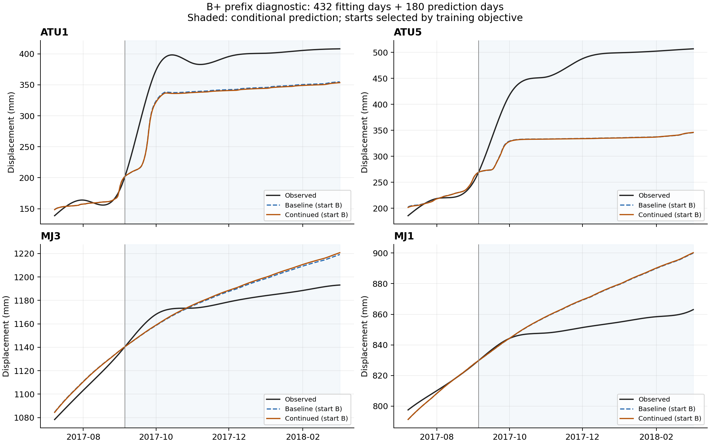
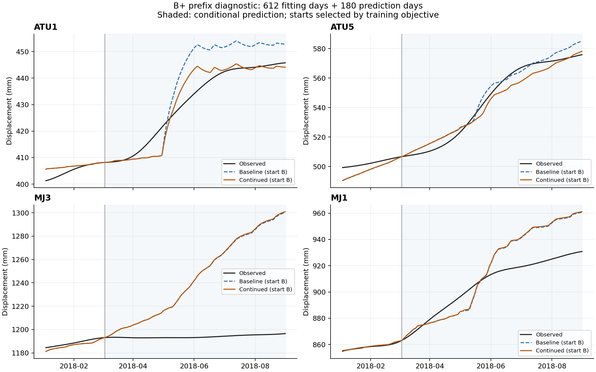

# 藕塘 B+ 前缀诊断 v1.2：实施与结果

日期：2026-09-10。状态：实施、数值核对和探索性评分完成；用户/导师验收待定。
执行前方案为 [v1.2 诊断计划](ootang_bplus_diagnostics_plan.v1.2.md)。

**本次没有得到稳定改善四点外推的物理参考。** 固定追加优化预算改善了训练目标，
但两个滚动窗口的预测结果一坏一好；六次续算均未达到既定一阶容差。
起点 A/B 的预测优劣随窗口互换，不能由训练拟合好直接推出外推好。
这些发现支持先调整物理参考的训练/验证目标，再决定神经网络修正对象；不证明经典 PINN 无效。

## 1. 输入、版本与执行边界

用户在两轮只读诊断之后授权“进行下一步”。本次新增独立实现和结果，
保留 [v1.1 结果](ootang_bplus_probabilistic_implementation.v1_1.md)。
数值管道只解析 CSV 前 792 日的驱动和四点位移；原件及历史产物的完整性检查读取完整文件字节，
不把其中更晚的观测值送入拟合或评分。

| 标定窗口 | 标定最后一天 | 预测日期 | 共同训练评分日数 | 预测评分日数 |
| --- | --- | --- | ---: | ---: |
| 432 日 | 2017-09-05 | 2017-09-06—2018-03-04 | 402 | 180 |
| 612 日 | 2018-03-04 | 2018-03-05—2018-08-31 | 582 | 180 |
| 792 日 | 2018-08-31 | 无，仅训练内续算 | 762 | 0 |

- 两个滚动窗口各从干净 A/B 起点执行原三阶段；第三阶段之后各追加一次 800 nfev。
  792 日 A/B 分别从自身已有第三阶段结果续算一次 800 nfev。
- 保持 54 参数、物理方程、边界、单位、64 子步/天、互补规则及原 TRF/差分设置。
  没有新增增量损失、正则、参数筛选或神经网络；所有状态从同一首日连续推进。
- 所有候选参数先写入 `fitted_parameters_locked.json` 再做预测评分；A/B 按对应训练目标选择。
  续算前后、三个长度均选 B。下表中更好的 A 预测仅作诊断，不追溯改变选择记录。
- 采用三个本地独立进程、一线程数值库。实际新增 nfev **14,457**，
  不超过预设 14,800；优化目标及 Jacobian 调用物理前向 **697,007** 次，
  另有 18 次优化末态复核，完整轨迹审计调用单独计算。
  本次执行约 **18.9 分钟**，不是神经训练耗时。

## 2. 收敛诊断

| 训练日数 | 起点 | 目标改善 | 续算 optimality | 最大参数变化¹ | 停止 |
| --- | --- | --- | --- | --- | --- |
| 432 | A | 0.099% | 1.263 | 0.86% | 预算上限 |
| 432 | B | 1.205% | 2.782 | 4.33% | 预算上限 |
| 612 | A | 0.467% | 3.994 | 1.79% | 预算上限 |
| 612 | B | 1.026% | 47.07 | 14.44% | 预算上限 |
| 792 | A | 0.104% | 50.01 | 1.57% | xtol |
| 792 | B | 0.209% | 49.9 | 0.20% | 预算上限 |

¹ 最大参数变化为存储坐标中的变化量除以该参数边界跨度；对数参数也在其对数存储坐标计算，
不能解释成物性百分比。612 日 B 中最大变化来自 `log_eta_O1_down`，约占其边界跨度 14.44%。

六个目标均下降，但下降幅度只有约 0.10%—1.20%；五次到达预算上限，
792 日 A 因 xtol 停止。**6/6 均未达到 optimality≤1e-7**，`success=true` 不等于本次的一阶条件满足。
训练目标变化小而某些参数仍能明显变化，提示需要进一步检查参数约束与目标设置；
本次没有进行秩、剖面似然或重复数据采样分析，因此不宣称证明参数不可辨识或找到了唯一根因。
SciPy 1.15 没有本接口的迭代回调，保留各阶段真实终止记录，不伪造逐迭代轨迹。

## 3. 按固定训练选择的结果

以下 RMSE 单位均为 mm，汇总方式均为四个测点 RMSE 的算术平均。

| 训练日数 | 按训练目标选择 | 训练 RMSE 原值 | 训练 RMSE 续算 | 预测 RMSE 原值 | 预测 RMSE 续算 |
| --- | --- | --- | --- | --- | --- |
| 432 | B | 7.1882 | 7.1230 | 57.3802 | 58.0122 |
| 612 | B | 7.2249 | 7.1930 | 23.1308 | 22.2448 |
| 792 | B | 12.8324 | 12.8197 | 不评估 | 不评估 |

- 432 日窗口：续算使四点预测 RMSE 全部变差；训练目标降低没有转化为预测改善。
- 612 日窗口：四点平均预测 RMSE 略降，但主要来自 ATU1；另外三点 RMSE 均上升。
- 792 日窗口：当前 B 的训练目标下降约 0.21%，RMSE 仅由 12.8324 降至 12.8197；
  训练最后 30 日增长速度偏差几乎保持。这里没有追加对原 376 日开发段或最终 293 日的评估。

| 训练日数 | 点位 | 预测 RMSE 原值 | 预测 RMSE 续算 | 续算平均偏差 |
| --- | --- | --- | --- | --- |
| 432 | ATU1 | 54.161 | 55.386 | -54.514 |
| 432 | ATU5 | 139.851 | 140.064 | -134.606 |
| 432 | MJ3 | 13.831 | 14.721 | +9.369 |
| 432 | MJ1 | 21.678 | 21.878 | +17.989 |
| 612 | ATU1 | 9.181 | 4.264 | +0.375 |
| 612 | ATU5 | 4.231 | 5.022 | -1.513 |
| 612 | MJ3 | 60.716 | 61.046 | +50.593 |
| 612 | MJ1 | 18.395 | 18.648 | +10.441 |

偏差定义为预测减实测。432 日 B 的 ATU1/ATU5 低估，MJ3/MJ1 平均高估；
612 日 B 的 MJ3 明显高估。**问题不是所有时段、所有点都需要同方向修正。**

## 4. 起点与外推的错配

| 训练日数 | 起点（续算后） | 训练 RMSE | 预测 RMSE |
| --- | --- | --- | --- |
| 432 | A | 9.3051 | 25.4663 |
| 432 | B | 7.1230 | 58.0122 |
| 612 | A | 9.9538 | 63.3987 |
| 612 | B | 7.1930 | 22.2448 |

432 日窗口 B 的训练拟合更好，预测却远差于 A；612 日窗口则 B 的训练和预测都更好。
不能据第一个窗口宣布应固定选择 A，也不能把两个窗口当作独立随机重复。
在这两个既定窗口内，单纯最小化训练目标不足以确保物理参考有稳定外推能力。

图件画出训练最后 60 日和全部 180 日预测，阴影为预测段；两条物理曲线分别来自按训练目标选中
的常规标定和续算版本。图中没有观测重置或区间包装。





## 5. 验证、产物与复现

- 新增六项测试全部通过，包含逐候选完整产物的独立验证：前缀读取边界、标签/起始值接口、
  末日权重及边界差分、训练选择、评分日期/轴、NPZ→CSV→指标与增长速度复算。
- 12 条有效候选轨迹的 **561,408 个子步**全部通过原约束；自定义与原求解器最大位移差
  `2.2737367544323206e-13 mm`，短/长前缀最大差 `0 mm`，
  最大归一化互补残差 `6.886053936029143e-16`。
- 原始 PDF/ZIP、冻结计划及完整 v1.1 结果等 **323 个文件**运行前后 SHA-256 一致。
  新科学源码与执行前方案哈希也一致。
- 原 NumPy 矩阵乘法在本机仍产生曾复现的 RuntimeWarning；警告保留于各 scope 日志，
  输出有限并通过独立数值对照，没有为消除警告修改原公式或裁剪预测。
- Ruff 与 diff 空白检查通过；两幅四点图已逐幅查看，日期、图例和数据范围一致。

主要产物目录为 [`20260910_diagnostics`](../results/ootang_bplus_v1_2/20260910_diagnostics/)：
`manifest.json`、执行前方案、输入前缀副本、科学源码快照、每阶段参数/优化记录、
原始日志、12 组 NPZ 状态、35,136 行逐点预测、100 行指标汇总、192 行增长速度分解、
`convergence_summary.csv`、`selected_summary.csv`、`tests.log` 与完整性检查。
完整计分 CSV 保留各初始参数起点；本次 A/B 是物理初始参数组，不是神经初始化种子。

```bash
# 从新 run id 重做本版固定诊断
PYTHONPATH=code .venv/bin/python -m physics_guided_diagnostics.run --run-id another_diagnostic_run
# 只从已完成产物重新导出表和图
.venv/bin/python scripts/report_ootang_bplus_diagnostics.py results/ootang_bplus_v1_2/20260910_diagnostics
# 对当前固定 run id 的数据与产物复核
PYTHONPATH=code .venv/bin/python -m unittest discover -s tests -p 'test_physics_guided_diagnostics.py' -v
```

## 6. 结论与下一步建议

**实施完成、数值核对通过；稳定提升四点预测的目标未实现；用户/导师验收待定。**
本步缩小了问题范围：固定续算对训练的收益小且对外推的影响不一致；物理参考的时间泛化及
其误差结构，是后续智能修正必须处理的部分。没有证据支持继续同样地加预算就能解决问题。

建议下一版先做一个可解释的单项对照：在原位移目标之外，加入训练期 **30 日位移增量**约束，
同时保留四点独立的滚动预测评价，查看是否改善增长趋势。窗口、权重和预算应在执行前另记版本，
该建议当前未实施、未证明有效。起点选择应进一步研究基于训练内部时序验证的规则，
不得直接用本次预测成绩追溯替换既有模型。

对神经网络，目前更合适的待检验方向是学习与物理状态/驱动相关的**增量残差**，
通过积分形成位移并同时约束长期漂移，而不是把训练段的累计位移偏差直接延续到预测段。
这只是基于本次误差变化的设计假设；增量误差也可能累积，需有限比较验证。
物理分量分解不支持单独把蠕变判为全部误差来源，也不能据此推广为经典 PINN 的结论。

本次仅一个已反复使用的案例、两个非独立滚动窗口、两个初始点和固定优化预算；
没有新盲测、统计显著性或跨案例有效性结论。11 项解释风险检查已覆盖：本轮无 p 值或
干预效果估计；重点保留重复使用历史、选择路径、汇总掩盖逐点差异以及模型分解不等于因果的限制。

## 来源记录（Material Passport）

| 材料 | 本次用途 | 完整性记录 |
| --- | --- | --- |
| 导师原 ZIP 最终交付代码、几何与查表 | 原方程、参数边界和求解器 | manifest 的 reference_provenance；与 ZIP 逐文件字节核对 |
| 原监测 CSV 前 792 日 | 全部数值输入 | input_prefix_792.csv、原/运行前缀数组哈希 |
| v1.1 A/B 三阶段记录 | 792 日续算起点 | prior_calibration_A/B.json；protected_before.json |
| 本次源码、方案、测试与导出器 | 可复现执行与验证 | source_snapshot、plan_before_execution、export_provenance、artifact_manifest |
