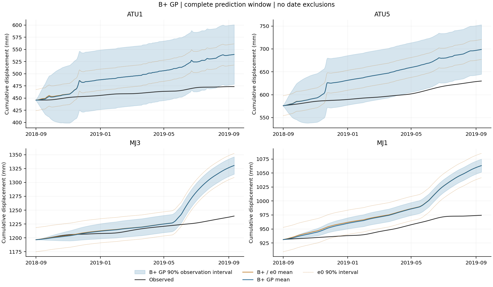
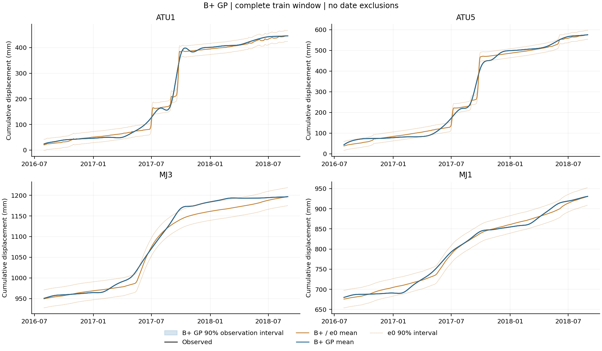

# 藕塘 B+–GP 单次开发验证结果 v1

2026-09-13，北京时间。科学输入基线 `d92524d`；[原计划](ootang_bplus_gp_plan.v1.md)、
[用户确认的执行补充](ootang_bplus_gp_execution_addendum.v1.1.md)及[冻结配置](../config/ootang_bplus_gp.v1.json)共同确定本次方案。

## 1. 结论与去留

**四点拟合与数值复核完成，完整通过条件未满足，本轮停止，保留 B+。**
这次出现小幅的四点均值改善和平均概率评分改善，不能沿用“全部指标都没有改善”的旧表述；
但 MJ3、MJ1 的概率表现不满足逐点保护条件，不能宣布本候选达标。

完整376日四点平均 RMSE **41.3684→41.1976 mm**，降低 **0.413%**；
MAE **33.2651→32.8855 mm**。四点预测均值两项均未退步。
CRPS **28.1156→25.1766 mm**，90% 区间评分 **388.4387→263.5318 mm**。

| 判定层次 | 结果 |
| --- | --- |
| 实现与来源 | 12 项合成检查、原54参数/日期/点序/来源核对通过；4点各拟合1次 |
| 计算验证 | 模型重载、独立矩阵、历史对照及保存评分复算通过；运行警告另行保留和核对 |
| 研究效果 | 6项平均改善均通过；ATU1、ATU5通过逐点条件，MJ3、MJ1失败；整体未通过 |
| 用户验收 | 用户批准方案与数值补充；没有新的效果接受或后续实验授权记录 |

停止该配置的本轮验证；不扩边界、换核、重启、拼点、再拟合或进入最终293日。
这不是对全部 GP、残差学习或物理引导方法的否定。

## 2. 实际输入、方法与隔离

- 原物理拟合：2016-07-01—2018-08-31，共792日，使用原 `prefix_792_v1_1` 的54参数与保存原B+轨迹，未调用物理求解器。
- GP训练与共同拟合评分：[30,792)，2016-07-31—2018-08-31，共762日；排除原30日预热。
- 开发预测：[792,1168)，2018-09-01—2019-09-11，**完整376日**，无尾段删减、点位删除或重选轮数。
- 四点数组顺序：ATU1、ATU5、MJ3、MJ1。五输入为日序、四代表域含水状态均值、雨致水头均值、滞后水头减当日库水位、当日库水位差分。
- 特征均值/标准差与逐点残差RMS只取762日训练段；残差为实测减B+，不中心化。
- 每点一个 `Constant × Matérn-3/2 + WhiteKernel`，五个ARD长度尺度；单初值、零重启，以训练负对数边际似然拟合。
- 均值对照为 M0 原B+；概率对照为同窗原 `v1.1-e0` 的完整三分量保存分布。M0概率指标不适用，不挪用旧180日P0。
- 先读取792日训练标签，完成并锁定四点模型、预测与标准化哈希后，才读取1168日前缀用于开发评分。**未读取最终293日位移标签。**
- 本次是用户另行明确选择的 GP 机器学习候选，不改称深度学习、PINN或具有跨测点协方差的联合模型。

配置 SHA-256：`f49fb4414f18598794ab706341df3af5644c53b57aa71ffa98ab2a724b9055c8`。
[来源快照](../results/ootang_bplus_gp_v1/20260913_development/source_snapshot.json)冻结19个源文件；
[来源核对](../results/ootang_bplus_gp_v1/20260913_development/reference_audit.json)记录原参数、1168日期与点序；
B+保存均值与原e0三分量均值最大差为 **0 mm**。
完整初值、边界、容差及特征字段以执行补充和配置为准。

## 3. 均值与概率总表

误差与CRPS单位均为mm。四点RMSE算术平均与合并RMSE分别列示；共同拟合成绩不作为独立预测证据。

| 窗口 | 模型 | 平均MAE | 四点平均RMSE | 合并RMSE | 平均CRPS |
| --- | --- | --- | --- | --- | --- |
| 拟合762日 | M0 | 9.5813 | 12.8324 | 13.2236 | 不适用 |
| 拟合762日 | v1.1-e0 | 9.5813 | 12.8324 | 13.2236 | 7.0647 |
| 拟合762日 | BPLUS_GP | 0.0004 | 0.0015 | 0.0021 | 0.0041 |
| 预测376日 | M0 | 33.2651 | 41.3684 | 41.6045 | 不适用 |
| 预测376日 | v1.1-e0 | 33.2651 | 41.3684 | 41.6045 | 28.1156 |
| 预测376日 | BPLUS_GP | 32.8855 | 41.1976 | 41.4408 | 25.1766 |

训练平均RMSE接近零，说明该GP能够拟合训练残差；它没有转化为相近量级的长窗预测收益。
“几乎贴合训练数据”不能解释为解决了实际预测问题。

### 完整376日逐点均值

| 点位 | B+ MAE | GP MAE | B+ RMSE | GP RMSE | RMSE相对降低 |
| --- | --- | --- | --- | --- | --- |
| ATU1 | 35.9776 | 35.7563 | 40.3284 | 40.2792 | 0.122% |
| ATU5 | 43.5550 | 43.4834 | 48.5180 | 48.5069 | 0.023% |
| MJ3 | 20.5259 | 20.3864 | 36.3772 | 36.3130 | 0.176% |
| MJ1 | 33.0021 | 31.9158 | 40.2499 | 39.6914 | 1.387% |

### 762日共同拟合逐点均值

| 点位 | B+ MAE | GP MAE | B+ RMSE | GP RMSE |
| --- | --- | --- | --- | --- |
| ATU1 | 7.9915 | 0.0001 | 12.1206 | 0.0002 |
| ATU5 | 12.3715 | 0.0001 | 16.6222 | 0.0004 |
| MJ3 | 11.4189 | 0.0009 | 14.5469 | 0.0038 |
| MJ1 | 6.5436 | 0.0007 | 8.0397 | 0.0018 |

### 完整376日逐点90%概率指标

| 点位 | 模型 | CRPS/mm | 覆盖率 | 平均宽度/mm | 区间评分/mm |
| --- | --- | --- | --- | --- | --- |
| ATU1 | v1.1-e0 | 29.6804 | 21.01% | 43.5018 | 390.3722 |
| ATU1 | BPLUS_GP | 23.3922 | 91.49% | 115.2442 | 121.0579 |
| ATU5 | v1.1-e0 | 37.3779 | 21.28% | 43.5018 | 546.5177 |
| ATU5 | BPLUS_GP | 30.3985 | 57.45% | 102.5022 | 165.4498 |
| MJ3 | v1.1-e0 | 18.6090 | 73.94% | 43.5018 | 284.8939 |
| MJ3 | BPLUS_GP | 18.2399 | 72.61% | 25.7070 | 299.4563 |
| MJ1 | v1.1-e0 | 26.7950 | 28.72% | 43.5018 | 331.9711 |
| MJ1 | BPLUS_GP | 28.6759 | 5.32% | 18.9309 | 468.1633 |

平均90%覆盖率 **36.24%→56.72%**，平均宽度 **43.5018→65.5960 mm**。
覆盖率总体仍不能视为校准充分。ATU1/ATU5的区间变宽，同时CRPS及区间评分改善；
MJ3/MJ1的区间变窄、覆盖不足，不能用平均改善掩盖它们。

80%、90%、95%的全部点位与两个时段的覆盖率、宽度、区间评分见
[完整指标](../results/ootang_bplus_gp_v1/20260913_development/metrics.csv)；
[聚合表](../results/ootang_bplus_gp_v1/20260913_development/aggregate.csv)保留两种RMSE口径，
[点日表](../results/ootang_bplus_gp_v1/20260913_development/daily_predictions.csv)保留13656行观测、均值、误差、CRPS和各档区间。

## 4. 固定验收与失败证据

| 条件 | 结果 |
| --- | --- |
| 拟合四点平均 MAE / RMSE 降低，每点均不退步 | 通过 |
| 预测四点平均 MAE / RMSE 降低，每点均不退步 | 通过 |
| 预测四点平均 CRPS / 90% 区间评分降低 | 通过 |
| 每点 CRPS 与90%区间评分均不退步 | 失败：MJ3区间评分变差；MJ1两项均变差 |
| 每点90%覆盖偏差不超过对照偏差+1/376 | 失败：MJ3、MJ1 |
| 加宽时90%区间评分必须改善 | 通过；不代表变窄的区间一定合格 |
| 四点来源、拟合、锁定、重载与复算完整 | 通过 |
| 所有条件同时通过 | **未通过，停止** |

MJ3的90%区间评分 **284.8939→299.4563 mm**，覆盖率 **73.94%→72.61%**；
MJ1的CRPS **26.7950→28.6759 mm**、区间评分 **331.9711→468.1633 mm**，
覆盖率 **28.72%→5.32%**。这些是全窗固定规则下的反例，不做事后日期拆分或逐点回退。

[判定文件](../results/ootang_bplus_gp_v1/20260913_development/decision.json)记录每点误差/评分绝对差、
相对增益及全部门槛。1e-6 mm是数值比较容差；本轮没有显著性检验，也没有证明这些小幅均值变化具有实际重要性。

## 5. 优化、方差与数值验证

| 点位 | 迭代 | 目标调用 | 核幅度方差 | 五长度尺度（标准化输入） | 噪声方差（归一化） | 结束 |
| --- | --- | --- | --- | --- | --- | --- |
| ATU1 | 25 | 33 | 9.4020 | 0.1692, 1000.0000, 12.1022, 12.0166, 1000.0000 | 1.0e-06 | 收敛 |
| ATU5 | 34 | 48 | 3.9104 | 0.1514, 1000.0000, 27.0405, 23.9175, 1000.0000 | 1.0e-06 | 收敛 |
| MJ3 | 19 | 22 | 0.4272 | 0.5042, 1000.0000, 1000.0000, 128.5920, 1000.0000 | 1.0e-06 | 收敛 |
| MJ1 | 30 | 35 | 0.7696 | 0.5200, 1000.0000, 551.1450, 280.3302, 1000.0000 | 1.0e-06 | 收敛 |

四点共 **138次**目标调用、**108次**迭代，均由L-BFGS-B报告收敛；没有达到200次迭代/400次调用上限。
四点噪声方差均到事前下界1e-6，多个长度尺度到上界1000；原收敛警告保留，
没有按库提示扩大边界再拟合。单初值的收敛不等于全局最优；长度尺度也不证明真实物理因素的因果作用。

主概率输出采用观测方差；WhiteKernel只计一次，jitter仅在训练矩阵对角。
均值乘残差RMS、方差乘RMS平方。四点RMS分别为12.1206、16.6222、14.5469、8.0397 mm；
没有触发RMS下限或常量特征处理，也没有触发负潜在方差归零。

[只读复算](../results/ootang_bplus_gp_v1/20260913_verification/verification.json)核验结果：

- 4个保存模型重载的均值、潜在方差、观测方差最大差均为0。
- 独立手写Matérn协方差及LU求解，与主预测均值最大差 **6.568e-10 mm**，
  潜在/观测方差最大差 **7.764e-10 mm²**，均通过事前容差。
- 24行逐点指标、12行聚合指标、13656行点日表及完整去留条件复算通过；
  原M0/e0共144条历史指标最大差 **1.236e-12**。
- 复算新增拟合与物理调用均为0；图件覆盖完整762日拟合与376日预测，两幅PNG已目视核对点序、图例、日期与评分对应关系。

运行和复算的矩阵乘法出现除零、溢出、无效值 RuntimeWarning；**未将其写成“无警告运行”**。
所有实际操作数与预测值有限，另以不用BLAS矩阵乘法的逐项乘加核对，
与保存均值最大差 **1.191e-10 mm**，通过原矩阵容差。
[警告核对记录](../results/ootang_bplus_gp_v1/matmul_warning_check.json)保留全部四点警告；
该检查没有改预测、读标签或重拟合，未确定警告底层成因，不声称修复了运行库。
绘图另有自动日期刻度回退提示，目视检查显示完整日期正常，没有因此删减数据。

GPR/WhiteKernel用法核对的是[scikit-learn 1.7原始API文档](https://scikit-learn.org/1.7/modules/generated/sklearn.gaussian_process.GaussianProcessRegressor.html)，
优化选项核对[SciPy 1.15.3文档](https://docs.scipy.org/doc/scipy-1.15.3/reference/optimize.minimize-lbfgsb.html)。
文档支持接口语义，不支持本候选已有效的结论。

## 6. 完整曲线





图中蓝带为GP观测90%区间，橙色点线为原e0区间；B+和GP均值大量重叠，训练GP区间极窄。
[预测PDF](../results/ootang_bplus_gp_v1/20260913_verification/prediction_curves.pdf)和
[拟合PDF](../results/ootang_bplus_gp_v1/20260913_verification/train_curves.pdf)由同一保存点日表生成。

## 7. 授权、预算、提交与复现

用户先要求“根据这个plan，一步步进行”，后确认“采用这套事前固定的补充方案”。
总预算从 **2026-09-12 17:32:19 UTC** 起，截止 **19:32:19 UTC**；
实现截止18:47:19、正式运行≤30分钟且最迟19:17:19结束。等待参数确认也计入该总时限。

- 正式运行：**2026-09-12T17:53:37.337884+00:00—2026-09-12T17:53:41.727466+00:00**，实际 **4.3896秒**，一次启动。
- 4次拟合、0次重启、0次物理调用，输入按792→预测锁定→1168顺序读取。
- 截至本报告收尾记录 **2026-09-12 17:59:24 UTC**，总累计 **1625.3秒（27.09分钟）**；
  后续仅文档核对与提交。训练已停止，剩余预算不挪作新实验。
- 原始运行状态文件保留生成时的“待独立复核”；最新完成状态由后续verification和本报告共同说明，不覆盖原记录。

| 步骤 | 提交 |
| --- | --- |
| 原GP计划整理 | `8b3849a` |
| 用户确认补充与配置冻结 | `d7c3ea2` |
| 实现、12项合成检查 | `13eec6d` |
| 唯一正式运行原始产物 | `cdae749` |
| 只读数值核验、曲线与警告记录 | `e2307a9` |

源码：[GP计算](../code/physics_guided_gp.py)、[唯一运行入口](../code/run_ootang_bplus_gp.py)、
[只读复算](../scripts/verify_ootang_bplus_gp.py)、[警告核对](../scripts/check_ootang_gp_matmul.py)、
[合成检查](../tests/test_physics_guided_gp.py)。
配置、源码哈希、模型、输入、预测、日志、指标均已备份；本次没有push请求，未推送。

仅复算现有结果，不启动训练：

```bash
.venv/bin/python -m unittest discover -s tests -p test_physics_guided_gp.py -v
PYTHONPATH=code:scripts .venv/bin/python -c 'from threadpoolctl import threadpool_limits; from verify_ootang_bplus_gp import verify; ctx=threadpool_limits(1); report,_=verify(); print(report["effect_passed"])'
```

只读verify不调用fit；正式运行入口与产物写入入口有已存在目录保护，旧执行命令不是新运行授权。

## 8. 局限与后续边界

本次检验支持“训练残差可拟合、同窗平均指标有局部正证据”，不足以支持四点概率质量稳定提升。
对训练的近乎插值、很小的观测噪声和长窗中有限的均值修正应一并呈现，不能只展示训练图。

开发窗已经反复暴露；原始日值as-of未知、h预处理及已知未来驱动的限制继续保留。
概率输出没有传播完整的B+参数或未来驱动不确定性，也没有学习跨点协方差；
四个独立GP不能替代时空联合分布，修正后位移不自动符合全部力学约束。

**本轮到此结案。** 可直接用本报告讨论“均值小幅改善，但概率区间在两点退步”的结果。
不自动送重复审核、不根据局部正结果追加版本或预算；
任何新方向须有独立依据与事前方案，本报告没有启动下一轮实验。
