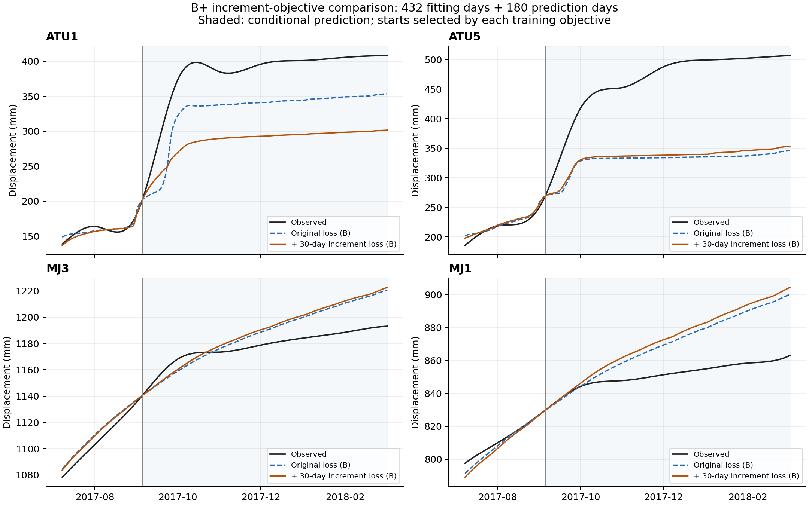
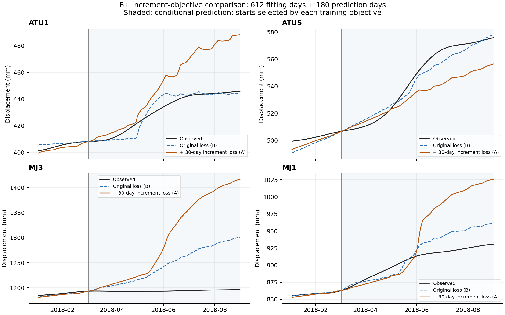

# 藕塘 B+ 位移与增量目标 v1.3：实施与结果

日期：2026-09-10。实施与数值验证完成；用户/导师验收待定。
执行前规格为 [v1.3 计划](ootang_bplus_increment_plan.v1.3.md)，前两版结果保持原样。

**本轮未获得稳定同时改善四点训练与预测的结果（1/8）。**
这里的“同时改善”要求同一点训练和预测两段的位移 RMSE、MAE 四项都比 C0 低超过 1e-6 mm。
这是两个已被使用过的历史窗口上的探索性比较；本轮没有训练新的概率模型，也没有新盲测。

## 1. 唯一目标变化与输入

用户在 v1.2 诊断后授权“进行下一步”。本轮检验固定 30 日净位移增量项，不更改 B+ 的
54 参数、边界、力学/水文方程、64 子步或观测映射。导师 ZIP 原文件的读取位置见 v1.3 计划，
平台移植和原件来源见 [v1.1 实施记录](ootang_bplus_probabilistic_implementation.v1_1.md)。

- C0：复用 v1.2 `continued` 的 A/B 参数和选择，已逐文件核对输入、源码和产物哈希。
- C1：从相同的干净 A/B 参数起点重新拟合，各阶段都加入固定权重 1 的增量项。
- 数值管道只解析前 792 日的雨量、水位和四点位移。432/612 日训练分别外推 180 日，
  最后训练日为 2017-09-05 / 2018-03-04；预测截至 2018-03-04 / 2018-08-31。
  完整性验证读取历史文件字节，但不把后期数值送入训练或评分。
- 每链四阶段预算为 900+800+800+800，末日权重依次为 0、n、100n、100n。
  TRF、单边差分步长及容差与 v1.2 相同。第三阶段结果保留作诊断，主比较只用第四阶段。
- 训练位移评分排除首 30 日，分别为 402/582 日；预测全 180 日计分。增量按目标日期计分，
  预测首 30 日包含跨训练分界的窗口；这些观测仅用于评分。
- 实际雨量和水位驱动条件预测，位移不反馈、不在分界重置；A/B 是物理参数起点，不是随机种子。
  C0 按训练 J0 选择，C1 按训练 J1 选择；不依据预测成绩改变任何选模记录。

令 r=(mu-y)/(100 mm)，本版目标为：

```
J0 = sum r[t,j]^2 + lambda_T * sum r[n-1,j]^2
J1 = J0 + n/(n-30) * sum (r[t,j]-r[t-30,j])^2,  t=30,...,n-1
```

两项共用 100 mm 尺度；增量是 30 日净位移误差，没有除以 30，也不是速度传感器观测。
两目标的数值不能直接横比优劣；[objective_components.csv](../results/ootang_bplus_v1_3/20260910_increment/objective_components.csv)
保存每条曲线在共同分量定义下的 J0、增量项及 J1。

## 2. 按预定训练选择的主结果

下表 RMSE 均为四点 RMSE 的算术平均，单位 mm；箭头为 C0 → C1。

| 训练日数 | C0 / C1 起点 | 训练 RMSE | 预测 RMSE | 同时改善点数 |
| --- | --- | --- | --- | --- |
| 432 | B / B | 7.1230 → 7.0022 | 58.0122 → 68.8448 | 1/4 |
| 612 | B / A | 7.1930 → 9.1095 | 22.2448 → 56.4485 | 0/4 |

逐点结果保留汇总可能掩盖的差异，完整偏差、增量和配对变化见
[comparison.csv](../results/ootang_bplus_v1_3/20260910_increment/comparison.csv)。

| 训练日数 | 点位 | 训练 RMSE | 预测 RMSE | 训练 MAE | 预测 MAE | 同时改善 |
| --- | --- | --- | --- | --- | --- | --- |
| 432 | ATU1 | 9.664 → 9.329 | 55.386 → 99.827 | 7.425 → 8.173 | 54.514 → 97.345 | 否 |
| 432 | ATU5 | 4.005 → 3.663 | 140.064 → 134.878 | 2.893 → 2.769 | 134.606 → 129.647 | 是 |
| 432 | MJ3 | 6.545 → 6.514 | 14.721 → 15.883 | 5.643 → 5.685 | 12.546 → 13.495 | 否 |
| 432 | MJ1 | 8.278 → 8.503 | 21.878 → 24.792 | 6.927 → 7.282 | 18.144 → 20.981 | 否 |
| 612 | ATU1 | 8.205 → 9.811 | 4.264 → 23.941 | 6.205 → 7.492 | 2.957 → 19.103 | 否 |
| 612 | ATU5 | 9.456 → 12.335 | 5.022 → 16.155 | 7.909 → 9.939 | 4.347 → 13.123 | 否 |
| 612 | MJ3 | 5.607 → 5.857 | 61.046 → 129.685 | 4.852 → 5.124 | 50.593 → 101.981 | 否 |
| 612 | MJ1 | 5.503 → 8.436 | 18.648 → 56.014 | 3.924 → 6.800 | 15.311 → 42.502 | 否 |

## 3. 增量与相同起点的配对结果

以下增量误差也取四点指标算术平均，单位 mm。增量变好不能替代逐点位移验收。

| 训练日数 | 分段 | 30 日增量 RMSE | 30 日增量 MAE |
| --- | --- | --- | --- |
| 432 | 训练 | 7.0351 → 6.3114 | 5.4689 → 5.0092 |
| 432 | 预测 | 20.5003 → 23.4842 | 14.3263 → 16.0588 |
| 612 | 训练 | 8.3869 → 8.6923 | 5.8314 → 6.4851 |
| 612 | 预测 | 10.4857 → 22.4861 | 8.8394 → 17.1629 |

相同起点的配对结果如下，不按这些预测成绩重新挑选起点。

| 训练日数 | 同一起点 | 训练位移 RMSE | 预测位移 RMSE | 同时改善点数 |
| --- | --- | --- | --- | --- |
| 432 | A | 9.3051 → 10.8814 | 25.4663 → 57.8263 | 0/4 |
| 432 | B | 7.1230 → 7.0022 | 58.0122 → 68.8448 | 1/4 |
| 612 | A | 9.9538 → 9.1095 | 63.3987 → 56.4485 | 0/4 |
| 612 | B | 7.1930 → 11.1115 | 22.2448 → 38.0548 | 0/4 |

432 日 B 的训练增量误差下降，但预测位移与增量误差均上升；只有 ATU5 满足逐点同时改善。
612 日按自身训练目标从 C0 的 B 换成 C1 的 A，四点训练与预测误差均变差。
同起点 A 的四点平均误差虽有下降，仍没有点满足全部四项标准，也不能据其预测表现追溯改选。

还有一个优化诊断：把 **612 日旧 B 参数**代入同一个新目标 J1，得到 **32.444117**，
比 C1 新拟合中的最佳 J1 **41.801142** 更低。新流程在本轮预算内没有找到优于这个已知可行参数的
新目标值，因此不能把负结果直接推广为“增量目标无效”。432 日 B 的共同 J1 则由 18.287592
降至 16.367884，外推仍变差，说明训练目标改善也不足以保证本轮预测改善。

图中展示训练末 60 日和随后 180 日；阴影为条件预测段，各条曲线均从同一首日连续递推。





## 4. 执行、收敛与数值核验

实际新增 nfev **13,086**，不超过固定的 13,200；优化目标和 Jacobian 调用
原物理前向 **623,036** 次，另有 16 次优化末态复核。
轨迹审计调用单独计数。本次最多三个本地独立进程，各数值库一线程，总执行约 **8.5 分钟**。

| 训练日数 | 起点 | 最终 J1 | optimality | 末阶段 nfev | 停止 |
| --- | --- | --- | --- | --- | --- |
| 432 | A | 34.010309 | 460.3 | 686 | xtol |
| 432 | B | 16.367884 | 48.64 | 800 | 预算上限 |
| 612 | A | 41.801142 | 90.89 | 800 | 预算上限 |
| 612 | B | 52.788694 | 7.964 | 800 | 预算上限 |

最终 0/4 条链满足 optimality≤1e-7。
优化器的停止标志不替代一阶收敛判断，也不表示全局最优。保存真实各阶段记录，没有伪造逐迭代轨迹。

- 运行前 30 项相关测试通过；新产物生成后，v1.3 的 7 项测试全部通过、无跳过。
  包含 alpha=0 对旧残差/差分的逐元素一致性、常值偏移抵消、已知斜率的解析增量、训练截止日
  隔离、跨边界评分日期，以及从每条保存曲线独立复算指标、目标、选择、预算和参数接续。
- 12 条候选轨迹共 **538,368 个子步**通过原约束。
  自定义/原求解器最大位移差 `2.273736754432321e-13 mm`，短/长前缀最大差
  `0 mm`，最大归一化互补残差 `6.886053936029143e-16`。
- 427 个原件、冻结计划和 v1.1/v1.2 产物运行前后哈希一致；
  13 份科学源码、v1.3 计划和配置哈希一致。控制组曲线与旧保存曲线逐值核对。
- Ruff 和格式检查通过；两幅图已查看。原 NumPy 矩阵乘法警告保留在日志中，输出有限并通过
  独立数值审计；没有为消除警告改公式或裁剪预测。

## 5. 结论、限制与下一步

本轮未获得稳定同时改善四点训练与预测的结果。实施完成、数值核验通过与效果判断分开记录；
概率区间、神经模型和导师精度目标没有因此自动完成。用户/导师接受状态仍待定。

下一步建议先检查**标定优化稳定性**，把已知可行参数的新目标值作为核对基准；并设计
**训练内部的滚动验证与物理参数选择规则**，再决定增量残差神经模型的设计。
该建议需要另记版本后执行；本轮不继续加预算、搜索增量权重或追加 ConvLSTM/PINN 训练。
仅把本轮预测好的起点追溯替换进去，会使比较失去既定的选模边界。

按 academic-research-suite 的解释检查覆盖 11/11 项，详见
[interpretation_audit.json](../results/ootang_bplus_v1_3/20260910_increment/interpretation_audit.json)。
本轮无 p 值、显著性或自然过程干预效果估计；四点平均不代表每点改善，两个历史窗口也不构成
独立样本或新盲测。累计位移与增量来自同一套观测，损失项不是独立证据；模型内部状态分解
不能证明真实滑坡的因果机制。

## 6. 产物与复现

完整产物位于 [`20260910_increment`](../results/ootang_bplus_v1_3/20260910_increment/)：
执行前计划、输入前缀、配置、源码和测试快照、每阶段参数/优化状态、原始日志、锁定参数、
12 组曲线/内部状态、33,696 行逐点预测、比较与验收表、两组 PNG/PDF、
`delivery_verification.json` 和 `artifact_manifest.json`。后一文件索引其余全部产物。

```bash
# 使用新 run id 复现固定预算；需要导师原 ZIP 及已复现、经哈希核对的 v1.2 控制组
PYTHONPATH=code .venv/bin/python -m physics_guided_increment.run --run-id another_increment_run
# 从上面新生成的运行导出表和图（不拟合）
PYTHONPATH=code .venv/bin/python -m physics_guided_increment.report results/ootang_bplus_v1_3/another_increment_run
# 独立核验本次固定 run id
PYTHONPATH=code .venv/bin/python -m unittest discover -s tests -p 'test_physics_guided_increment.py' -v
```

复现工具不会覆盖已有 run id；在其他机器上先按 v1.1 的平台步骤准备原求解器。
本机控制组复用要求源码、输入与旧产物哈希一致，跨平台重新拟合产生的数值应另存新版本，不混入本次记录。
已归档的 `20260910_increment` 保持原样；若只需重新导出，应先复制到新目录再传入导出器。

分步备份：方案 `cba8a19`、实现及测试 `fa909b3`、原始结果及核验 `65e8075`；
本结果说明与导航在其后单独提交。没有 push。

## 来源记录（Material Passport）

| 材料 | 本版用途 | 依据 |
| --- | --- | --- |
| 导师 ZIP 最终交付的物理模型与标定代码 | 原方程、参数、边界、干净起点 | v1.3 执行前计划、manifest.reference_provenance |
| v1.2 输入前 792 日 | 全部数值输入 | input_prefix_792.csv 及数组/字节哈希 |
| v1.2 continued A/B | 匹配预算的控制组 | control_manifest_sha256、protected_before.json |
| v1.3 计划、配置、代码、测试 | 固定比较及核验 | plan_before_execution、source_snapshot、verification_execution |
| 保存曲线和状态 | 全部本轮数值结论 | CSV/NPZ、comparison、acceptance、artifact_manifest |
