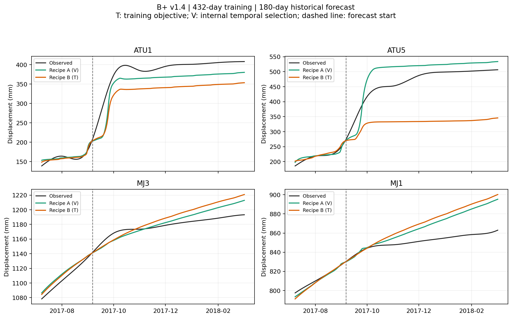
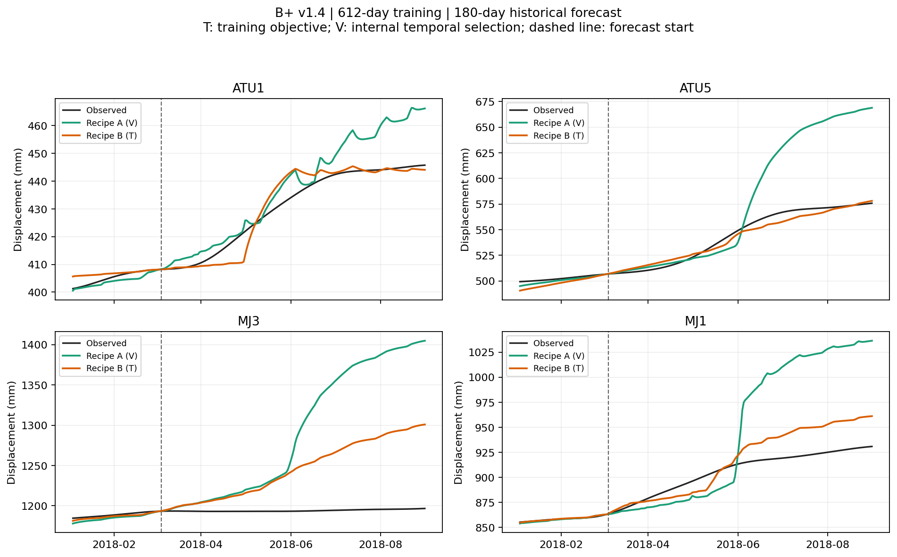

# 藕塘 B+ 优化与训练内选模 v1.4：实施与结果

## Material Passport

- 日期：2026-09-11。用户在 v1.4 检查和方案提交后授权“继续进行下一步”。
- Origin Skill/Mode：academic-research-suite / experiment-agent / run + validate，当前对话内执行。
- Verification Status：ANALYZED；数值复算与实现核验逐项记录，不把单次标定称为完整优化复现。
- 执行前依据：[v1.4 方案](ootang_bplus_optimization_selection_plan.v1.4.md)、
  [只读检查](ootang_bplus_optimization_review.v1.4.md) 和原版本结果。
  方案提交 `2a53df6`，实现与相关测试提交 `7a6db5d`。
- 范围：同一藕塘剖面 ATU1、ATU5、MJ3、MJ1，仍以物理引导概率位移预测为研究目标。
  本次子任务是物理标定和选模诊断，不含概率区间、神经训练、预警或新案例。

## 1. 输入、公式与实施边界

输入是 v1.2 已归档的前 792 日监测副本，2016-07-01—2018-08-31。
启动前核对导师 ZIP 最终交付的 `physical_model.py`、`physical_solver.c`、
`calibrate_boundary.py` 及已编译原生库；原件定位沿用 [v1.1 §3.1](ootang_bplus_probabilistic_experiment_plan.v1.1.md)。
54 参数、存储尺度、边界、64 子步、活动集约束和物理方程保持。

子任务 A 固定 v1.3 的 J1；各长度从同前缀 v1.2/v1.3 已有四个候选中按训练 J1 选择锚点，
分别续算一次 800 nfev。记录原始锚点与边界内移初值；只有复算目标下降超过 1e-7 且物理检查
通过，续算结果才替代锚点。A 不新增预测评分。

子任务 B 固定 v1.2 的 J0；新增 252/342 日的干净 A/B 配方，四阶段预算各为
900、800、800、800 nfev，末日权重分别为 0、n、100n、100n。
复用同配方的 432/612 日 v1.2 结果。A 的 J1 参数不参与 B。
所有轨迹由首日连续递推，预测只使用实际雨量与库水位，分界不对齐实测。

| 外层训练长度 | 内层训练长度 | 内层验证长度 | 外层预测 |
| ---: | --- | ---: | --- |
| 432 日 | 252 日 | 180 日 | 2017-09-06—2018-03-04 |
| 612 日 | 252、342、432 日 | 各 180 日 | 2018-03-05—2018-08-31 |

T 按完整外层训练的 J0 选择配方；V 按内部各窗口和四点的平均 RMSE 选择，
1e-6 mm 内的平局再比 MAE，仍平局取 A。选择完整四点配方，然后使用该配方在完整外层训练上
拟合的参数。参数锁、内部指标锁、选择锁均在外层评分前生成，禁止覆盖。
432 日任务只有一个内部窗口；612 日的三个窗口含 540 个窗口日，但仅 360 个不同日期。

## 2. 子任务 A：同前缀续算

两条续算均耗尽预定的 800 nfev。复算确认训练 J1 下降，两次都保留续算参数。

| 训练长度 | 原锚点 | J1 变化 | 降幅 | 续算后 optimality | 是否达到 gtol |
| ---: | --- | --- | ---: | ---: | --- |
| 432 日 | v1.3 B | 16.367884 → 16.160747 | 1.2655% | 2.1291 | 否 |
| 612 日 | v1.2 B | 32.444117 → 31.497799 | 2.9168% | 136.9006 | 否 |

目标仍可下降，支持把更好的同前缀参数保留下来；**没有达到既定的一阶容差，也未验证外推改善**。
本次不追加预算，不把两个小幅目标降幅解释成参数可辨识性或物性学习。
两次最大单参变动分别为 `log_tauBulk` 的边界跨度 3.26%、`log_eta_O1_down` 的 8.48%，
均按存储尺度计算；目标下降与参数稳定是不同判断。

实际 nfev 为 1,600，优化/Jacobian 原物理前向为 80,415 次，监控运行墙钟时间约 60.0 秒。
另有初始目标检查 4 次、末态复算 2 次、轨迹前向 10 次、梯度诊断前向 112 次；
10 条独立力学轨迹覆盖 333,440 个子步。最后的独立验证再调用 16 次原物理前向，没有重复拟合。
保存的 10 条曲线重新前向最大差为 0 mm，540 个受保护文件与 19 份科学/测试源码哈希保持。
产物：[子任务 A](../results/ootang_bplus_v1_4/20260911_optimization/)，已提交 `a2299c9`。

## 3. 子任务 B：训练内选模

四条新链均完成，实际新 nfev 为 **10,870/13,200**，优化/Jacobian 前向 **535,240** 次，
监控拟合墙钟时间为 1,144.822 秒。最终三条链达到预算上限、一条按 ftol 停止；
**0/4 达到 optimality≤1e-7**。每阶段原始参数、初值内移、目标分量与停止信息均保留。

| 新训练长度 | 配方 | 四阶段总 nfev | 最终 J0 | 最终 optimality | 末阶段停止 |
| ---: | --- | ---: | ---: | ---: | --- |
| 252 | A | 2,754 | 1.313964 | 0.001822 | 800 nfev 上限 |
| 252 | B | 2,038 | 1.310207 | 0.000785 | ftol，4 nfev |
| 342 | A | 2,778 | 14.786263 | 0.006771 | 800 nfev 上限 |
| 342 | B | 3,300 | 17.575613 | 6.506117 | 800 nfev 上限 |

每个内部窗口的四点平均 RMSE 均选择 A；612 日三个窗口的等权平均仍选 A。
这不是窗口间优胜者互换，但其共同选择也没有在下一个外层预测段保持优势。

| 内层训练长度 | 配方 A 验证 RMSE / mm | 配方 B 验证 RMSE / mm | 优胜配方 |
| ---: | ---: | ---: | --- |
| 252 | 57.5074 | 60.7390 | A |
| 342 | 90.6272 | 99.7306 | A |
| 432 | 25.4663 | 58.0122 | A |
| 612 日外层的三窗平均 | 57.8670 | 72.8273 | A |

两个外层的 T 都选择 B，V 都选择 A。下表箭头为 T → V，RMSE 为四点指标的算术平均，
不是把所有误差合并后开方。训练排除首 30 日，预测全 180 日计分。

| 外层训练长度 | T / V 配方 | 训练 RMSE / mm | 预测 RMSE / mm | 严格同时改善 |
| ---: | --- | --- | --- | --- |
| 432 | B / A | 7.1230 → 9.3051 | 58.0122 → 25.4663 | 0/4 |
| 612 | B / A | 7.1930 → 9.9538 | 22.2448 → 63.3987 | 0/4 |

| 外层 | 点位 | 训练 RMSE / mm | 预测 RMSE / mm | 训练 MAE / mm | 预测 MAE / mm |
| ---: | --- | --- | --- | --- | --- |
| 432 | ATU1 | 9.664 → 9.695 | 55.386 → 32.249 | 7.425 → 7.418 | 54.514 → 30.036 |
| 432 | ATU5 | 4.005 → 12.199 | 140.064 → 41.925 | 2.893 → 9.275 | 134.606 → 38.287 |
| 432 | MJ3 | 6.545 → 7.027 | 14.721 → 9.756 | 5.643 → 6.071 | 12.546 → 8.285 |
| 432 | MJ1 | 8.278 → 8.299 | 21.878 → 17.935 | 6.927 → 6.861 | 18.144 → 14.543 |
| 612 | ATU1 | 8.205 → 11.056 | 4.264 → 9.647 | 6.205 → 7.553 | 2.957 → 7.331 |
| 612 | ATU5 | 9.456 → 11.610 | 5.022 → 52.227 | 7.909 → 9.001 | 4.347 → 36.672 |
| 612 | MJ3 | 5.607 → 8.593 | 61.046 → 124.337 | 4.852 → 7.553 | 50.593 → 96.153 |
| 612 | MJ1 | 5.503 → 8.557 | 18.648 → 67.384 | 3.924 → 5.675 | 15.311 → 52.683 |

432 日四点预测 RMSE/MAE 均改善，但四点训练 RMSE 均变差，因此全部未满足预定四项验收。
612 日四点训练与预测 RMSE/MAE 全部变差。**严格同时改善合计 0/8**；没有追溯改变容差、
按点混用配方，或利用外层误差重选窗口。完整偏差和差值见
[comparison.csv](../results/ootang_bplus_v1_4/20260911_selection/comparison.csv)。

图示为最后 60 日训练和后续 180 日条件预测；虚线为预测开始，曲线没有在此重置。
原自动导出图保留；下列副本仅调整日期刻度密度与页边距，图源数据哈希未变。





产物：[子任务 B](../results/ootang_bplus_v1_4/20260911_selection/)，已提交 `46b4a27`。

## 4. 实现与验证

独立模块为 `code/physics_guided_optimization_selection/`，未修改旧科学模块。
运行前 25 项相关测试通过：v1.4 的 12 项、v1.2 的 6 项、v1.3 的 7 项；Ruff 与格式检查通过。
新测试覆盖短前缀读取、拒绝长前缀参数、未来位移扰动隔离、边界内移与原参数保留、目标/差分
一致性、调用预算、窗口日期、平局/失败、共同评分分母和逐点四项验收。

两个子任务使用不同且不可覆盖的运行目录，以便分别 commit。B 的 manifest 引用 A，
累计新 nfev 不超过 14,800；拟合进程占用时间合计硬上限 30 分钟，不含两个步骤间的文档或 commit 时间。
最多三个数值进程，每库一线程；30 秒记录状态，90 秒无进展只作提示，不自动重试。
优化、Jacobian、独立前向复算与子步审计分别计数。

A+B 合计新 nfev **12,470/14,800**、优化/Jacobian 前向 **615,655/828,800** 次，
监控拟合耗时 **1,204.845 秒（约 20.1 分钟）**，未触发超时、重试或追加预算。

B 的独立复算逐项检查 16 个拟合阶段、16 条完整轨迹和 568,064 个力学子步，
保存曲线再次前向的最大差为 **0 mm**，原/独立力学实现最大差为 `2.273737e-13 mm`。
四个完整外层候选与 v1.2 原曲线一致，短/长前缀差均为 0。
另有 32 次初始目标检查、16 次末态检查和 16 次原生轨迹前向；最后的独立验证增加 64 次
原生前向，未重新拟合。模型的全部验证调用不与 nfev 混写。

B 结束后再次运行 25 项相关 unittest 测试，全部通过；当前环境没有 pytest，误用 pytest
入口时的启动失败已单独保存，随后使用仓库已有 unittest 入口，没有安装新依赖。
Ruff 与格式检查通过；两幅可读图件逐幅查看。
611 个受保护原件/历史文件及 19 份科学/测试源码哈希一致；8 条新拟合/复用参数来源、
参数锁→选模锁→外层评分顺序再次核对。B 的产物索引覆盖其余 120 个文件。

保存原 NumPy 矩阵乘法警告；以有限值、原/独立轨迹、子步约束和复算误差判断数值是否合格，
不通过修改公式或裁剪结果消除警告。

解释检查覆盖 11/11：逐窗逐点对照保留，避免总体结果替代个体结论；单案例不支持代表性
抽样或群体推广；无碰撞变量调整或因果估计；无事件基准率、p 值或显著性检验；全部起点及
停止记录保留，固定预算与规则不追溯筛选；不把目标下降解释为自然因果或反向因果。
重叠窗口不是独立重复，反复使用的历史数据不是新盲测，模型状态不是新增实测真值。

## 5. 结论与限制

本版实施与数值检查完成，**稳定四点提升仍未实现**，用户/导师接受状态待定。
A 说明更好的同前缀参数可以保留且训练目标还有小幅下降空间，但优化仍未达到既定容差，
也未评价其外推效果。B 的单窗和多窗选择均未满足完整精度目标；这只约束本版的两个配方及
历史窗口，不等于否定所有时序选模方法。

按固定停止规则结束 v1.4，保留原 B+ 基线及各版负结果。后续建议先形成训练内误差结构与
概率修正目标的新版本方案，明确需要修正的时序偏差、允许输入和评价边界，再决定
ConvLSTM/方程内修正/PINN 的设计。该方向尚属建议，未增加训练预算、未启动新神经模型；
本轮结果不能宣称概率覆盖改善或已达到导师目标。

## 6. 复现与备份

下列命令需在仓库根目录和现有 `.venv` 中执行。新拟合必须使用新的 run id，保持本次目录只读。

```bash
PYTHONPATH=code .venv/bin/python -m physics_guided_optimization_selection.run --task A --run-id another_optimization
PYTHONPATH=code .venv/bin/python -m physics_guided_optimization_selection.report results/ootang_bplus_v1_4/another_optimization
PYTHONPATH=code .venv/bin/python -m physics_guided_optimization_selection.verify results/ootang_bplus_v1_4/another_optimization --write
PYTHONPATH=code .venv/bin/python -c "from pathlib import Path; from physics_guided_optimization_selection.run import index_artifacts; index_artifacts(Path('results/ootang_bplus_v1_4/another_optimization'))"
PYTHONPATH=code .venv/bin/python -m physics_guided_optimization_selection.run --task B --optimization-run another_optimization --run-id another_selection
```

子任务 A 归档哈希索引后，B 引用该封存目录；B 的报告、复算及索引命令同理，只替换结果目录。
已归档结果只需运行不带 `--write` 的 verify，完全不拟合。
本轮实际命令、源代码及测试快照、依赖、输入、原件和参数哈希均归档于各自 manifest。

分步备份：`7a6db5d` 实现与相关测试、`a2299c9` 子任务 A 结果、`46b4a27` 子任务 B 结果。
本结果文档、progress 与导航另作一个文档提交；仅本地 commit，没有 push。
