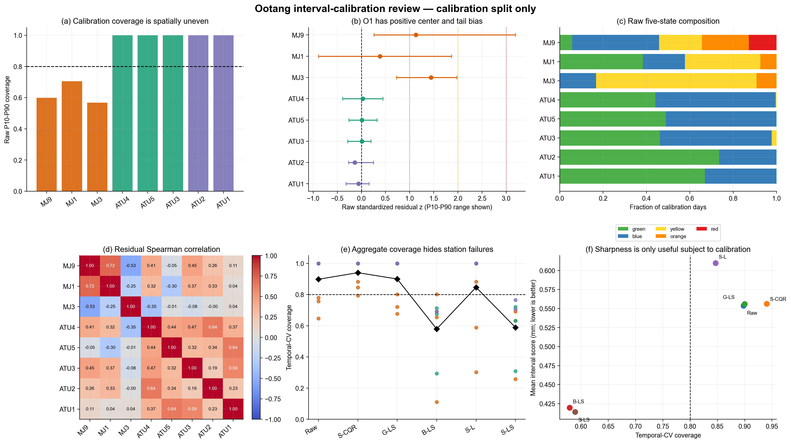
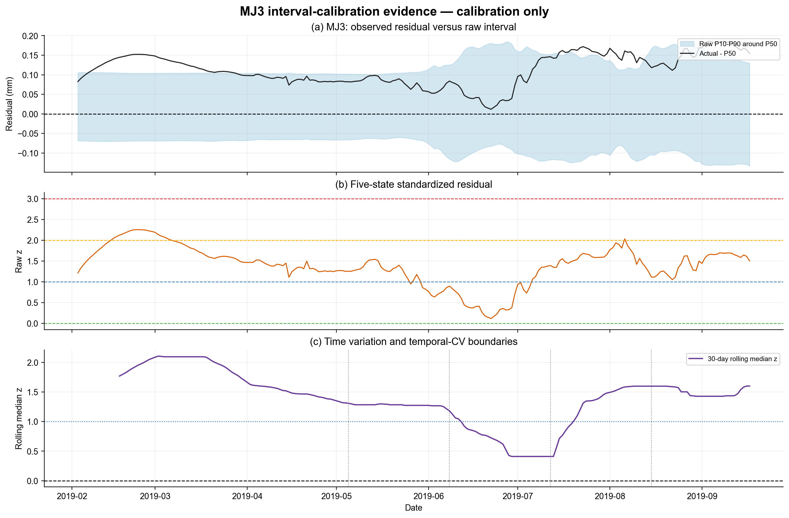
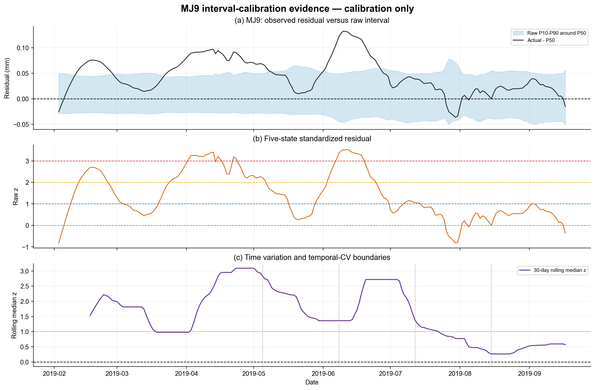
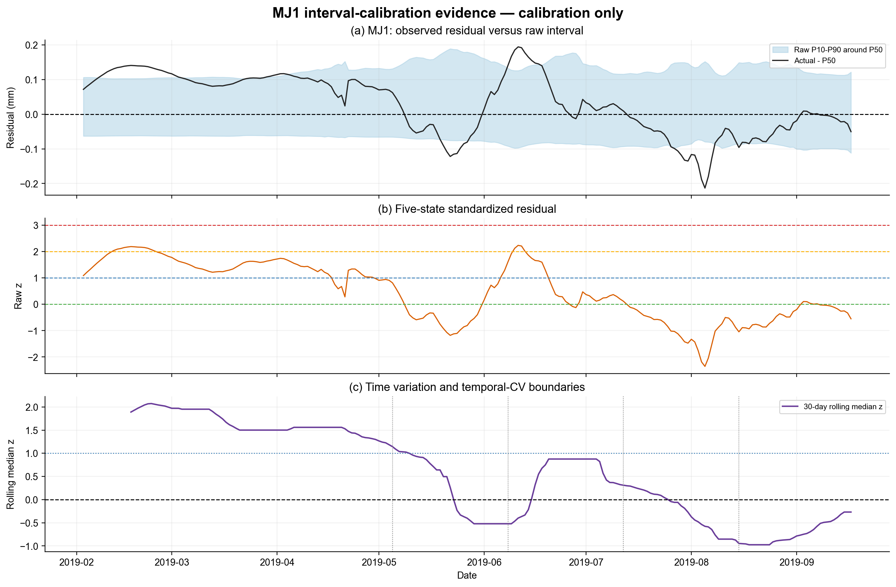

# 藕塘滑坡区间校准专家审查

## Material Passport

- Origin Skill: `academic-research-suite / experiment-agent`
- Origin Mode: `validate`
- Origin Date: `2026-07-26`
- Verification Status: `ANALYZED`
- Version Label: `ootang_interval_calibration_expert_review_v1`
- Source Commit: `c74a8a3`
- Review Scope: 藕塘 8 个测点的区间分布质量、空间偏差与 calibration-only 方法比较
- Excluded Scope: 不用 test 选择方法或参数；不读取、不分析、不启动 Vajont
- Data Lineage Status: `BLOCKED`
- Formal Warning Output: `false`

## 1. 专家结论

本轮没有找到可以直接提升为五级 `μ+kσ` 映射正式校准器的固定方案。

建议冻结以下审查状态：

```text
interval_calibration_decision = no_fixed_calibration_candidate_promoted
current_raw_interval_role = diagnostic_observed_state_only_not_formal
current_station_conformal_role = coverage_sensitivity_only_not_mu_sigma_calibration
global_fixed_location_scale = rejected_for_spatial_masking
block_fixed_location_scale = rejected_for_within_o1_heterogeneity
station_fixed_location_or_scale = rejected_for_temporal_instability
formal_warning_output = false
vajont_used = false
```

这不是“什么都没有做出来”，而是排除了三个会直接改变预警颜色、但在时间外推中不可靠的错误方向：

1. 不能用 8 点总体覆盖率代表逐测点可靠性；
2. 不能让 O1 三点完全共用一个固定校准器；
3. 不能把当前只扩宽 P10/P90、却不移动 P50 的 conformal 端点直接解释为五级状态所需的完整 `μ/σ` 校准。

新增数据血缘审查后，当前最稳妥的技术方向调整为：先恢复原始观测锚点和日值处理链；在血缘门禁通过后，再诊断概率模型的测点特异性与时变偏差，并预先定义“逐测点时变中心 + 单独上尾”的校准方案。现阶段不应依据本轮结果改动正式阈值、运行颜色或 test 结果。

## 2. 证据边界与来源优先级

本轮遵循以下顺序：

1. 指定 Word：
   [`物理引导的阶跃型水库滑坡变形智能概率预测模型与预警方法研究.docx`](../literature/物理引导的阶跃型水库滑坡变形智能概率预测模型与预警方法研究.docx)
2. 已确认的开发与审查约束：
   [`advisor_review_action_plan.md`](advisor_review_action_plan.md)
3. 版本化代码、配置、藕塘数据和可复算产物；
4. 原始统计方法论文只用于评价原则和备选方向，不替藕塘发明预警阈值。

用户本人的藕塘毕业论文没有作为本轮公式、阈值或方法选择依据。

指定 Word 明确给出 `μ`、`μ+σ`、`μ+2σ`、`μ+3σ` 的五级区域，但没有给出：

- 如何把 P10/P50/P90 转换为 `μ/σ`；
- 如何重校准偏置、尺度或偏度；
- 如何在测点间共享校准参数；
- 覆盖率或分布校准的通过门槛。

因此项目仍使用已确认的项目近似：

```text
μ_t = P50_t
σ_t = (P90_t - P10_t) / (2 × 1.28155)
z_t = (U_t - μ_t) / σ_t
```

本轮检查的正是这套近似及其输入是否具有足够的逐点、逐时稳定性，不能把审查方法写成指定 Word 的原方法。

## 3. 数据隔离与可复核性

### 3.1 决策输入

- split：`calibration`
- 日期：2019-02-03 至 2019-09-17，连续 227 个物化日历行
- 测点：8
- 行数：1816
- 自然主键重复：0
- 非有限输入：0
- 分位数交叉：0
- calibration 切片 SHA-256：
  `5cd1323ea4bc3403a4f678387d4d89e5ab67551daf4072c7ec4b173239c1518f`

输入文件 [`forecast_predictions.csv`](../figures/convlstm/forecast_predictions.csv) 的 SHA-256 为：

```text
2f82e0cd764d91d9415295e8356b6d8d3cee7183df7cfe70831a0e8c4a3ff459
```

### 3.2 test 隔离的真实边界

本轮候选拟合、方法比较和专家选择中：

```text
test_rows_used_for_fit = 0
test_rows_used_for_method_selection = 0
test_metrics_used_for_method_selection = 0
```

但必须诚实记录：当前 `forecast_predictions.csv` 和既有模型产物早已物化 test 行，前一轮 v2 审查也核对过 test 摘要。因此，这批 test 已不能再声称是历史上“从未看过”的纯盲测集。

本轮能保证的是：**仓库代码层面没有用 test 反向选择本轮校准方法或参数。** 但 fit/calibration/test 只是发布物化序列上的日历切分；源序列生成是否使用月内未来锚点未知。真正独立的最终检验需要来源清楚的原始时间戳与观测值，并在每个时间折内部重新完成日值生成；仅增加同类物化序列的未来时段不能自动解除血缘问题。

### 3.3 可复现性

- 运算类型：确定性；
- temporal-CV OOF 行：`4 folds × 34 days × 8 stations × 6 methods = 6528`；
- 同一环境连续重跑两次，全部 CSV、JSON 和 PNG 的组合 SHA-256 均为：
  `6ce9c80858841e08281fb45db6b32eadf2b25b10a4ea1e0fab4381b801c081cf`；
- 独立复算与既有 `interval_calibration_diagnostics.csv` 的原始覆盖率、偏差和 qhat 一致。

审查计算协议见：

- [`review protocol`](../figures/warning_review/interval_calibration/ootang_interval_calibration_review_protocol.json)
- [`temporal-CV folds`](../figures/warning_review/interval_calibration/ootang_interval_candidate_cv_folds.csv)
- [`OOF predictions`](../figures/warning_review/interval_calibration/ootang_interval_candidate_oof_predictions.csv)

### 3.4 数据血缘限定

[`藕塘数据血缘专家审查`](ootang_data_lineage_expert_review.md)确认，8 条位移和 GWT 在全部 48 个自然月内具有强分段三次指纹，且 fit/calibration/test 三个关键边界都切穿同一个月内三次段。因此，本审查只能复算“模型相对于发布物化序列”的残差和区间失配，不能验证相对于独立原始 GNSS 日观测的覆盖率或测量不确定性。

## 4. 当前实现到底用了什么

### 4.1 五级运行仍使用未校准的 P10/P50/P90

`code/warning/operational_run.py` 只加载 `actual/p10/p50/p90`，随后直接调用 `classify_observed_interval_states()`。`code/warning/interval_state.py` 以未校准 P50 为 `μ`，以未校准 P10–P90 总宽度反推 `σ`。本节的 `raw` 只表示“未校准模型分位数”，不表示原始监测数据。

对 v2 时间线逐行复核：

- `interval_mu - raw P50` 最大绝对差为 0；
- `interval_sigma - raw sigma` 最大绝对差约 `9.7×10^-17`；
- `calibrated_p10/calibrated_p90/qhat_mm` 没有进入当前五级状态。

因此，现有 conformal 端点不能被误写成当前预警颜色已经采用的校准。

### 4.2 当前 conformal 只做逐点对称扩宽

项目现有实现对每个测点计算：

```text
score = max(P10 - U, U - P90)
qhat = max(Q_higher_level(score), 0)
P10* = P10 - qhat
P90* = P90 + qhat
P50* = P50
```

全 calibration 同批拟合并回看自身时：

- ATU1–ATU5：`qhat=0`
- MJ1：`qhat=0.011561 mm`
- MJ3：`qhat=0.028171 mm`
- MJ9：`qhat=0.030821 mm`

其同批表观覆盖率在 O1 三点均恰为 `0.8106`。这只能说明 qhat 的有限样本构造按预期工作，不能证明跨时间泛化；更不能修正 P50 的中心偏差。

## 5. calibration 原始质量审查

表中 bias 为 `P50-实测`，负值表示模型低估实测位移。`z>1` 对应区间指标至少进入 yellow；green 为 `实测≤P50`。

| 测点 | 原始覆盖率 | 同批 conformal 覆盖率 | P50 bias mm | 正残差天数 | `z` 中位数 | `z>1` | `z>3` | green | red | lag-1 `z` |
|---|---:|---:|---:|---:|---:|---:|---:|---:|---:|---:|
| MJ9 | 0.599 | 0.811 | -0.0455 | 214 | 1.127 | 123 | 29 | 13 | 29 | 0.988 |
| MJ1 | 0.705 | 0.811 | -0.0308 | 140 | 0.386 | 96 | 0 | 87 | 0 | 0.990 |
| MJ3 | 0.568 | 0.811 | -0.1128 | 227 | 1.442 | 189 | 0 | 0 | 0 | 0.985 |
| ATU4 | 1.000 | 1.000 | -0.0048 | 127 | 0.027 | 1 | 0 | 100 | 0 | 0.985 |
| ATU5 | 1.000 | 1.000 | -0.0126 | 116 | 0.012 | 0 | 0 | 111 | 0 | 0.971 |
| ATU3 | 1.000 | 1.000 | -0.0115 | 122 | 0.013 | 5 | 0 | 105 | 0 | 0.979 |
| ATU2 | 1.000 | 1.000 | +0.0143 | 60 | -0.137 | 0 | 0 | 167 | 0 | 0.976 |
| ATU1 | 1.000 | 1.000 | +0.0158 | 75 | -0.057 | 0 | 0 | 152 | 0 | 0.940 |

主要结论：

1. **总体原始覆盖率 `0.859` 没有代表性。** 五个 ATU 点全部为 100% 覆盖，而 O1 只有 56.8%–70.5%。
2. **ATU 的主要问题是过宽。** 它们的 `z` 大多被压缩在 0 附近，简单扩宽不会改善。
3. **O1 的主要问题是中心偏低和上尾欠覆盖。**
4. **MJ3 是最明确的中心偏差：227/227 天实测均高于 P50，green 为 0。**
5. **MJ9 是最明确的窄区间/右尾问题：29 天 `z>3`。**
6. **MJ1 是时变问题：平均看似较轻，但残差在校准期内改变方向。**
7. 每点 `z` 的 lag-1 自相关为 0.94–0.99，227 天绝不能当作 227 个独立样本随机切分。

此外，P50 并非 P10/P90 的严格中点。O1 的平均下/上半宽分别为：

- MJ1：0.0773 / 0.1306 mm
- MJ3：0.0866 / 0.1268 mm
- MJ9：0.0347 / 0.0512 mm

所以用总宽度反推单一对称 `σ` 不能同时复原原始 P10 和 P90；这是项目正态近似的结构性限制。



完整逐点表：
[`ootang_interval_calibration_baseline.csv`](../figures/warning_review/interval_calibration/ootang_interval_calibration_baseline.csv)

## 6. 地质分区与竞争解释

### 6.1 O1 不能被当成同一误差总体

calibration 的 227 天中：

- O1 至少一个点 `z>1`：221 天；
- O2 至少一个点 `z>1`：5 天；
- O3 至少一个点 `z>1`：0 天；
- O1 至少两个点同时为正残差：217 天；
- O1 三点同时为正残差：137 天。

但 O1 三点残差的 Spearman 相关为：

| 测点对 | 残差相关 | 残差一阶差分相关 |
|---|---:|---:|
| MJ1–MJ9 | +0.723 | +0.668 |
| MJ1–MJ3 | -0.251 | +0.281 |
| MJ3–MJ9 | -0.533 | +0.284 |

三等分时段的残差中位数进一步显示不同方向：

| 测点 | T1 | T2 | T3 |
|---|---:|---:|---:|
| MJ1 | +0.105 | +0.035 | -0.043 mm |
| MJ9 | +0.058 | +0.068 | +0.020 mm |
| MJ3 | +0.112 | +0.081 | +0.156 mm |

因此：

- MJ1 与 MJ9 有一部分共同变化；
- MJ3 的长期偏差结构与另外两点不同；
- O1 可以作为空间背景或部分池化先验，不能作为完全可交换的单一校准组。

[Wang 等（2025）](../literature/Journal%20of%20Geophysical%20Research%20%20Machine%20Learning%20and%20Computation%20-%202025%20-%20Wang%20-%20Enhancing%20Landslide%20Displacement.pdf)支持 O1/O2/O3 的空间拓扑和局部依赖，但没有规定同一分区测点必须同分布，也没有给出本项目的校准参数。因此该论文不能支持 O1 完全池化。

### 6.2 模型偏差、真实局部变形与测量问题

| 解释 | 证据等级 | 本轮判断 |
|---|---|---|
| 模型相对于物化序列的测点特异残差 | 高（描述性） | MJ3 全期正残差；MJ9 214/227 天正残差；预测日增量中位数明显低于目标序列；ATU 与 O1 的误差型态相反；来源可能同时包含模型失配和上游序列处理 |
| 发布序列预处理结构 | 高（存在性） | 自然月分段三次指纹可影响日增量、残差自相关和站点差异；生成算法与锚点缺失，不能与模型偏差完全分离 |
| 真实 O1 局部变形 | 中 | O1 具有局部水文—地质响应基础，且多个时段出现分区独立偏离；但残差是“真实响应 + 模型失配”的混合量 |
| 当前 calibration 的测量方向错误 | 低 | 本期 O1 累计位移与绝大多数日增量为正，未见全期符号翻转；但原始 GNSS 方向、仪器改正和宏观巡查记录仍缺失 |

当前 ConvLSTM 外生输入只有 `RWL`、`RWL_rate` 和 7/15/30 日降雨累计；发布建模表中的 GWT 与温度没有进入该模型。这个事实只支持“模型可能遗漏 O1 的局部响应变量”作为待检假设，不能据此声称某一环境因子已经被证明为偏差原因。

逐时段和相关数据：

- [`temporal segments`](../figures/warning_review/interval_calibration/ootang_interval_calibration_temporal_segments.csv)
- [`monthly diagnostics`](../figures/warning_review/interval_calibration/ootang_interval_calibration_monthly.csv)
- [`residual correlations`](../figures/warning_review/interval_calibration/ootang_interval_residual_correlations.csv)

## 7. 物化序列上的 calibration-only 日历后置块比较

### 7.1 为什么用连续时间块

概率预测的评价应同时检查校准与锐度，而不能只追求更窄的区间。Gneiting、Balabdaoui 与 Raftery提出“在满足校准的前提下提高锐度”，并明确讨论了时间序列和交叉验证中的诊断；Gneiting 与 Raftery提出的 interval score 同时惩罚区间宽度和漏覆：

- [Probabilistic forecasts, calibration and sharpness, JRSSB 2007](https://doi.org/10.1111/j.1467-9868.2007.00587.x)
- [Strictly Proper Scoring Rules, Prediction, and Estimation, JASA 2007](https://doi.org/10.1198/016214506000001437)

项目当前逐点对称扩宽与 conformalized quantile regression 的区间分数构造相近，但本轮没有声称完全复现该论文：

- [Conformalized Quantile Regression, NeurIPS 2019](https://proceedings.neurips.cc/paper_files/paper/2019/hash/5103c3584b063c431bd1268e9b5e76fb-Abstract.html)

这些论文支持评价原则和候选方向，不提供藕塘预警阈值、分区共享规则或本项目的固定校准参数。

### 7.2 时间折

| Fold | 参数拟合期 | n 天 | 后续验证期 | n 天 |
|---|---|---:|---|---:|
| 1 | 2019-02-03–05-04 | 91 | 2019-05-05–06-07 | 34 |
| 2 | 2019-02-03–06-07 | 125 | 2019-06-08–07-11 | 34 |
| 3 | 2019-02-03–07-11 | 159 | 2019-07-12–08-14 | 34 |
| 4 | 2019-02-03–08-14 | 193 | 2019-08-15–09-17 | 34 |

共评价 136 个日历后置日、1088 个测点—日期。每折参数只使用验证块以前的 calibration 行；这保证仓库代码层面的先后顺序，不证明上游日值生成在边界两侧独立。

### 7.3 候选

比较六种固定方案：

1. raw；
2. 逐点对称 conformal；
3. 全局稳健 location-scale；
4. O1/O2/O3 分区稳健 location-scale；
5. 逐点稳健 location-only；
6. 逐点稳健 location-scale。

location-scale 使用：

```text
z = (U-P50)/σ
m_g = median(z)
b_g = Q_higher,0.8(|z-m_g|) / 1.28155

P50* = P50 + m_g σ
P10* = P50* - b_g(P50-P10)
P90* = P50* + b_g(P90-P50)
```

location-only 固定 `b_g=1`。这是本轮审查候选，不是指定 Word 公式，也没有被提升为运行规则。

### 7.4 总体结果

bias 为 `实测-P50*`。Interval score 和 pinball 越低越好，但只有在覆盖和逐点稳定性可接受时才有意义。

| 方法 | P50 bias mm | P50 MAE | Coverage | Width | Interval score | P10 pinball | P90 pinball |
|---|---:|---:|---:|---:|---:|---:|---:|
| raw | +0.0235 | **0.0688** | 0.898 | 0.521 | 0.554 | 0.0260 | 0.0294 |
| 逐点 conformal | +0.0235 | **0.0688** | 0.940 | 0.542 | 0.556 | 0.0267 | 0.0289 |
| 全局 location-scale | -0.0011 | 0.0723 | 0.900 | 0.525 | 0.556 | 0.0239 | 0.0317 |
| 分区 location-scale | -0.0082 | 0.0709 | 0.579 | 0.151 | 0.420 | 0.0211 | 0.0209 |
| 逐点 location-only | -0.0074 | 0.0724 | 0.847 | 0.521 | 0.610 | 0.0309 | 0.0301 |
| 逐点 location-scale | -0.0074 | 0.0724 | 0.589 | 0.150 | **0.414** | 0.0203 | 0.0211 |

不能把最后两种较低的 interval score 写成“最好”。它们把区间收窄到约 0.15 mm，但覆盖率同时降至约 58%–59%；这是失校准带来的表面锐度。

四折 coverage 范围为：

| 方法 | 最低 | 最高 |
|---|---:|---:|
| raw | 0.846 | 0.930 |
| 逐点 conformal | 0.912 | 0.974 |
| 全局 location-scale | 0.838 | 0.949 |
| 分区 location-scale | 0.419 | 0.746 |
| 逐点 location-only | 0.783 | 0.897 |
| 逐点 location-scale | 0.401 | 0.805 |

逐点结果和参数：

- [`candidate summary`](../figures/warning_review/interval_calibration/ootang_interval_candidate_cv_summary.csv)
- [`station metrics`](../figures/warning_review/interval_calibration/ootang_interval_candidate_station_metrics.csv)
- [`fold metrics`](../figures/warning_review/interval_calibration/ootang_interval_candidate_cv_fold_metrics.csv)
- [`candidate parameters`](../figures/warning_review/interval_calibration/ootang_interval_candidate_parameters.csv)

## 8. MJ3、MJ9、MJ1 的决定性证据

| 方法 | MJ3 bias / coverage | MJ9 bias / coverage | MJ1 bias / coverage |
|---|---:|---:|---:|
| raw | +0.1135 / 0.647 | +0.0376 / 0.779 | -0.0164 / 0.757 |
| 逐点 conformal | +0.1135 / 0.794 | +0.0376 / 0.882 | -0.0164 / 0.846 |
| 全局 location-scale | +0.1020 / 0.676 | +0.0333 / 0.801 | -0.0269 / 0.721 |
| 分区 location-scale | -0.0218 / 0.801 | -0.0150 / 0.654 | -0.1462 / 0.110 |
| 逐点 location-only | -0.0227 / 0.882 | -0.0313 / 0.588 | -0.1285 / 0.301 |
| 逐点 location-scale | -0.0227 / 0.691 | -0.0313 / 0.632 | -0.1285 / 0.257 |

### 8.1 MJ3

- 全 calibration 实测都高于 P50；
- 固定逐点位置修正确实把 MAE 从 0.1135 降到约 0.0405 mm；
- 但 MJ3 偏差强度并非恒定，T2 明显减弱，T3 又升高；
- 单独扩宽区间可以改善覆盖，却仍然不会产生 center-corrected green。



### 8.2 MJ9

- 主要问题同时包含中心偏低、原始区间窄和右尾；
- 正残差在后期减弱，固定位置平移开始过校正；
- 当前对称 conformal 把覆盖提高到 0.882，但 interval score反而略变差，且 P50 不变。



### 8.3 MJ1

- MJ1 是拒绝固定校准器的决定性反例；
- T1/T2/T3 残差中位数由正转负；
- 用早期正偏拟合固定 location 后，后续验证 bias 达到约 `-0.1285 mm`；
- O1 共用校准更严重，MJ1 覆盖率只剩 0.110。



## 9. 方法处置

| 方法 | 处置 | 原因 |
|---|---|---|
| raw | 仅作未校准参照 | ATU 过宽、O1 欠覆盖且中心偏低 |
| 逐点对称 conformal | 仅保留覆盖敏感性 | O1 覆盖改善，但 P50 不变，总体过覆盖 |
| 全局 location-scale | 拒绝 | 被五个 ATU 点主导，掩盖 O1 |
| 分区 location-scale | 拒绝 | O1 内部不同步，对 MJ1 严重过校正 |
| 逐点 location-only | 拒绝固定版本 | MJ3 改善，但 MJ1/MJ9 随时间变号或减弱 |
| 逐点 location-scale | 拒绝固定版本 | 区间表面变窄，但多个站点和时间折严重欠覆盖 |

机器可读处置表：
[`ootang_interval_candidate_disposition.csv`](../figures/warning_review/interval_calibration/ootang_interval_candidate_disposition.csv)

## 10. 统计解释与谬误扫描

### 10.1 Overall Confidence

- 对“当前固定校准方案能否进入正式五级预警”：`RED_FLAG`
- 对“已识别出逐点、时变校准方向”：`CAUTION`
- 对“本轮 calibration-only 描述性复算是否可复现”：`SOLID`

本轮没有运行把 227 天视为独立样本的普通显著性检验。高自相关条件下，这类 p 值会制造虚假的样本量；因此使用连续时间块外推和方向一致性判断。

### 10.2 11/11 fallacy scan

| 谬误 | 严重度 | 本轮结果 |
|---|---|---|
| Simpson's paradox | RED_FLAG | 总体 0.859 覆盖掩盖 ATU=1.0 与 O1=0.568–0.705 的相反失配 |
| Ecological fallacy | CAUTION | O1 聚合接近目标不能推出 MJ1/MJ3/MJ9 各自校准可靠 |
| Berkson's paradox | NOTE | 没有按残差筛行，但 calibration 仍是固定历史窗口，外推范围有限 |
| Collider bias | NOTE | 本轮未做控制变量因果回归；环境量不进入校准因果裁决 |
| Base-rate neglect | CAUTION | 没有独立危险事件标签，不能把状态频率写成灵敏度、误报率或灾害概率 |
| Regression to the mean | CAUTION | 用早期极高 z 固定平移会在 MJ1 后期产生明显过校正 |
| Survivorship bias | NOTE | calibration 1816 行无缺失，但只代表现有已物化预测窗口 |
| Look-elsewhere effect | CAUTION | 比较了六个探索候选；因此不凭单个最优分数晋级，test 不参与选择 |
| Garden of forking paths | CAUTION | 方法自由度较多；本轮以版本化 review protocol、固定 folds 和全量结果保留审计 |
| Correlation ≠ causation | CAUTION | O1 残差同步不能证明库水、降雨或局部变形造成模型偏差 |
| Reverse causality | CAUTION | 没有独立事件与时滞识别，不能确定环境—变形的方向关系 |

## 11. 下一步技术路线

### 11.1 区间方法线

不再继续尝试固定 global/block/station 偏移。数据血缘门禁通过前，暂停新的神经输入和校准候选消融；它们无法区分模型漏项、空间异质性与目标序列构造效应。取得原始锚点并按折重建后，若继续校准，应先写成独立、可替换的方法协议：

1. **先过数据门禁，再做模型侧诊断**：检查 ConvLSTM 为什么相对于新建、按折生成的目标序列低估 MJ3/MJ9 增量；候选输入必须通过 fit/calibration 消融，不能因为“地质上可能相关”就直接加入。
2. **校准侧分两部分**：
   - 逐点时变中心；
   - 单独上尾/区间宽度。
3. O1 只允许部分池化或共同事件项；只有逐点 temporal-CV 同时改善中心偏差、coverage、interval score 和状态稳定性时才保留。
4. 不随机切分，不用 test 选窗口、更新规则或改阈值。
5. 方法、窗口和更新方式冻结后，当前 test 最多写作 `calendar-held-out descriptive evaluation on the materialized series`，不是首次盲测或确认性原始数据评价。

Gibbs 与 Candès 的 adaptive conformal work 支持在未知时间分布漂移下考虑在线/自适应覆盖方法，但它不直接提供本项目五级 `μ/σ` 的中心校准，也不授权事后挑窗口：

- [Adaptive Conformal Inference Under Distribution Shift, NeurIPS 2021](https://proceedings.neurips.cc/paper/2021/hash/0d441de75945e5acbc865406fc9a2559-Abstract.html)

因此，该论文只作为下一方案的高可信方法方向，不是本轮已经实施或通过的结果。

### 11.2 不依赖正式区间校准、可先推进的结构工作

在保持 `operational_draft_not_formal` 的条件下，只可继续不改变科学结论的结构和工程审查：

1. 同时输出 O1/O2/O3 分区候选和全滑坡体跨区确认；
2. 为 interval-only 候选显式增加 `interval_calibration_status=unresolved`；
3. 做 6/8 且每区至少 2 点的缺测/降级敏感性试验，仅用 calibration；
4. 不把未跨区候选改写为 green；
5. 不改变当前颜色、阈值或 test 结果，直到数据血缘、校准与 `V0` 三条阻断线分别解决。

## 12. 本轮没有做的事

- 没有改 `code/warning/interval_state.py`；
- 没有改 operational v2 配置或阈值；
- 没有用候选校准重写 calibration/test 颜色；
- 没有输出正式预警；
- 没有读取、运行或分析 Vajont；
- 没有把用户毕业论文当作权威来源。
