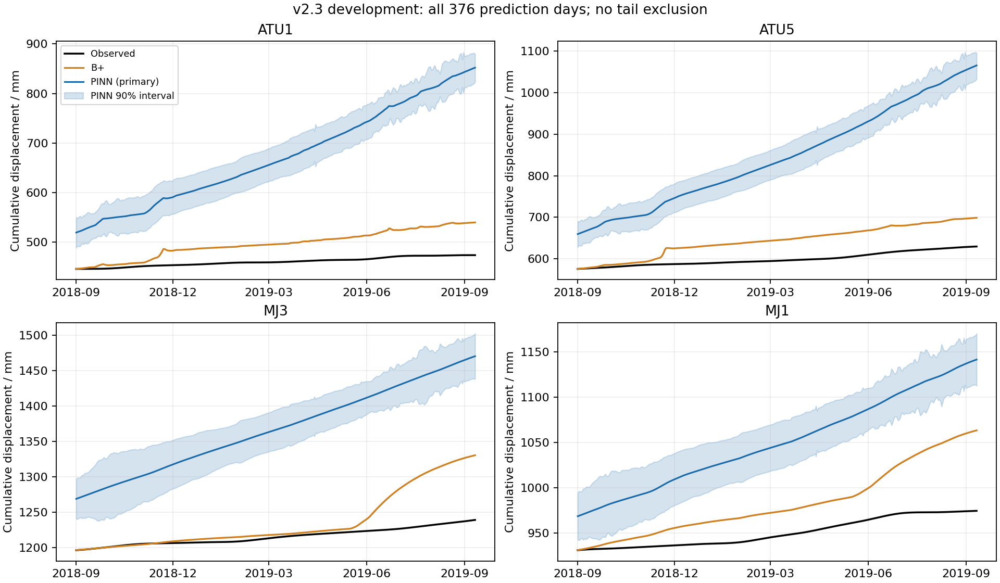

# v2.3 概率 PINN 开发段结果：未达标，已停止

日期：2026-09-12。**一次开发段实验已完成；预测精度、概率质量和神经近似检查均未通过。**
保留 B+，未进入最终 293 日训练，不追加轮数、种子或变体。导师目标仍未完成。

## Material Passport

| 项目 | 本次范围 |
| --- | --- |
| 用户授权 | “继续下一步，我批准启动新实验”；采用此前提出的 60 分钟总时限，08:24:03—09:24:03 UTC |
| 固定设计 | [v2.3 方案](ootang_probability_pinn_plan.v2.3.md)、[执行配置](../config/ootang_probability_pinn.v2_3.json)；只执行开发阶段 |
| 实际输入 | 原 792 日 B+ 参数、给定降雨/库水位、训练前缀观测、原开发 e0 分布；完整来源哈希随配置保存 |
| 实际执行 | 三种子 0/1/2，各 300 次更新，只取 e300；没有重新标定 B+ 或重训旧模型 |
| 结果状态 | 实现及重评分已核验；效果失败；没有导师验收，也不是新盲测 |

方法、输出和解释边界按 academic-research-suite 核对；不因本次负结果改写旧实验。

## 1. 同窗比较结果

本轮拟合段为 2016-07-01—2018-08-31，共 792 日，拟合评分排除首 30 日，保留 762 日。
**开发预测段是 2018-09-01—2019-09-11 的完整 376 日。**
以下数值不是导师最终 2019-09-12—2020-06-30 的 293 日成绩，不能与其直接跨窗排名。
尾段没有删去、裁剪、降权或重新定义。

均值参照为 M0 改进 B+；概率参照为同一开发段的原 v1.1-e0 已保存分布。
后者均值等于 B+，但 **M0 本身没有概率指标**，不称它为早期窗口的 P0。
下表概率参照列属于 v1.1-e0，不赋给 M0。

| 开发预测指标 | 固定参照 | v2.3 神经主输出 |
| --- | ---: | ---: |
| 四点平均 MAE / mm | **33.2651** | 177.5373 |
| 四点平均 RMSE / mm | **41.3684** | 190.1728 |
| 合并 RMSE / mm | **41.6045** | 200.0195 |
| 四点平均 CRPS / mm | **28.1156** | 166.6350 |
| 90% 区间覆盖率 | 36.24% | **0.00%** |
| 90% 区间平均宽度 / mm | 43.5018 | 63.5271 |
| 90% 区间评分 / mm | **388.4387** | 2976.8224 |

四点均值主标准没有任何一点改善，概率主标准也没有任何一点改善；九项配置检查均未通过。
区间变宽仍未覆盖观测，不能据“输出了区间”或“训练 loss 下降”认定概率效果成功。

| 测点 | B+ MAE | PINN MAE | B+ RMSE | PINN RMSE | e0 CRPS | PINN CRPS |
| --- | ---: | ---: | ---: | ---: | ---: | ---: |
| ATU1 | 35.9776 | 212.2380 | 40.3284 | 229.7053 | 29.6804 | 200.7085 |
| ATU5 | 43.5550 | 245.6444 | 48.5180 | 266.0211 | 37.3779 | 233.5356 |
| MJ3 | 20.5259 | 151.9915 | 36.3772 | 158.9043 | 18.6090 | 141.3796 |
| MJ1 | 33.0021 | 100.2755 | 40.2499 | 106.0606 | 26.7950 | 90.9162 |

以上误差/评分单位均为 mm。四点的 90% 覆盖率均为 0，不只是总体平均较低。
拟合有效日四点平均 MAE 也从 B+ 的 **9.5813** 增至 **34.1867 mm**；
平均 RMSE 从 12.8324 增至 40.9263 mm。因此拟合段本身就没有达到要求。



图中神经均值在预测起点已有明显高估，随后继续偏离；不能把本次失败归结为允许忽略的局部末端。
全部 80/90/95% 指标见[指标表](../results/ootang_probability_pinn_v2_3/20260912_development/metrics.csv)，
完整点日预测见[逐日表](../results/ootang_probability_pinn_v2_3/20260912_development/daily_predictions.csv)。

## 2. 独立物理对照说明了什么

每个种子的蠕变背景被冻结后，均由原 C 求解器从零状态完整重放。
三次同背景重放通过原有运动、反力、互补与舍入界检查，均作为 `replay_diagnostic` 单独保存。
**神经主输出没有被这些物理解替换。**

神经均值与对应 C 均值的逐日绝对差先按种子分别计算，再平均；四点分别为
**167.0935、195.8916、123.7453、58.9807 mm**（ATU1/ATU5/MJ3/MJ1）。
这远非可忽略的数值近似，不能把神经路径当成已通过物理验收的预测。
各神经路径原始负屈服间隙的最大值分别为 979.1657、968.5127、977.4271，
单位为原模型广义反力量纲；原始残差完整保留，没有用加权平均 loss 替代物理误差。

同背景 C 对照的开发平均 MAE/RMSE 为 **41.1096/48.5170 mm**，也高于 B+ 的 33.2651/41.3684 mm。
因此对照路径同样没有给出本窗改善证据；它不是另一个可供挑选的成功主模型。
同时，蠕变关系是在与失败的神经状态近似共同优化时学得的，这不构成对真实蠕变机制的独立否定或可辨识性结论。

本次可确认的是：**这组固定结构与 300 次更新配置没有学到足够准确的状态路径，也没有满足均值/概率目标。**
不能据此断言所有 PINN 都无效，也没有证据把问题简单归结为“只差更多轮数”。

## 3. 实现、复算与异常记录

- 实现：[模型组件](../code/physics_guided_pinn/creep.py)、[数据与同背景 C 接口](../code/physics_guided_pinn/creep_workflow.py)、
  [一次运行入口](../code/physics_guided_pinn/run_creep.py)。运行时源码及配置快照保存在结果目录；执行代码提交为 `003156d`。
- 八项相关检查通过：完整历史值/梯度、原运动和反力递推、有限差分梯度检查、训练前缀隔离、
  概率评分、日/子步对齐、800 日原 C 接口，以及禁止用较好的对照替换神经主输出；Ruff 通过。
- 原 792 日参数在完整 1168 日上重放，与原开发 e0 均值最大差为 **0 mm**。
  74688 个子步的张量记忆重建通过原检查，运动状态最大差 2.90e−11 mm，反力最大差 9.08e−10（原量纲）。
- 首次接口检查遇到原 C 保留的一个负 `dx=-6.1302e−9 mm`，其仍在原 `−1e−8 mm` 容差内，原 C 审核已通过。
  修正的是对照检查接口：保留这个原值，不裁剪、不放宽容差；神经路径仍严格使用非负增量。
  修正发生在首次优化更新之前，[初次检查及修正后记录](../results/ootang_probability_pinn_v2_3/20260912_preflight.txt)保留。
- 这台机器的 NumPy 矩阵乘法出现浮点警告；在不调用 C 的有限数组乘单位阵中也能复现，结果差为 0。
  警告原文保留在[执行日志](../results/ootang_probability_pinn_v2_3/20260912_execution.txt)；
  未忽略非有限结果，原检查持续校验所有结果。独立 NumPy 复算也确认保存值一致。
- 三个 e300 模型携带训练中心与归一化元数据保存，重载后均值、尺度、背景及全部状态的差均为 **0**。
  三种子预测写入锁定文件之后才读取开发观测作评分，没有在该段重新选轮数。
- [独立复算脚本](../scripts/verify_ootang_creep_pinn.py)不训练、不调用 C：核验 53 项文件清单、388 行指标、18688 行点日表，
  重算神经背景/原始残差、主输出观测映射及九项验收。指标最大差 5.68e−14，逐日均值差 2.28e−13 mm，
  原始残差摘要差 9.09e−13。[验证记录](../results/ootang_probability_pinn_v2_3/20260912_verification.json)明确区分复算通过与效果失败。
  复算工具提交为 `7f0ed6d`，完整运行产物及验证记录提交为 `4aad0c9`。

执行 worker 于 **08:44:21—08:47:17 UTC** 完成，共 **175.47 秒**，包含准备、900 次更新、重放和评分。
正式运行中原 B+ 前向调用 1 次、带记录 C 重放 4 次（基线 1 次、各种子 1 次）；实现检查的调用另记在测试/初检日志中。
全流程从 08:24:03 UTC 开始，准备、实现、验证、记录与提交均计入本轮 60 分钟上限；不把剩余时间移作新实验。

可只读复算，命令不会重训：

```bash
.venv/bin/python scripts/verify_ootang_creep_pinn.py results/ootang_probability_pinn_v2_3/20260912_development
```

## 4. 解释边界与停止决定

按 academic-research-suite 检查 11/11 项统计解释风险：

| 检查项 | 本次边界 |
| --- | --- |
| 辛普森悖论、生态谬误（2） | 逐点和平均同时呈现；不把单案例四点结果推广为全部滑坡表现 |
| Berkson 选择偏差、碰撞变量偏差（2） | 固定已有案例和四点，非随机样本，不据此推断总体关联或因果 |
| 基率忽略（1） | 区间覆盖不是滑坡发生概率，本次不做预警分类 |
| 回归均值（1） | 未按极端误差选日期，没有前后干预收益主张 |
| 幸存者偏差（1） | 保留全部三种子、完整日期、初检异常与失败结果，不只呈现成功步骤 |
| 多重寻找、分析分叉（2） | 固定 e300，不按结果改轮数/权重/种子；历史窗口已暴露，不宣称盲测或显著性 |
| 相关不等于因果、反向因果（2） | 水文依赖与模拟分量不证明真实因果；本次未做机制识别 |

原始日值 as-of 未知、既有 h 预处理、给定未来驱动的条件预测、边际区间及已暴露窗口的限制保持。
三个种子不是独立现场重复；边际区间不保证同时覆盖全部日期和测点。

**本轮已经停止，原 B+ 仍为保留基线。** 没有启动最终 293 日训练，没有追加诊断实验或重新调参。
本次已完成实现、运行和可复算交付；研究效果未达标，导师尚未验收。
后续若重新讨论方法，须以这次主路径和物理对照的共同失败为依据，不把末端容忍当成继续延长当前结构的理由。
