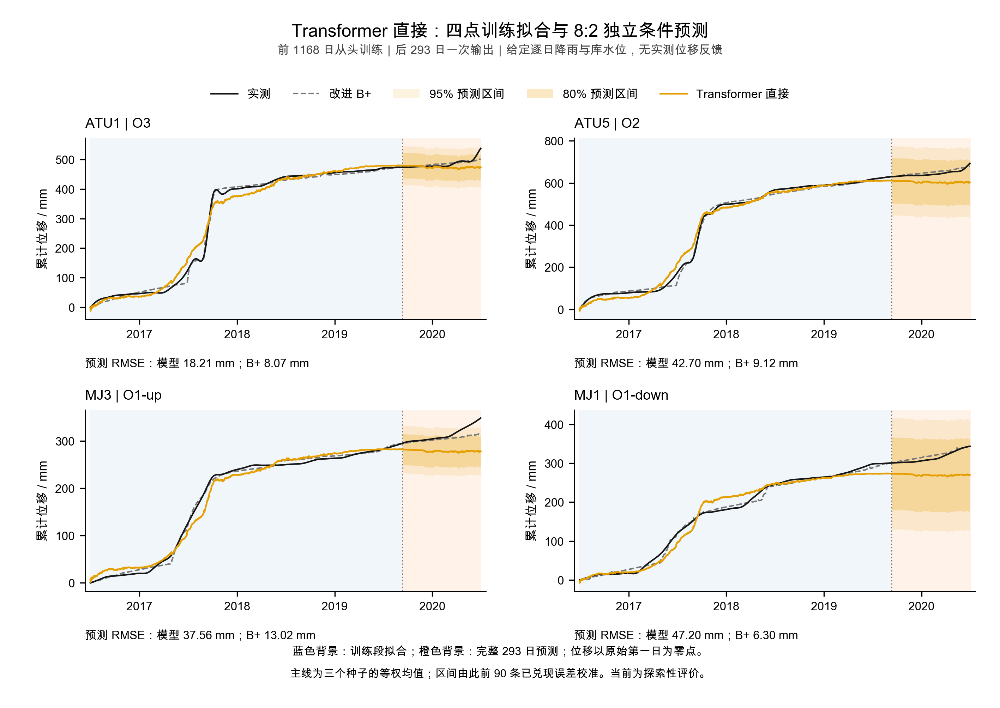
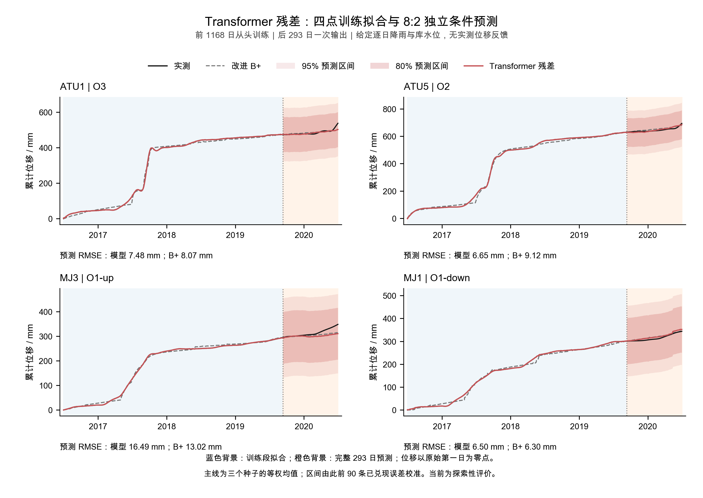
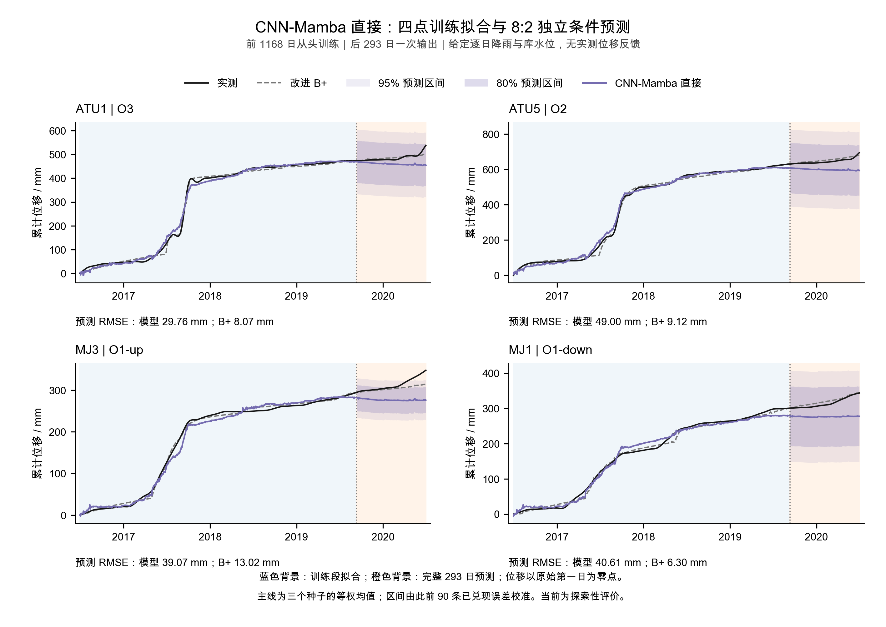
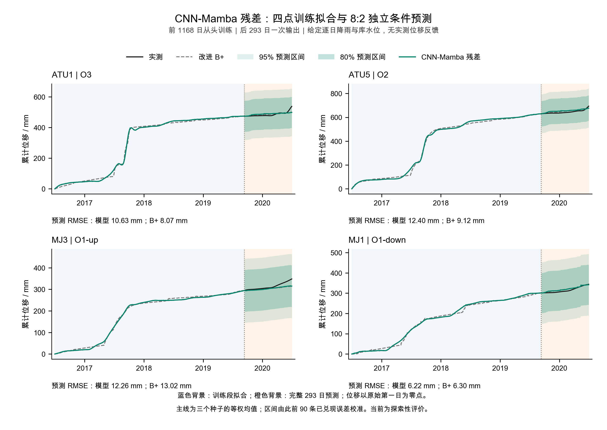
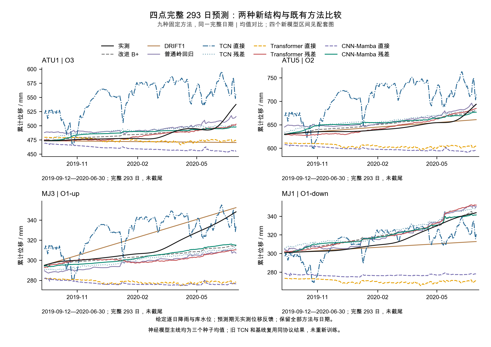

# 藕塘四点：轻量 Transformer 与 CNN-Mamba 完整对比报告

**两个结构、四个输出版本已从头训练，并跑完全部开发及最终 293 日评价；没有因效果差中断。** 四个新方法均未达到完整工作条件。 开发完整条件通过 0/4，最终通过 0/4；“程序跑通”和“预测有效”分别记录。

本次最终平均 **MAE 最低为Transformer 残差，RMSE 最低为改进 B+**；CRPS优先的概率排序最小者为 **DRIFT1**。MAE略低不等于MAE/RMSE同时改善。这些是同窗探索性排序，不回改开发时已锁定的 **DRIFT1（均值）/ DRIFT1（概率）**。

## 1. 本次确实训练了什么

| 项目 | 记录 |
|---|---|
| Material Passport | EXECUTED / VERIFIED；探索性研究结果；未声称用户或导师已验收 |
| 固定数据与协议 | ATU1、ATU5、MJ3、MJ1；给定未来逐日降雨/库水位，预测段无实测位移反馈 |
| 日期 | 内部612/180日、开发792/376日、最终1168/293日；原日历完整保留 |
| Transformer | 4916参数，16维/2头/2层、因果注意力、正弦日期编码；共同选择400次 |
| CNN-Mamba | 7956参数，16通道时间卷积+2层Mamba-1；共同选择400次 |
| 正式新增训练 | 36次拟合，14400次Adam更新，180份检查点 |
| 旧模型 | B+、DRIFT1、岭回归及两版TCN复用已核验同协议产物；旧模型拟合和物理调用0 |
| 交付 | Markdown、CSV、五张中文四点PNG/SVG；本地分步提交，不push/PDF |

三个种子0/1/2、CPU单线程float64、Adam 0.001；内部固定跑50/100/200/400检查点，选择只用内部前90日。每种结构的直接/残差两臂共用一次内部选择，开发和最终各从头训练。三种子等权均值为主输出，全部种子保存，不按最终表现换轮数或挑种子。

直接版输出 `y0 + 网络修正`，残差版输出 `连续原 B+ + 网络修正`，输出单位相同。两版都读相同22维合法物理/驱动特征；这是**输出基线/残差目标的配对**，不是有无物理信息消融，也不是PINN。
每个模型从第0日给定特征编码，最终293日一次发出；不把实测位移回灌，也不依靠自身位移每7天递推。已知未来驱动属于条件回算，不等于实际业务中预知未来天气。

旧Mamba分支为8点、7日输入→1日、空间网格和CUDA分位数模型。本次是时间CNN与Mamba的四点适配，未使用其权重。本机CPU版本保留Mamba-1选择性状态递推，核对了[官方参考扫描](https://github.com/state-spaces/mamba/blob/e9594ce1c732d97440f0332fdc43170a2294dbfa/mamba_ssm/ops/selective_scan_interface.py)及独立串行实现；未冒称运行官方CUDA内核。Transformer使用小型因果编码器，不称PatchTST；架构和掩码参照[编码器文档](https://docs.pytorch.org/docs/stable/generated/torch.nn.TransformerEncoderLayer.html)。

**DRIFT1** 是最后一天速度不变的外推基线：`预测 = 最后观测 + h × (最后观测 − 前一天观测)`，无待训练参数。普通岭回归固定alpha=1，使用同协议22维特征。原TCN为6996参数、固定100次更新；各结构训练次数和参数量不同，本次不宣称等算力比较。

## 2. 完整最终293日结果

2019-09-12—2020-06-30，每点293日。指标均为四点等权平均；RMSE先逐点计算再平均。除覆盖率外，表内单位均为mm。误差和区间评分越低越好；覆盖率与宽度须一起判断，不能单看覆盖率越高或宽度越小越好。

| 方法 | MAE | RMSE | CRPS | 90%区间评分 | 90%覆盖率 | 90%宽度 |
| --- | --- | --- | --- | --- | --- | --- |
| 改进 B+ | 6.9017 | 9.1242 | 16.1544 | 220.0776 | 100.00% | 220.0776 |
| DRIFT1 | 9.1098 | 12.9777 | 7.2776 | 78.3136 | 68.09% | 23.7142 |
| 普通岭回归 | 11.3182 | 12.3382 | 18.5727 | 249.3211 | 100.00% | 249.3211 |
| TCN 直接 | 39.4880 | 43.2534 | 37.4360 | 446.4024 | 100.00% | 446.4024 |
| TCN 残差 | 11.4957 | 12.8621 | 18.8142 | 252.2612 | 100.00% | 252.2612 |
| Transformer 直接 | 32.8479 | 36.4169 | 22.8228 | 197.9257 | 91.89% | 177.5066 |
| Transformer 残差 | 6.8838 | 9.2791 | 19.1769 | 262.8302 | 100.00% | 262.8302 |
| CNN-Mamba 直接 | 36.2500 | 39.6101 | 26.2944 | 248.1011 | 91.55% | 222.5435 |
| CNN-Mamba 残差 | 8.4988 | 10.3756 | 18.9905 | 259.2824 | 100.00% | 259.2824 |

- **Transformer 直接**：相对 B+ 的 MAE/RMSE未同时降低，CRPS/区间评分未同时降低；相对 DRIFT1 的两项均值指标未同时降低，相对岭回归未同时降低。完整均值条件未通过、概率条件未通过。
- **Transformer 残差**：相对 B+ 的 MAE/RMSE未同时降低，CRPS/区间评分未同时降低；相对 DRIFT1 的两项均值指标均降低，相对岭回归均降低。完整均值条件未通过、概率条件未通过。
- **CNN-Mamba 直接**：相对 B+ 的 MAE/RMSE未同时降低，CRPS/区间评分未同时降低；相对 DRIFT1 的两项均值指标未同时降低，相对岭回归未同时降低。完整均值条件未通过、概率条件未通过。
- **CNN-Mamba 残差**：相对 B+ 的 MAE/RMSE未同时降低，CRPS/区间评分未同时降低；相对 DRIFT1 的两项均值指标均降低，相对岭回归均降低。完整均值条件未通过、概率条件未通过。

逐点RMSE（全部测点，不拼接最优方法）：

| 测点 | 改进 B+ | DRIFT1 | 普通岭回归 | TCN 直接 | TCN 残差 | Transformer 直接 | Transformer 残差 | CNN-Mamba 直接 | CNN-Mamba 残差 |
| --- | ---: | ---: | ---: | ---: | ---: | ---: | ---: | ---: | ---: |
| ATU1 | 8.0682 | 19.2442 | 12.2003 | 70.4518 | 11.9794 | 18.2109 | 7.4835 | 29.7635 | 10.6274 |
| ATU5 | 9.1150 | 6.9817 | 14.3457 | 68.4673 | 15.6458 | 42.6950 | 6.6470 | 48.9992 | 12.3986 |
| MJ3 | 13.0163 | 12.3349 | 17.0308 | 21.3137 | 15.1322 | 37.5598 | 16.4883 | 39.0659 | 12.2552 |
| MJ1 | 6.2972 | 13.3502 | 5.7761 | 12.7807 | 8.6908 | 47.2017 | 6.4975 | 40.6119 | 6.2212 |

完整CSV：[阶段汇总](../results/ootang_sequence_conditional_v1/20260914/analysis/phase_summary.csv)、[逐点评分](../results/ootang_sequence_conditional_v1/20260914/analysis/metrics_by_point.csv)、[相对各基线和TCN的差值](../results/ootang_sequence_conditional_v1/20260914/analysis/comparisons.csv)。各点MAE、CRPS、80/90/95%区间评分、覆盖与宽度均保留。

## 3. 开发结果和残差收益分别判断

开发2018-09-01—2019-09-11共376日。其名单在最终阶段开始前已锁定；最终成绩没有用于改名单、结构、种子或更新次数。

| 方法 | MAE | RMSE | CRPS | 90%区间评分 | 90%覆盖率 | 90%宽度 |
| --- | --- | --- | --- | --- | --- | --- |
| 改进 B+ | 33.2651 | 41.3684 | 31.0351 | 460.6002 | 49.80% | 96.2730 |
| DRIFT1 | 5.4246 | 6.5413 | 6.4505 | 75.8794 | 99.73% | 75.8663 |
| 普通岭回归 | 38.1820 | 45.8998 | 32.6934 | 430.6532 | 50.27% | 117.5166 |
| TCN 直接 | 78.7726 | 91.6841 | 57.0359 | 445.3147 | 67.02% | 208.4884 |
| TCN 残差 | 43.4917 | 49.5982 | 35.8456 | 474.6633 | 48.60% | 107.0196 |
| Transformer 直接 | 33.2393 | 36.8568 | 23.1912 | 206.0969 | 99.53% | 205.9692 |
| Transformer 残差 | 39.8373 | 48.1866 | 35.1621 | 523.5968 | 48.47% | 99.0268 |
| CNN-Mamba 直接 | 43.1289 | 47.5539 | 28.1334 | 207.2080 | 90.89% | 192.3863 |
| CNN-Mamba 残差 | 42.5318 | 50.1041 | 35.8727 | 480.8398 | 53.19% | 110.8945 |

残差配对的均值改善同时要求MAE/RMSE降低，概率改善同时要求CRPS/90%区间评分降低；还需至少2/3同种子方向一致。下表报告集成方向和种子数量，不把一个阶段的改善冒充跨阶段稳定收益：

| 阶段 | 结构 | 残差版两均值指标均改善 | 均值同向种子/3 | 残差版两概率评分均改善 | 概率同向种子/3 |
| --- | --- | --- | --- | --- | --- |
| 开发 376 日 | Transformer | 否 | 0 | 否 | 0 |
| 开发 376 日 | CNN-Mamba | 否 | 1 | 否 | 0 |
| 最终探索性 293 日 | Transformer | 是 | 3 | 否 | 0 |
| 最终探索性 293 日 | CNN-Mamba | 是 | 3 | 否 | 0 |

每种子概率诊断共用该臂已发出的集成校准尺度，未为种子另挑误差池。所有种子数值见[种子汇总](../results/ootang_sequence_conditional_v1/20260914/analysis/seed_summary.csv)，配对差值和完整判定见[残差配对](../results/ootang_sequence_conditional_v1/20260914/analysis/residual_pairing.csv)；正差表示残差版更差。

最终阶段的训练拟合误差另列，不能用于替代预测成绩：

| 方法 | 拟合MAE | 拟合RMSE |
| --- | --- | --- |
| 改进 B+ | 6.6285 | 8.4237 |
| 普通岭回归 | 4.6239 | 6.1307 |
| TCN 直接 | 20.2169 | 24.9172 |
| TCN 残差 | 1.3472 | 1.7890 |
| Transformer 直接 | 13.3360 | 17.2199 |
| Transformer 残差 | 0.3846 | 0.5171 |
| CNN-Mamba 直接 | 8.5624 | 10.9375 |
| CNN-Mamba 残差 | 0.2986 | 0.3994 |

## 4. 导师可直接查看的图件

四张模型图均按同一形式绘制：蓝色训练段、橙色完整预测段、实测、原B+、模型均值及80/95%预测区间。所有曲线统一减原始首日位移，不在分界处重新贴合实测。区间只画在预测段；图内RMSE来自完整293日。

### Transformer 直接

[可编辑 SVG](../figures/ootang_sequence_conditional_v1/20260914/v1/TRANSFORMER_DIRECT_COND.svg)

### Transformer 残差

[可编辑 SVG](../figures/ootang_sequence_conditional_v1/20260914/v1/TRANSFORMER_BRES_COND.svg)

### CNN-Mamba 直接

[可编辑 SVG](../figures/ootang_sequence_conditional_v1/20260914/v1/CNN_MAMBA_DIRECT_COND.svg)

### CNN-Mamba 残差

[可编辑 SVG](../figures/ootang_sequence_conditional_v1/20260914/v1/CNN_MAMBA_BRES_COND.svg)

### 九方法完整预测窗

[可编辑SVG](../figures/ootang_sequence_conditional_v1/20260914/v1/all_methods_forecast.svg)／[图件索引与数据](../figures/ootang_sequence_conditional_v1/20260914/README.md)。此图只叠加均值，概率区间见上方配套图，未删去误差大的日期或方法。

## 5. 如何理解结果和限制

均值、概率以及残差额外收益须分别作答。完整工作条件沿用事前TCN协议：平均MAE/RMSE相对B+改善至少1%且逐点保护，概率两评分改善至少1%且逐点退步≤5%、平均/逐点覆盖达到85%/80%。这些是研究工作条件，不是导师逐条确认的数值门槛。超过B+、超过简单/岭回归、超过既有TCN以及残差收益是不同结论。

区间由此前90条已兑现独立预测误差的RMS构造，预测期不更新。误差存在序列相关性，尺度从旧训练前缀模型转移到本次重训模型；100%覆盖若伴随宽区间和较差区间评分，不能作为概率模型成功依据。本轮无新概率头、C18方差项或同时覆盖保证。
数据日值原始as-of及历史预处理限制沿用原记录，前缀教师既有优化器未收敛标志保留。历史窗口已反复评价，不能当成新盲测或真实预警证据；四点来自同一案例，三种子不是独立滑坡样本。
这轮只能回答两个固定小结构在当前条件任务中的表现，不能推论整个Transformer或Mamba家族无效。与旧滚动、起点固定驱动递推、旧8点Mamba任务不混排；本轮停止追加模型和轮数，负结果、原始预测和失败记录保留。

## 6. 执行与复核凭据

来源73项、训练前六项合同核验通过。独立复核全部180份权重，使用NumPy显式因果注意力与Mamba逐日串行递推；PyTorch重载也逐数组核对。共核对2220800项数值，最大绝对差1.47e-11；含原单位预测、归一化、尺度、逐日区间、所有评分和开发锁定。原始模型数值容差和SVG坐标量化容差分开记录。
正式训练异常0次；未因为成绩差退出。纯正式训练循环累计617.97秒，准备/核验/绘图也计入独立120分钟窗口，实际总用时见[最终回执](../results/ootang_sequence_conditional_v1/20260914/final_receipt.json)。

[事前计划](ootang_sequence_conditional_plan.v1.0.md)／[配置](../config/ootang_sequence_conditional.v1_0.json)／[来源清单](ootang_sequence_conditional_sources.v1.0.json)／[核验报告](ootang_sequence_conditional_validation.v1.0.md)／[独立数值回执](../results/ootang_sequence_conditional_v1/20260914/verification_v1/receipt.json)。
复现入口为 `PYTHONPATH=code .venv/bin/python -m sequence_conditional.run <phase>`，已完成有效拟合只重载；不自动重新训练。保存结果只读复核入口为 `sequence_conditional.audit --attempt <新核验目录名>`，无需优化器更新。
