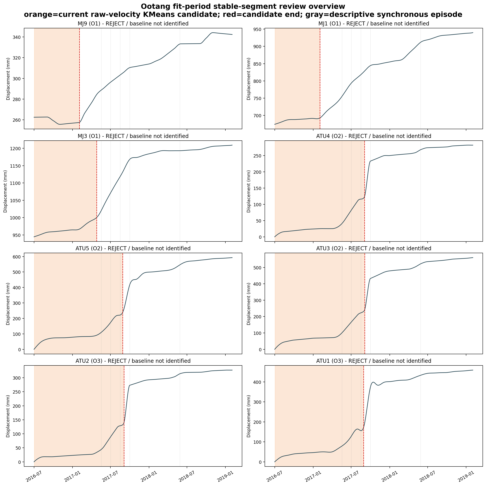

# 藕塘滑坡逐测点初始稳定段专家审查

> **产物链接失效说明（2026-08-15）**：本文引用的 `figures/warning_review/stable_segment/` 审查产物（逐测点复算表、同步事件描述表、总览图、8 张测点证据图和 manifest）已随已退役产物清理从工作树删除，可按 Git 历史提交 `7d2e38b` 及之前恢复。本文的审查结论不受影响：8/8 个 KMeans 候选仍为 `rejected_for_formal_v0`，严格 MVIF 8/8 仍为 `tf_multistart_unstable`，正式状态仍为 `no_stable_baseline_identified`，正式 `V`、`σ`、`V0` 均为 `NA`。这些结论是当前速度和改进切线角阈值层仍未获得可用基线的直接依据。

## Material Passport

- Origin Skill: `academic-research-suite / experiment-agent`
- Origin Mode: `validate`
- Origin Date: `2026-07-26`
- Verification Status: `ANALYZED`
- Version Label: `ootang_stable_segment_expert_review_v1`
- Source Commit: `c74a8a3`
- Review Scope: 藕塘 8 个测点初始稳定段与 `V0` 前置条件
- Excluded Scope: 不读取、不分析、不启动 Vajont
- Data Lineage Status: `BLOCKED`
- Formal Warning Output: `false`

## 1. 专家结论

本轮结论必须分成两个不同层次：

1. **基于发布物化日序列相邻差分速度的 KMeans 前缀候选：8/8 均拒绝作为正式初始稳定段。**
2. **指定 Word 的严格 MVIF 路径：8/8 均为当前方法下无法识别稳定段。**

第二项不等于“地质上不存在初始稳定阶段”，而是表示当前发布物化序列、当前 MVIF 参数化和既定数值门禁没有得到可辨识的趋势曲线，因而不能继续计算正式 `V`、`σ` 和 `V0`。新增数据血缘审查又确认该序列具有强自然月分段三次指纹；因此本结论不能外推到尚未取得的原始观测锚点或真实地质阶段。

建议将正式状态记录为：

```text
kmeans_candidate_acceptance = rejected_for_formal_v0
formal_mvif_stable_segment_status = no_stable_baseline_identified
formal_v = NA
formal_sigma = NA
formal_v0 = NA
```

现有 KMeans 数值只能保留为 `operational_draft_not_formal` 的运行 comparator，不得写成指定 Word 的 MVIF `V0`，也不得进入论文正式速度或切线角阈值。

## 2. 判定依据与证据边界

### 2.1 指定 Word

指定 Word 的印刷页 76（渲染页 86）给出：

```text
MVIF 趋势位移 → 初始稳定斜率 → 稳定阶段平均速度 V
V0 = max(1.5V, V + 2σ)
```

但该文没有给出：

- 初始稳定段的自动起止规则；
- `σ` 的样本定义、窗口和自由度；
- MVIF 多解或参数不可辨识时的处置；
- 藕塘逐测点的宏观变形接受记录；
- 在 MVIF 失败时改用原始速度 KMeans 的授权。

因此，指定 Word 可以确定输入对象和 `V0` 公式，不能替项目补出自动分段算法。

### 2.2 许强等（2009）

许强等 PDF 第 3 页明确提出：

1. 根据监测变形曲线并结合滑坡宏观变形破坏迹象，综合划分变形阶段；
2. 从中识别等速阶段；
3. 对该阶段各监测周期的速度取算术平均，得到基准速度。

该文支持“曲线证据 + 宏观地质证据 + 专家接受”的路径，不支持仅凭速度聚类自动接受稳定段。

### 2.3 本轮接受门

逐点接受至少需要同时满足：

1. 严格 MVIF 趋势拟合通过既定可辨识性门禁；
2. 候选段累计位移近似线性，速度没有持续趋势或升速；
3. 段末不落在阶跃或连续升速边缘；
4. 位移方向、仪器改正和异常值含义清楚；
5. 有同期宏观变形记录支持“稳定”解释；
6. 对同步响应和环境背景完成排除性核对；环境量只作背景，不单独决定是否接受。

当前第 1 项在 8 点全部失败，项目中也没有可供本轮核对的 2016–2017 年逐点宏观裂缝、鼓胀或仪器变更记录。因此，本轮可以明确拒绝现有 KMeans 候选，但不能人工补出一组正式替代段。

## 3. 数据与审查产物

### 3.1 数据范围

- 发布序列范围：2016-07-01 至 2020-06-30，共 1461 个连续日历行；不等同于 1461 个已确认独立原始 GNSS 日观测；
- 本轮稳定段审查只使用 fit 期：2016-07-01 至 2019-02-02，共 947 天；
- 测点：MJ9、MJ1、MJ3、ATU4、ATU5、ATU3、ATU2、ATU1；
- 分区：O1=`MJ9/MJ1/MJ3`，O2=`ATU4/ATU5/ATU3`，O3=`ATU2/ATU1`。

### 3.2 输入指纹

| 输入 | SHA-256 |
|---|---|
| `data/monitoring_data.csv` | `ee63480ad9b8065dea359d49873182b1554013f910bec1c6988c0b152bede118` |
| `stable_segment_candidates.csv` | `e53422763805428507789201874212b842a50f175b2d2347c5f614308646bd96` |
| `mvif_fit_candidates.csv` | `5f8b04650d335de712d4fde9bbf107a7055357553db37e200d84274691668e55` |
| 指定 Word | `a16b75e64c45278eb28a1379caed67e66ecc08acf597832e13aae9325c3aa13a` |
| 许强等（2009）PDF | `7ce5aded5890e4aaabda932cfab645aeebedd6c7751fc347932ec0957d6757b3` |

本轮新增：

- [`逐测点复算表`](../figures/warning_review/stable_segment/ootang_station_stable_segment_review.csv)
- [`同步事件描述表`](../figures/warning_review/stable_segment/ootang_descriptive_synchronous_events.csv)
- [`总览图`](../figures/warning_review/stable_segment/ootang_stable_segment_review_overview.png)
- [`产物清单与指纹`](../figures/warning_review/stable_segment/manifest.json)

全部产物固定为 `formal_warning_output=false`、`vajont_used=false`。

## 4. 为什么现有 KMeans 候选不能接受

现有算法先对全部 fit 期物化日序列相邻差分速度做高低两类 KMeans，再从首个有效速度开始，截取连续属于低速类的前缀。它没有检验：

- 累计位移是否为单一线性阶段；
- 速度是否存在趋势；
- 段末是否处于持续升速过程；
- 位移方向和测量修正；
- 宏观变形迹象。

后期极大速度会抬高“高速类”中心及两类边界，使较长的渐进升速过程仍被归入“低速类”，所以前缀机械延伸到阶跃上升沿。

复算得到：

- 8/8 段的最大日速度都发生在段末；
- 8/8 段的次日速度继续增大；
- 段末均位于包含 19–52 个连续递增速度观测的升速序列中；
- `σ/|V|` 为 0.84–2.74；
- 候选段累计位移线性拟合 `R²` 仅为 0.68–0.85；
- 8/8 的 comparator `V0` 都由 `V+2σ` 分支控制；
- MJ9 的平均速度为负。

这些现象足以排除“把当前候选数值当作等速基线”。但月内三次结构本身会产生高度规则的差分速度与连续增速序列，所以不能把这些逐日细节直接解释为未经处理的真实地质升速。



## 5. 逐测点审查

表中 `Σv` 为候选段全部逐日速度之和；“前/后半段”用于暴露段内多阶段性，不作为新阈值。

| 测点 | 当前候选段 | n | `Σv` mm | `V±σ` mm/d | `σ/|V|` | 负速度 | 前/后半段均速 mm/d | 段末→次日 mm/d | 随后 30 d 均速 | 包含段末的连续升速序列 | 结论 |
|---|---|---:|---:|---:|---:|---:|---:|---:|---:|---|---|
| MJ9 | 2016-07-02–2017-02-03 | 217 | -5.008 | -0.0231±0.0632 | 2.74 | 61 | -0.0520 / 0.0056 | 0.0871→0.1295 | 0.3510 | 2017-02-01–02-19，19 个速度观测 | 拒绝；方向与测量解释缺失 |
| MJ1 | 2016-07-02–2017-02-02 | 216 | 18.638 | 0.0863±0.0958 | 1.11 | 30 | 0.1316 / 0.0410 | 0.3492→0.3806 | 0.6017 | 2017-01-08–02-23，47 个速度观测 | 拒绝；减速后重新升速 |
| MJ3 | 2016-07-02–2017-04-26 | 299 | 55.702 | 0.1863±0.1567 | 0.84 | 12 | 0.1209 / 0.2512 | 0.5652→0.5945 | 0.9884 | 2017-04-06–05-27，52 个速度观测 | 拒绝；明显阶段性升速 |
| ATU4 | 2016-07-02–2017-09-03 | 429 | 123.730 | 0.2884±0.3518 | 1.22 | 18 | 0.1173 / 0.4587 | 1.7131→2.2459 | 3.6574 | 2017-08-17–09-16，31 个速度观测 | 拒绝；段末处于共同升速期 |
| ATU5 | 2016-07-02–2017-08-28 | 423 | 238.030 | 0.5627±0.6228 | 1.11 | 0 | 0.3852 / 0.7394 | 2.5452→2.8174 | 5.3784 | 2017-08-09–09-17，40 个速度观测 | 拒绝；段末处于共同升速期 |
| ATU3 | 2016-07-02–2017-09-04 | 430 | 243.172 | 0.5655±0.5966 | 1.05 | 0 | 0.3208 / 0.8102 | 3.8705→4.7434 | 6.3666 | 2017-08-17–09-16，31 个速度观测 | 拒绝；段末处于共同升速期 |
| ATU2 | 2016-07-02–2017-09-04 | 430 | 141.216 | 0.3284±0.4120 | 1.25 | 26 | 0.1138 / 0.5430 | 2.7286→3.3434 | 4.4164 | 2017-08-17–09-16，31 个速度观测 | 拒绝；段末处于共同升速期 |
| ATU1 | 2016-07-02–2017-08-29 | 424 | 171.110 | 0.4036±0.5270 | 1.31 | 47 | 0.2306 / 0.5765 | 2.8837→3.2567 | 6.2734 | 2017-08-09–09-16，39 个速度观测 | 拒绝；段末处于共同升速期 |

### 5.1 O1

- **MJ9**：候选段累计速度和为 `-5.008 mm`，平均速度为负，且有 61 个负速度日。未核对监测轴方向、基准点调整、仪器改正和宏观变形前，不能把它解释为下滑方向的等速基线。
- **MJ1**：前半段均速明显高于后半段，但段末又进入长达 47 个速度观测的持续升速序列，表现为“初期较快—减速—重新升速”，不是单一等速阶段。
- **MJ3**：后半段均速约为前半段的 2.1 倍，段末位于 52 个速度观测的持续升速序列内。

### 5.2 O2

- **ATU4、ATU5、ATU3**：后半段均速分别约为前半段的 3.9、1.9 和 2.5 倍；
- 三点候选段末均集中在 2017-08-28 至 09-04；
- 段末后 30 天均速达到 3.66、5.38 和 6.37 mm/d，明显高于候选均速；
- 这三个候选都把 2017 年主要阶跃的上升前缘纳入所谓稳定段。

### 5.3 O3

- **ATU2**：后半段均速约为前半段的 4.8 倍，段末与 ATU3 同日进入显著升速；
- **ATU1**：有 47 个负速度日，后半段均速约为前半段的 2.5 倍，段末后 30 天均速升至 6.27 mm/d；
- 两点均不符合单一等速阶段。

逐点证据图：

- [MJ9](../figures/warning_review/stable_segment/MJ9_stable_segment_evidence.png)
- [MJ1](../figures/warning_review/stable_segment/MJ1_stable_segment_evidence.png)
- [MJ3](../figures/warning_review/stable_segment/MJ3_stable_segment_evidence.png)
- [ATU4](../figures/warning_review/stable_segment/ATU4_stable_segment_evidence.png)
- [ATU5](../figures/warning_review/stable_segment/ATU5_stable_segment_evidence.png)
- [ATU3](../figures/warning_review/stable_segment/ATU3_stable_segment_evidence.png)
- [ATU2](../figures/warning_review/stable_segment/ATU2_stable_segment_evidence.png)
- [ATU1](../figures/warning_review/stable_segment/ATU1_stable_segment_evidence.png)

## 6. 严格 MVIF 可辨识性

严格 MVIF 诊断中，每点 6 个多起点优化均收敛，且各有 5 个近似最优解，但近似等价解给出的 `t_f` 严重不一致：

| 测点 | `log(t_f-t_end)` 跨度 | 对应时距倍率 |
|---|---:|---:|
| ATU1 | 3.416 | 30.4 |
| ATU2 | 2.671 | 14.4 |
| ATU3 | 5.255 | 191.4 |
| ATU4 | 3.449 | 31.5 |
| ATU5 | 3.809 | 45.1 |
| MJ1 | 2.367 | 10.7 |
| MJ3 | 4.511 | 91.0 |
| MJ9 | 3.759 | 42.9 |

因此：

- 8/8 为 `failed / tf_multistart_unstable`；
- 严格 MVIF 门禁后的 Bai–Perron 路径 8/8 停止，没有产生初始段 `V`；
- 已退役的 Wang–An/MVIF 适配把 942/942 个窗口及完整 947 天 fit 期全部判为均匀，属于全段退化，不能恢复为有效候选；
- 上表只能证明 `t_f` 不可辨识，不能解释为真实失稳时间范围。

由于严格 MVIF 趋势本身没有通过门禁，本轮逐点图只展示发布累计位移序列，并明确标记“strict MVIF trend unavailable”；不能绘制或人工挑选一条未通过的趋势曲线。

## 7. 同步阶跃与环境背景

为避免不同测点绝对速度量级造成支配，本轮仅作描述性同步排序：

1. 计算各点 30 天平均位移速率；
2. 在各测点自身 fit 期内转为百分位；
3. 取 8 点百分位中位数作为同步背景分数；
4. 展示首 60 天后、彼此至少间隔 45 天的前 5 个高分日期。

该排序只用于定位审查图中的共同响应背景，不是稳定段选择阈值或预警规则。

| 日期 | 8 点速率百分位中位数 | ≥P90 测点 | 主要测点 | 30 d 雨量 mm | 30 d `ΔRWL` m | 30 d `ΔGWT` m |
|---|---:|---:|---|---:|---:|---:|
| 2017-05-18 | 0.839 | 2 | MJ1、MJ9、MJ3 | 360.0 | -7.03 | +5.89 |
| 2017-07-02 | 0.947 | 7 | MJ1、ATU4、MJ3 等 | 1020.0 | -0.13 | -3.79 |
| 2017-08-16 | 0.778 | 0 | ATU2、MJ3、ATU4 | 169.0 | -6.98 | -2.38 |
| 2017-10-01 | 0.999 | 6 | ATU5、ATU1、ATU4 等 | 2254.5 | +15.15 | +7.52 |
| 2018-05-28 | 0.790 | 0 | MJ1、ATU2、MJ9 | 1546.5 | -8.85 | +2.66 |

ATU1–ATU5 的候选段末位于 2017-08-28 至 09-04：

- 30 天雨量为 432.5–958.0 mm；
- 30 天库水位变化为 `+3.43～+6.01 m`；
- 五点均处于 31–40 个速度观测组成的持续升速序列中。

O1 的候选退出日较早（MJ1/MJ9 为 2017-02-02/03，MJ3 为 2017-04-26），而 O2/O3 的 5 个 ATU 点集中在 8 天内退出。这里的日期是 KMeans 低速前缀的退出日，不是独立识别的事件起点；最多只能描述为“O1 较早出现局部升速边缘，O2/O3 于 2017 年晚夏共同升速”，不能据此证明空间传播因果。

这些同期环境量不能证明降雨、库水或地下水“导致”了升速，也不单独参与稳定段判定。发布序列中的多测点持续升速足以排除把当前候选数值解释为等速基线；其地质真实性仍需原始观测和处理链确认，环境量只用于说明该时段的表格背景。

## 8. 当前可以冻结的审查结论

建议把以下内容冻结为审查事实：

- 当前 KMeans 8 个候选全部 `rejected_for_formal_v0`；
- 严格 MVIF 8 点全部 `no_stable_baseline_identified`；
- 正式 `V`、`σ`、`V0` 暂为 `NA`；
- `no_stable_baseline_identified` 不表示地质上不存在稳定阶段；
- 未取得用户授权前，不用非 MVIF 趋势方法替代指定 Word 路径；
- 现有 comparator 只可用于非正式管线跑通；
- 本轮不改 v2 阈值、颜色或运行产物；
- 不启动 Vajont。

仍需补齐的原始证据：

1. MJ9 及其余测点的位移正方向定义；
2. 2016–2017 年仪器更换、基准点调整、数据修正记录；
3. 同期地表裂缝、后缘拉张、前缘鼓胀、局部塌滑等宏观巡查记录；
4. 如果存在，指定 Word 作者实际使用的 MVIF 拟合代码、参数约束和稳定段人工判读记录。
5. 原始 GNSS/GWT 时间戳、观测值、日值聚合、QC、异常处理及插值/平滑锚点；
6. MJ/ATU 与 GPS/FJ、坐标和现场分区的正式映射；
7. 2016-07-01 至 2016-08-05 发布日序列的来源。

这些证据缺失时，不应靠放宽 `t_f` 门禁、缩短窗口或试到某个“看起来平稳”的段来补出 `V0`。

## 9. 下一步技术路线

稳定段审查已经形成明确阻断结论，区间校准审查也已完成。新增数据血缘门禁后，下一步调整为：

1. **优先恢复原始数据血缘**：索取原始观测锚点、日值生成方法、基准改正和点位映射；
2. 稳定段线暂保持 `no_stable_baseline_identified`；
3. 只有在按时间切分原始锚点、并在各折内部重建日序列后，才重跑稳定段、MVIF 和 `V0`；
4. 在此之前，速度/切线角只保留 comparator 诊断，不进入正式性能评价。

## 10. 11 类统计与方法谬误扫描

- Coverage: `11/11 checked`

| 谬误 | 级别 | 本轮结果 |
|---|---|---|
| Simpson's paradox | CAUTION | 汇总“8 点低速”会掩盖 O1 与 O2/O3 不同的阶段变化 |
| Ecological fallacy | RED_FLAG | 单点或单分区稳定/升速不能直接推断整个滑坡体 |
| Berkson's paradox | NOTE | 本轮使用完整 fit 期，不存在按最终颜色筛样；但结论不能外推到缺测状态 |
| Collider bias | NOTE | 未建立控制环境变量的因果回归，不作因果解释 |
| Base-rate neglect | RED_FLAG | 没有独立失稳事件基率，不能据此计算预警阳性预测值 |
| Regression to the mean | CAUTION | 以全期高低速度聚类会使极端后期速度反向影响“初始低速”边界 |
| Survivorship bias | CAUTION | 发布日历网格无缺行，但这不能证明原始监测无缺测或仪器中断 |
| Look-elsewhere effect | CAUTION | KMeans、退役 Wang–An 适配和 Bai–Perron 构成多分析路径 |
| Garden of forking paths | RED_FLAG | 不能在看到结果后放宽 `t_f`、窗口或选段条件以获得可用 `V0` |
| Correlation ≠ causation | RED_FLAG | 同步升速与雨量、RWL、GWT 同期不构成触发因果 |
| Reverse causality | CAUTION | 环境与变形的时滞方向未冻结，不能从同期图确定先后机制 |

## 11. Reproducibility

- Method: 从 `monitoring_data.csv` 独立复算发布物化序列的派生速度、KMeans 候选段统计、段末连续升速序列、30 天背景量和跨测点描述性同步排序。
- Arithmetic Match: 候选样本数、`V`、样本 `σ`、`V0` 与版本化 KMeans 产物逐项一致。
- Full MVIF Re-run: 本轮未重新执行严格 MVIF 优化器；读取并审查其版本化多起点诊断。
- Full Operational Runner Re-run: 未执行。
- Verdict: 当前审查计算与版本化输入为 `MATCH`；完整上游流水线为 `CANNOT_VERIFY`。
- Visual QA: 总览图及代表两端情况的 MJ9、ATU3 逐点图已按原始分辨率检查；8 张逐点 PNG 尺寸一致，另有 1 张总览图，9 张均可读取。

本轮未修改代码、配置、阈值或既有运行产物。

## 12. 当前续作状态

- 当前工作继续由 Codex 在本任务内完成，未转交 Claude Opus 5。
- 已完成结论：8/8 KMeans 候选拒绝；8/8 严格 MVIF 稳定段无法识别；正式 `V/σ/V0=NA`。
- 新增最高优先级阻断：[`藕塘数据血缘专家审查`](ootang_data_lineage_expert_review.md)。
- 下一项：恢复原始观测锚点和日值处理链；在此之前暂停正式 `V0` 与导数阈值。
- `review.md` 与 Vajont 工作簿仍不修改；Vajont 仍需用户再次明确授权。
