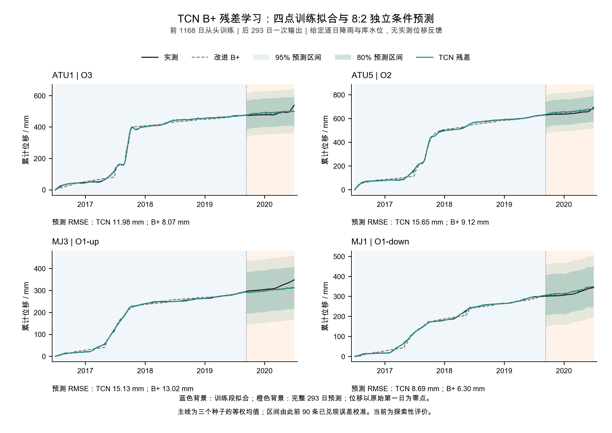
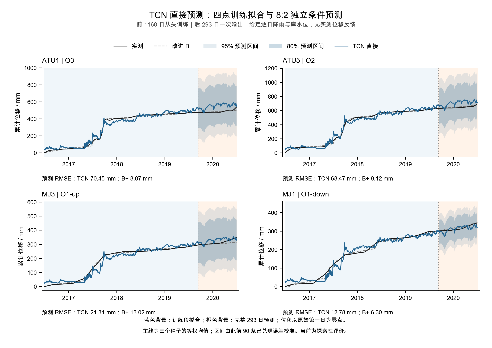
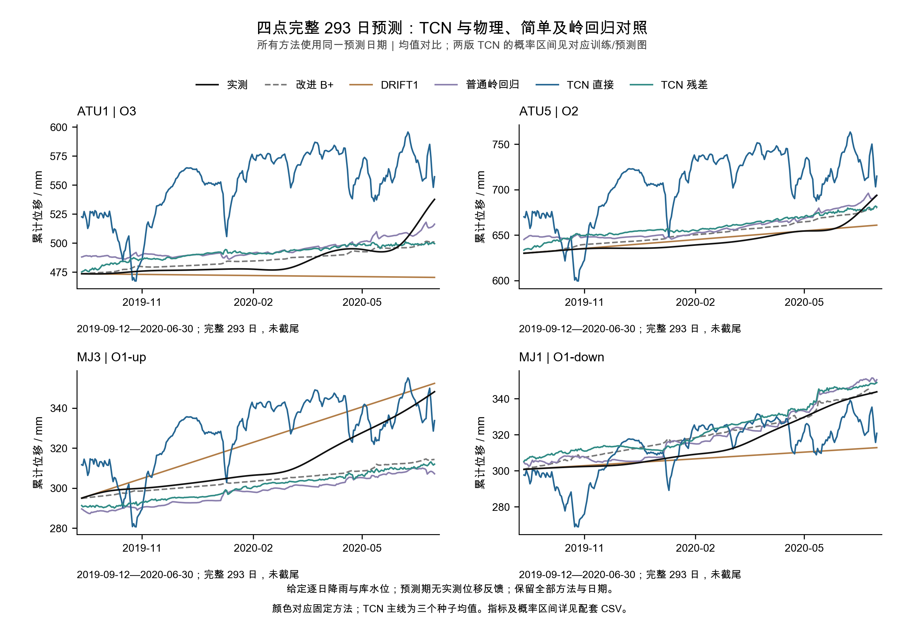

# 藕塘四点 TCN：按导师条件重新训练的完整对比报告

**本次已从头训练，并跑完全部开发和最终评价。整体仍未达到“优于改进 B+ 的均值与概率预测”目标，负结果完整保留。**

相比直接版，B+ 残差版在开发和最终的平均 MAE/RMSE 均改善，三个配对种子的方向也一致；但最终四个测点的均值及主要概率评分仍全部落后连续原 B+。执行完成、数值核验通过和研究效果未达标分别记录，不声称导师已验收。

## Material Passport

| 项目 | 本轮记录 |
| --- | --- |
| 任务 | 藕塘 ATU1、ATU5、MJ3、MJ1 四点累计位移条件概率预测 |
| 状态 | EXECUTED / VERIFIED；整体效果未达标；用户/导师效果验收尚未提供 |
| 协议 | 给定未来逐日降雨/库水位，预测段无实测位移反馈，B+ 连续状态不重置 |
| 数据 | 原 1461 日；最终训练 1168 日，完整预测 293 日 |
| 新训练 | 18 次拟合、3600 次更新、66 份检查点；B+ 参数重估 0 |
| 执行 | 分支 `codex/tcn-conditional-training`，仅本地提交；120 分钟独立上限，实际用时见最终回执 |

本轮依据[训练计划](ootang_tcn_conditional_training_plan.v1.0.md)及用户“无论效果多差都要跑通”的[执行补充](ootang_tcn_conditional_execution.v1.0.md)。旧七天滚动和旧权重 293 日递推都已完成；本轮是另外的整段重新训练。训练目标、推断方式、未来驱动以及 B+ 对照定义均与上一轮递推不同，不能把跨轮误差差值归因于单一改动。

## 1. 实际怎样训练和预测

两个 TCN 使用相同 6996 参数结构、22 个合法物理/驱动通道、四块因果卷积、三个种子及输出单位。直接版学习相对初始位移，残差版学习相对连续 B+ 的修正；两版都能读取相同物理特征，所以这不是“有/无物理信息”消融，也不称为 PINN。

每阶段用完整前缀从头训练，逐日输出四点轨迹。最终 2019-09-12—2020-06-30 的 293 日均值与区间一次锁定，不回灌预测段位移，也不消费自身位移递推。第一日位移仅作为共同原点；图中所有曲线统一减去同一原点，不在训练/预测分界贴合实测。

内部前 90 日选择 100 次更新，共同 Q：50次 0.262849，100次 0.121938，200次 0.165076，400次 0.162085。选定后，内部后 90 日误差用于开发区间；开发末 90 日误差用于最终区间，整段不更新尺度。所有检查点保留，未按最终成绩改成其他次数。

开发完整 376 日的均值/概率优胜者均为 **DRIFT1**，名单已在最终训练前锁定。开发阶段两臂效果门失败，仍继续执行全部五方法最终评价。最终表中 B+ 均值最好是探索性比较结果，不回改开发名单。

**DRIFT1** 是最后一天速度的恒速外推：`预测位移 = 起点前最后观测 + h × (最后观测 − 前一天观测)`。全预测段速度固定，没有学习参数。普通岭回归用相同 22 个当前日特征重新拟合，alpha=1，不复用旧七天模型。

## 2. 完整 293 日预测结果

每个点均为 293 日，没有截尾。表中指标为四点等权平均；MAE、RMSE、CRPS、宽度与区间评分单位均为 mm。RMSE 先逐点计算再平均；原 B+ 的全部点日合并 RMSE 为 9.4506 mm，与四点 RMSE 均值是不同统计口径。

| 方法 | MAE | RMSE | CRPS | 90%区间评分 | 90%覆盖率 | 90%宽度 |
| --- | --- | --- | --- | --- | --- | --- |
| 连续原 B+ | 6.9017 | 9.1242 | 16.1544 | 220.0776 | 100.00% | 220.0776 |
| DRIFT1 | 9.1098 | 12.9777 | 7.2776 | 78.3136 | 68.09% | 23.7142 |
| 普通岭回归 | 11.3182 | 12.3382 | 18.5727 | 249.3211 | 100.00% | 249.3211 |
| TCN 直接版 | 39.4880 | 43.2534 | 37.4360 | 446.4024 | 100.00% | 446.4024 |
| TCN 残差版 | 11.4957 | 12.8621 | 18.8142 | 252.2612 | 100.00% | 252.2612 |

逐点 RMSE：

| 测点 | B+ | DRIFT1 | 岭回归 | TCN 直接 | TCN 残差 |
| --- | ---: | ---: | ---: | ---: | ---: |
| ATU1 | 8.0682 | 19.2442 | 12.2003 | 70.4518 | 11.9794 |
| ATU5 | 9.1150 | 6.9817 | 14.3457 | 68.4673 | 15.6458 |
| MJ3 | 13.0163 | 12.3349 | 17.0308 | 21.3137 | 15.1322 |
| MJ1 | 6.2972 | 13.3502 | 5.7761 | 12.7807 | 8.6908 |

三个需要分开回答的结论：

- **是否超过 B+：没有。** 残差版四点 MAE、RMSE、CRPS 和 90% 区间评分均高于连续原 B+；两版完整均值/概率工作条件都失败。
- **是否超过简单及普通机器学习对照：没有建立整体优势。** 残差版平均 RMSE 12.8621 略低于 DRIFT1 的 12.9777，但其 MAE、CRPS 和区间评分更高；其平均四项主要评分也均落后普通岭回归。不能只用 RMSE 的局部优势称整体达标。
- **残差版是否优于直接版：本轮有均值收益。** 两阶段平均 MAE/RMSE 均下降，各阶段 3/3 配对种子方向一致；最终平均 RMSE 相对直接版降低 70.26%。概率收益有边界：最终平均 CRPS/区间评分改善、3/3 种子方向一致，但 MJ1 概率评分退步；开发区间评分退步，配对种子只有 1/3 同时改善两项概率评分，不能称为跨阶段稳定的概率收益。

**100% 覆盖并非概率预测成功。** 最终直接版、残差版的 90% 平均宽度分别为 446.40、252.26 mm；原 B+ 也达 220.08 mm。这些方法的尺度来自开发末 90 日的较大误差，转用于重新拟合的最终模型后很宽。CRPS/区间评分保留这一代价，不通过缩窄区间或增补概率头补救本轮。DRIFT1 的概率评分较低，但最终 90% 覆盖只有 68.09%，同样不是可靠覆盖的证明。

## 3. 训练拟合与开发表现

最终前 1168 日完整训练段的四点平均拟合指标：

| 方法 | 拟合 MAE | 拟合 RMSE |
| --- | --- | --- |
| 连续原 B+ | 6.6285 | 8.4237 |
| 普通岭回归 | 4.6239 | 6.1307 |
| TCN 直接版 | 20.2169 | 24.9172 |
| TCN 残差版 | 1.3472 | 1.7890 |

残差版拟合 RMSE 降到 1.7890 mm，但预测 RMSE 为 12.8621 mm，高于 B+。直接版在固定 100 次更新下的训练拟合仍较差。这里说明拟合改善没有转化为导师要求的预测优势；不将固定次数结束称为已经收敛，也不据此对整个 TCN 家族作结论。

开发段 2018-09-01—2019-09-11，完整 376 日：

| 方法 | MAE | RMSE | CRPS | 90%区间评分 | 90%覆盖率 | 90%宽度 |
| --- | --- | --- | --- | --- | --- | --- |
| 连续原 B+ | 33.2651 | 41.3684 | 31.0351 | 460.6002 | 49.80% | 96.2730 |
| DRIFT1 | 5.4246 | 6.5413 | 6.4505 | 75.8794 | 99.73% | 75.8663 |
| 普通岭回归 | 38.1820 | 45.8998 | 32.6934 | 430.6532 | 50.27% | 117.5166 |
| TCN 直接版 | 78.7726 | 91.6841 | 57.0359 | 445.3147 | 67.02% | 208.4884 |
| TCN 残差版 | 43.4917 | 49.5982 | 35.8456 | 474.6633 | 48.60% | 107.0196 |

最终种子级四点平均指标（种子概率评分使用其对应臂发出时的集成校准尺度，未逐种子重新挑选区间）：

| 方法 | 种子 | MAE | RMSE | CRPS | 90%区间评分 |
| --- | --- | --- | --- | --- | --- |
| TCN 直接版 | 0 | 39.7566 | 43.6926 | 37.5237 | 446.4024 |
| TCN 直接版 | 1 | 43.2664 | 47.7778 | 38.6387 | 446.4024 |
| TCN 直接版 | 2 | 36.5885 | 40.3164 | 36.6824 | 446.4024 |
| TCN 残差版 | 0 | 9.7367 | 11.3897 | 18.6279 | 252.2612 |
| TCN 残差版 | 1 | 11.1449 | 12.6372 | 18.7973 | 252.2612 |
| TCN 残差版 | 2 | 13.6504 | 14.9606 | 19.1135 | 252.2612 |

## 4. 给导师看的四点图

全部图使用完整日期，蓝底为训练拟合、橙底为预测。色带为 80%/95% 逐日边际区间，训练段不虚构概率带；主线为三个种子等权均值。PNG 为 300 dpi，另有可编辑文字 SVG。

### B+ 残差版

### 直接版

### 完整预测段的五方法均值对比

## 5. 核验、交付与限制

训练前六项合同检查、39 项来源、三组教师参数和原 B+ 连续重放通过。训练后全部 **66 份检查点**用独立 NumPy 因果卷积重算，另以 SVD 代数复算岭回归；共核对 **509586 个数值**，最大差 **1.47e-11**，所有预测、尺度、评分与选择顺序通过。没有为这些复算新增训练或优化器更新。

三张最终图的 12 面板已目视，38612 个曲线/区间数值从实际 SVG 顶点核对，最大导出差 7.44e-6 mm；1.5 pt 对齐、中文字体、PNG 尺寸、完整日期和图中 RMSE 通过。SVG 数值容差仅针对六位小数坐标导出，不修改模型/评分容差。首次图件附带数组因重复尺度键打包失败，修复后 v2 全部成功；v1 图件及错误日志保留，训练与评分不重跑。

静态绘图检查要求 PDF、未识别动态对齐函数与尺寸表达式；本任务明确不制作 PDF，按实际 SVG/PNG 和渲染几何核验，不称 PDF 审计通过。原物理与独立代数复算中的矩阵运算警告保留；所有被比较结果有限且一致，不声称底层警告成因已解决。

| 交付 | 入口 |
| --- | --- |
| 两阶段汇总 CSV | [phase_summary.csv](../results/ootang_tcn_conditional_v1/20260914/analysis/phase_summary.csv) |
| 最终逐点完整指标 | [metrics_by_point.csv](../results/ootang_tcn_conditional_v1/20260914/final_exploratory/metrics_by_point.csv) |
| 最终 5860 行点日预测与全部区间 | [daily_predictions.csv](../results/ootang_tcn_conditional_v1/20260914/final_exploratory/daily_predictions.csv) |
| 拟合与种子汇总 | [拟合表](../results/ootang_tcn_conditional_v1/20260914/analysis/fitting_summary.csv) / [种子表](../results/ootang_tcn_conditional_v1/20260914/analysis/seed_summary.csv) |
| 三张 PNG/SVG | [图件索引](../figures/ootang_tcn_conditional_v1/20260914/README.md) |
| 核验记录 | [核验文档](ootang_tcn_conditional_validation.v1.0.md) / [独立复算](../results/ootang_tcn_conditional_v1/20260914/verification_v1/receipt.json) / [图件核验](../figures/ootang_tcn_conditional_v1/20260914/v2/delivery_qa.json) |
| 最终用时与完整产物锁 | [final_receipt.json](../results/ootang_tcn_conditional_v1/20260914/final_receipt.json) |

给定未来驱动、历史日期反复暴露、原始日值 as-of 状态未知、前缀 B+ 教师为拟合回代及历史优化器未收敛的限制保持。90 条连续误差并非独立样本，重新拟合后的尺度迁移无覆盖保证，区间也不是整段同时覆盖带。成果只支持这个公开日序列、这项固定配置的探索性结论，不代表真实预警有效。

**全部预定实验和核验已经完成，保留负结果。本轮结束，不追加模型或训练次数，不恢复旧预算。**
