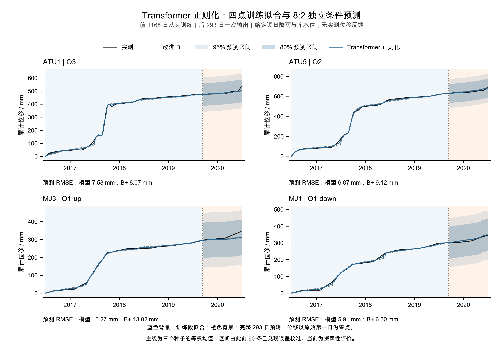
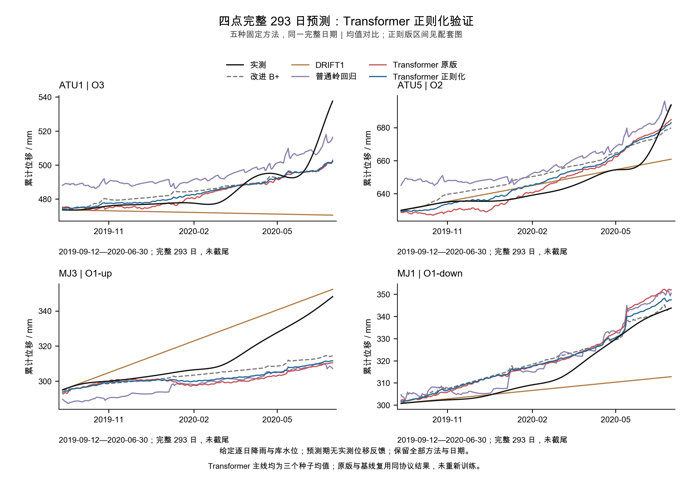

# Transformer 残差正则化：完整验证报告 v1.0

**进一步验证已完成，未因效果差中断。正则化改善了原版 Transformer；最终平均均值小幅超过 B+，但未达到跨阶段、逐点及概率的完整目标。**

## Material Passport

状态：EXECUTED / VERIFIED；用户已授权实现和完整实验。仍是同一案例、已反复暴露日期的探索性条件预测，未声称用户或导师已验收。原版及历史负结果保持。

## 1. 这次只改了什么

固定原4916参数的轻量Transformer、22维输入、三种子0/1/2、CPU float64、Adam 0.001及每次400更新。唯一新增项是训练前缀归一化修正的平方惩罚：`L=mean((q−r)²)+mean(q²)`，λ=1；输出仍为`B+ + s×q`。这是输出幅度软约束，非PINN或严格方程约束，也非新增概率头。无架构、λ或轮数搜索。

共 **9次新拟合、3600次更新、45检查点**：内部612/180日、开发792/376日、最终1168/293日，各三个种子从头训练。检查点0/50/100/200/400完整保存，400固定用于预测。原版、B+、DRIFT1、岭回归均复用同协议结果；旧模型拟合与物理前向0。

给定未来逐日降雨和库水位，预测期无实测位移/速度/残差反馈；原B+连续状态不在分界重置。所有均值和区间先保存锁定，再释放相应评分标签。开发均值与概率名单均锁为DRIFT1，最终未改名单。

## 2. 完整开发与最终比较

均为四点等权平均，RMSE先逐点计算再平均；除覆盖率外单位mm。覆盖率必须结合区间宽度和评分理解。开发2018-09-01—2019-09-11，最终2019-09-12—2020-06-30，全部日期保留。

### 开发376日

| 方法 | MAE | RMSE | CRPS | 90%区间评分 | 90%覆盖率 | 90%宽度 |
| --- | --- | --- | --- | --- | --- | --- |
| 改进 B+ | 33.2651 | 41.3684 | 31.0351 | 460.6002 | 49.80% | 96.2730 |
| DRIFT1 | 5.4246 | 6.5413 | 6.4505 | 75.8794 | 99.73% | 75.8663 |
| 普通岭回归 | 38.1820 | 45.8998 | 32.6934 | 430.6532 | 50.27% | 117.5166 |
| Transformer 原版 | 39.8373 | 48.1866 | 35.1621 | 523.5968 | 48.47% | 99.0268 |
| Transformer 正则化 | 36.1469 | 44.4136 | 32.7553 | 487.0080 | 51.93% | 97.1229 |

### 最终293日（探索性）

| 方法 | MAE | RMSE | CRPS | 90%区间评分 | 90%覆盖率 | 90%宽度 |
| --- | --- | --- | --- | --- | --- | --- |
| 改进 B+ | 6.9017 | 9.1242 | 16.1544 | 220.0776 | 100.00% | 220.0776 |
| DRIFT1 | 9.1098 | 12.9777 | 7.2776 | 78.3136 | 68.09% | 23.7142 |
| 普通岭回归 | 11.3182 | 12.3382 | 18.5727 | 249.3211 | 100.00% | 249.3211 |
| Transformer 原版 | 6.8838 | 9.2791 | 19.1769 | 262.8302 | 100.00% | 262.8302 |
| Transformer 正则化 | 6.5394 | 8.9073 | 17.6571 | 241.6550 | 100.00% | 241.6550 |

最终正则版相对B+平均MAE降低 **5.25%**、RMSE降低 **2.38%**；开发段两项均落后B+。最终超过DRIFT1和岭回归的两项均值指标；开发超过岭回归但落后DRIFT1。主概率评分两阶段均未同时超过B+和DRIFT1，最终两项概率评分均优于岭回归。

正则版两阶段均未通过完整均值/概率工作条件。最终虽通过平均均值改善≥1%，MJ3逐点保护失败；开发四点均值均退步。工作条件沿用旧版，不因本次小幅正结果调整。

## 3. 四点与种子：收益并非处处一致

| 测点 | B+ RMSE | 原版 RMSE | 正则版 RMSE |
| --- | --- | --- | --- |
| ATU1 | 8.0682 | 7.4835 | 7.5760 |
| ATU5 | 9.1150 | 6.6470 | 6.8742 |
| MJ3 | 13.0163 | 16.4883 | 15.2727 |
| MJ1 | 6.2972 | 6.4975 | 5.9065 |

最终正则版的ATU1、ATU5、MJ1两项均值指标都优于B+，MJ3两项均退步。相对原版，ATU1两项略退步，ATU5的MAE改善但RMSE略退步，MJ3/MJ1两项改善；不能描述为四点全面提升。

| 阶段 | 配对指标 | 集成同时改善 | 同向种子/3 | 配对条件 |
| --- | --- | --- | --- | --- |
| 开发376日 | 均值 MAE/RMSE | 是 | 3 | 通过 |
| 开发376日 | 概率 CRPS/IS90 | 是 | 3 | 通过 |
| 最终293日（探索性） | 均值 MAE/RMSE | 是 | 2 | 通过 |
| 最终293日（探索性） | 概率 CRPS/IS90 | 是 | 3 | 通过 |

这里的配对是“正则版相对原版”，与“超过B+”分开判断；≥2/3同种子及集成两指标同时改善才算该阶段配对通过。两阶段均值和概率配对均通过，但它只支持本次固定正则项改善原版，不证明机制、泛化到其他数据或整个模型家族有效。

| 最终种子 | 原版 MAE | 正则版 MAE | 原版 RMSE | 正则版 RMSE |
| --- | --- | --- | --- | --- |
| 0 | 8.5387 | 7.2392 | 11.0925 | 9.5711 |
| 1 | 6.8125 | 6.8780 | 9.0082 | 9.0438 |
| 2 | 9.1646 | 6.8655 | 11.4932 | 9.2379 |

最终仍只有 **1/3** 个正则版种子的RMSE低于B+；种子1相对原版两项均值略退步。集成包含不同种子误差的抵消，不能把集成的小幅改善说成每次训练都可靠超过B+。

## 4. 幅度惩罚是否真的起作用

| 阶段 | 方法 | 训练拟合MAE | 训练拟合RMSE |
| --- | --- | --- | --- |
| 开发376日 | 改进 B+ | 9.2981 | 12.5979 |
| 开发376日 | Transformer 原版 | 0.3362 | 0.4675 |
| 开发376日 | Transformer 正则化 | 4.6694 | 6.3242 |
| 最终293日（探索性） | 改进 B+ | 6.6285 | 8.4237 |
| 最终293日（探索性） | Transformer 原版 | 0.3846 | 0.5171 |
| 最终293日（探索性） | Transformer 正则化 | 3.3402 | 4.2506 |

按点计算修正RMS再平均，开发训练段原版12.5674→正则版6.2843 mm，最终训练段8.3884→4.1919 mm，约减半；开发预测段10.0317→5.0095 mm，最终预测段4.6689→2.5186 mm。原版紧贴训练标签的程度降低，预测配对改善。这个受控结果支持幅度约束在本轮有帮助；尚不能将原失败唯一归因为过拟合，或把更接近B+本身视为额外物理价值。

## 5. 概率诊断：大部分最终CRPS差距来自尺度

主概率层仍用此前90条成熟独立误差的RMS，预测期冻结。正则版最终尺度按点平均为73.4579 mm，而最终平均RMSE为8.9073 mm；误差池来自开发末90日另一训练前缀模型。过去的大误差迁移到新模型，使区间很宽。该现象是本窗描述性证据，不据最终误差重新估计区间。

下面为预定3×3交叉诊断的最终CRPS：行是已锁定均值，列是已锁定尺度来源。所有交叉项均不参与选模，也不替代主输出。完整开发/最终的CRPS、区间评分、覆盖和宽度见CSV。

| 均值来源 / 尺度来源 | B+尺度 | 原版尺度 | 正则版尺度 |
| --- | --- | --- | --- |
| 改进 B+ | 16.1544 | 19.1102 | 17.6424 |
| Transformer 原版 | 16.2199 | 19.1769 | 17.7094 |
| Transformer 正则化 | 16.1650 | 19.1270 | 17.6571 |

固定正则版均值，换用B+的已发出尺度时，诊断CRPS从17.6571降至16.1650；纯B+为16.1544，仍略优。这说明尺度解释了主CRPS差距的大部分，同时均值小幅RMSE收益不足以保证CRPS更好。所有这些最终交叉区间90%覆盖均为100%，IS90等于宽度，不能用高覆盖宣称概率成功。

DRIFT1最终CRPS最低但90%覆盖仅68.09%，同样不能视为全面合格。单纯换均值网络没有解决当前冻结校准的跨阶段适用性。

## 6. 导师可查看的图件

[可编辑SVG](../figures/ootang_transformer_regularization_v1/20260914/v1/TRANSFORMER_BRES_REG1.svg)

[可编辑比较SVG](../figures/ootang_transformer_regularization_v1/20260914/v1/all_methods_forecast.svg)

蓝色训练背景、橙色完整预测背景；位移统一减原始首日值，不在分界重新贴合。图1为三种子均值和80/95%边际区间，图2为全部五方法均值比较。全部四点和困难尾段保留。

## 7. 核验、限制与本轮决定

779项来源保持；全部45检查点PyTorch精确重载及独立NumPy因果注意力全前向通过。共复核696320项数值，最大差5.46e-12；训练异常0。完整发出顺序、90条成熟误差池、所有点评分、13380行逐日表、开发名单和门槛通过。训练循环累计73.15秒；全部准备/核验/图文也计入独立120分钟上限，实际总用时见最终回执。

原始日值as-of、历史预处理、教师既有未收敛标志、给定未来驱动、误差相关性、重训模型与校准模型不同及历史窗口反复暴露限制保留。三种子不是三个独立滑坡案例；不报告显著性、因果或真实预警能力。详见核验页的11项统计解释检查。

**本轮结论：正则化相对原版有两阶段一致的配对改善，但相对B+仍未获得跨阶段、逐点及概率上的完整收益。保留正则版的探索性正信号和全部负结果，按冻结方案结束本轮，不追加λ、结构或更新次数。**

[阶段CSV](../results/ootang_transformer_regularization_v1/20260914/analysis/phase_summary.csv)／[逐点CSV](../results/ootang_transformer_regularization_v1/20260914/analysis/metrics_by_point.csv)／[全部种子](../results/ootang_transformer_regularization_v1/20260914/analysis/seed_summary.csv)／[正则配对](../results/ootang_transformer_regularization_v1/20260914/analysis/regularization_pairing.csv)／[均值尺度交叉](../results/ootang_transformer_regularization_v1/20260914/analysis/cross_scoring.csv)／[误差池来源](../results/ootang_transformer_regularization_v1/20260914/analysis/calibration_errors.csv)／[校准转移](../results/ootang_transformer_regularization_v1/20260914/analysis/calibration_transfer.csv)／[修正幅度](../results/ootang_transformer_regularization_v1/20260914/analysis/correction_amplitudes.csv)。

[冻结计划](ootang_transformer_regularization_plan.v1.0.md)／[核验记录](ootang_transformer_regularization_validation.v1.0.md)／[配置](../config/ootang_transformer_regularization.v1_0.json)／[上一轮报告](ootang_sequence_conditional_results.v1.0.md)。
