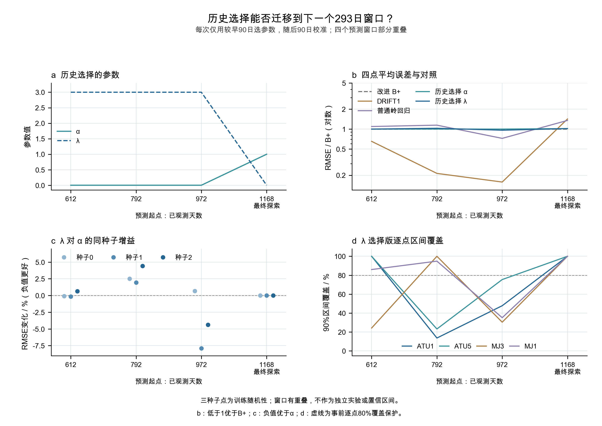

# Transformer 跨起点 α 与有限 λ 搜索：完整结果 v1.0

**三步已全部完成。固定 λ 网格也完整跑通，但历史选出的 α／λ 都未建立稳定的四点 B+ 优势。最终历史选择为 α=1、λ=0，两条流程退回同一个原版 Transformer，RMSE 为 9.279082 mm，高于 B+ 的 9.124173 mm。**

## Material Passport

- 类型：代码实验；状态 EXECUTED / VERIFIED。研究实现核验通过；效果条件未通过；未声称用户或导师验收。
- 来源：[事前计划](ootang_transformer_temporal_plan.v1.0.md)、[配置](../config/ootang_transformer_temporal.v1_0.json)、[156项来源](ootang_transformer_temporal_sources.v1.0.json)。原数据、旧模型及旧结论保留。
- 五个训练起点，432起点先形成180日选择/校准窗口，随后612/792/972/1168各发出完整293日。给定未来降雨/水位，每条路径内不反馈实测位移。
- 新增42次神经拟合、16,800次更新，复用18次旧拟合；新岭回归5次，B+重拟合0，物理前向11次。正式新神经拟合合计约370.66秒，包含每次检查点保存/前向；全部准备和交付用时另见最终回执。
- 本轮独立16:31:07—18:31:07 UTC窗口，不恢复旧预算。仅本地分步提交，不push/PDF/RL。

## 1. 第一步：现在有了什么样的跨时间证据

所有候选先发出并保存，再使用已成熟历史片段选择下一起点参数、冻结区间。最终起点的全部均值/区间锁定后，才统一释放完整外层标签评分。四点共用一个参数，三种子等权；每次新起点选择一次，293日路径中保持不变。

<!-- table:choices -->
| 起点 | 历史选择索引 | 校准索引 | 选出的 α | 选出的 λ |
| --- | --- | --- | --- | --- |
| 612 | [432,522) | [522,612) | 0 | 3 |
| 792 | [612,702) | [702,792) | 0 | 3 |
| 972 | [792,882) | [882,972) | 0 | 3 |
| 1168 | [972,1062) | [1062,1152) | 1 | 0 |
<!-- endtable:choices -->

索引均为从0开始的半开区间，选择/校准互不重叠。最终校准截止1151，距1168起点有16日间隔，按事前安排保持。概率层均为上一发出窗口第91—180日90条误差的RMS；选择版使用相同候选的历史发出误差，未用当前模型训练拟合误差。

**这些窗口部分重叠，且日期早已暴露，全部属于探索性时间外推检查。** 972起点沿用合法的792日B+参数，该教师未更新至972；第三历史窗口还与最终窗口重叠97日。因此不能将四个窗口当成四个独立数据集，不能推广为每个起点重新拟合B+的效果。400次训练来自旧研究，本轮信息顺序核验不抹除过去的选模暴露。

## 2. 第二步：α对照完成，权重未稳定迁移

定义 `预测=B+ + α×原网络残差`，α=0即B+，α=1即原版网络。历史选择在前三个起点均取0，最终取1；没有稳定选中0.5。下面五个权重全部列出，单位mm；这张完整窗口表仅作事后诊断，不能据此回改选择名单。

<!-- table:alpha_grid -->
| 固定 α | 612窗 RMSE | 792窗 RMSE | 972窗 RMSE | 1168窗 RMSE |
| --- | --- | --- | --- | --- |
| 0 | 34.949548 | 27.313325 | 67.167389 | 9.124173 |
| 0.25 | 34.836424 | 28.484649 | 65.507465 | 8.927240 |
| 0.5 | 34.758173 | 29.789181 | 63.980507 | 8.867132 |
| 0.75 | 34.720121 | 31.181573 | 62.603178 | 8.977292 |
| 1 | 34.731633 | 32.638862 | 61.393257 | 9.279082 |
<!-- endtable:alpha_grid -->

最终固定半残差 RMSE 8.867132 mm，比B+低2.82%，复现了旧局部收益。但在本轮合法的历史选择片段中，它没有胜出；其最终低误差不能替代历史已锁定的α=1。

## 3. 第三步：λ四点搜索已完整完成

固定λ为0、1/3、1、3；保持相同网络、输入、400次更新、种子与训练单位。平方惩罚的理想目标分别对应残差系数1、0.75、0.5、0.25；有限优化不保证等同输出缩放。原损失未除以(1+λ)，因此λ也改变目标总尺度，这一优化差异明确保留。

<!-- table:lambda_grid -->
| 固定 λ | 612窗 RMSE | 792窗 RMSE | 972窗 RMSE | 1168窗 RMSE |
| --- | --- | --- | --- | --- |
| 0 | 34.731633 | 32.638862 | 61.393257 | 9.279082 |
| 0.333333 | 34.826160 | 30.897719 | 62.481427 | 9.037042 |
| 1 | 34.871079 | 29.408014 | 63.148258 | 8.907333 |
| 3 | 34.927836 | 28.101706 | 64.541391 | 8.998911 |
<!-- endtable:lambda_grid -->

三个历史起点均选择λ=3，最终选择λ=0。新加的1/3和3在最终窗口的平均MAE/RMSE都没有超过已试过的λ=1；该事实只覆盖本次有限网格，不证明所有λ取值都无效。历史972窗口，选择λ=3的平均RMSE下降3.91%，但MJ3的MAE/RMSE退步，逐点保护未过。

## 4. 实际历史选择流程与基线

下表每个窗口均为完整293日、四点各自指标等权平均。不能把本轮612/792的293日与旧180/376日同名阶段直接混排。

<!-- table:mean -->
| 起点 | 方法 | MAE / mm | RMSE / mm |
| --- | --- | --- | --- |
| 612 | B+ | 29.431283 | 34.949548 |
| 612 | DRIFT1 | 19.879082 | 22.780898 |
| 612 | 普通岭回归 | 32.792665 | 38.231832 |
| 612 | 历史选 α | 29.431283 | 34.949548 |
| 612 | 历史选 λ | 29.505689 | 34.927836 |
| 792 | B+ | 23.582514 | 27.313325 |
| 792 | DRIFT1 | 4.960013 | 5.824270 |
| 792 | 普通岭回归 | 27.493401 | 31.315924 |
| 792 | 历史选 α | 23.582514 | 27.313325 |
| 792 | 历史选 λ | 24.222704 | 28.101706 |
| 972 | B+ | 61.563106 | 67.167389 |
| 972 | DRIFT1 | 8.637339 | 10.594506 |
| 972 | 普通岭回归 | 43.445352 | 48.588248 |
| 972 | 历史选 α | 61.563106 | 67.167389 |
| 972 | 历史选 λ | 58.579759 | 64.541391 |
| 1168 | B+ | 6.901689 | 9.124173 |
| 1168 | DRIFT1 | 9.109845 | 12.977735 |
| 1168 | 普通岭回归 | 11.318237 | 12.338214 |
| 1168 | 历史选 α | 6.883836 | 9.279082 |
| 1168 | 历史选 λ | 6.883836 | 9.279082 |
<!-- endtable:mean -->

历史三个窗口DRIFT1的平均MAE/RMSE均低于两选择流程；972窗口普通岭回归也更好。最终两流程超过DRIFT1/岭回归的平均均值误差，却仍未超过B+的RMSE。DRIFT1是固定起点最后一天增量直线外推：`y(t+h)=y(t)+h×[y(t)-y(t-1)]`，期间不更新位移。

最终α=1与λ=0均是原版，因此输出和本轮校准尺度相同。逐点失败继续保留：

<!-- table:final_points -->
| 测点 | B+ MAE | 选择版 MAE | B+ RMSE | 选择版 RMSE |
| --- | --- | --- | --- | --- |
| ATU1 | 5.431794 | 4.121325 | 8.068246 | 7.483541 |
| ATU5 | 8.108033 | 5.538352 | 9.115007 | 6.646954 |
| MJ3 | 8.779059 | 11.936891 | 13.016274 | 16.488313 |
| MJ1 | 5.287871 | 5.938774 | 6.297166 | 6.497519 |
<!-- endtable:final_points -->

<!-- table:final_seeds -->
| 种子 | α选择版 MAE | α选择版 RMSE | λ选择版 MAE | λ选择版 RMSE |
| --- | --- | --- | --- | --- |
| 0 | 8.538734 | 11.092461 | 8.538734 | 11.092461 |
| 1 | 6.812506 | 9.008236 | 6.812506 | 9.008236 |
| 2 | 9.164564 | 11.493235 | 9.164564 | 11.493235 |
<!-- endtable:final_seeds -->

## 5. 概率区间与配对判断

所有方法采用同一种事前固定的历史90条误差取法，没有再搜索概率规则。三种子的概率评分共用其方法的集成校准尺度，未逐种子重新拟合或选择区间。本轮最终误差池来自972起点的第91—180日，与上一版DIST90来源不同，跨版本概率分数变化不能全部归因α或λ。80/95%完整结果见CSV；下表列主90%。

<!-- table:probability -->
| 起点 | 方法 | CRPS / mm | 90%区间评分 / mm | 90%覆盖 / % | 90%宽度 / mm |
| --- | --- | --- | --- | --- | --- |
| 612 | B+ | 34.552637 | 472.091090 | 77.90 | 221.191539 |
| 612 | 历史选 α | 34.552637 | 472.091090 | 77.90 | 221.191539 |
| 612 | 历史选 λ | 34.691638 | 473.913710 | 77.56 | 220.239178 |
| 792 | B+ | 24.157337 | 366.241971 | 56.83 | 96.272998 |
| 792 | 历史选 α | 24.157337 | 366.241971 | 56.83 | 96.272998 |
| 792 | 历史选 λ | 24.223415 | 365.670463 | 57.94 | 96.273758 |
| 972 | B+ | 48.091953 | 535.730275 | 44.20 | 86.842089 |
| 972 | 历史选 α | 48.091953 | 535.730275 | 44.20 | 86.842089 |
| 972 | 历史选 λ | 45.402482 | 503.110283 | 47.18 | 88.701155 |
| 1168 | B+ | 14.894908 | 201.642014 | 100.00 | 201.642014 |
| 1168 | 历史选 α | 14.141969 | 189.836396 | 100.00 | 189.836396 |
| 1168 | 历史选 λ | 14.141969 | 189.836396 | 100.00 | 189.836396 |
<!-- endtable:probability -->

90条相邻误差不是90次独立实验；区间仅是高斯逐日边际预测区间。部分最终覆盖达到100%，必须同时看宽度和区间评分，不据此认定区间可靠或整条轨迹具有90%同时覆盖保证。选择距离为1—90日，校准距离为91—180日，评价延长到293日；距离迁移限制保留。

<!-- table:pairing -->
| 起点 | 比较 | 三种子同时降低 MAE/RMSE | 均值门 | 概率门 |
| --- | --- | --- | --- | --- |
| 612 | 历史选 α 对 B+ | 0/3 | 未通过 | 未通过 |
| 612 | 历史选 λ 对 B+ | 0/3 | 未通过 | 未通过 |
| 612 | 历史选 λ 对 历史选 α | 0/3 | 未通过 | 未通过 |
| 792 | 历史选 α 对 B+ | 0/3 | 未通过 | 未通过 |
| 792 | 历史选 λ 对 B+ | 0/3 | 未通过 | 未通过 |
| 792 | 历史选 λ 对 历史选 α | 0/3 | 未通过 | 未通过 |
| 972 | 历史选 α 对 B+ | 0/3 | 未通过 | 未通过 |
| 972 | 历史选 λ 对 B+ | 2/3 | 未通过 | 未通过 |
| 972 | 历史选 λ 对 历史选 α | 2/3 | 未通过 | 未通过 |
| 1168 | 历史选 α 对 B+ | 1/3 | 未通过 | 未通过 |
| 1168 | 历史选 λ 对 B+ | 1/3 | 未通过 | 未通过 |
| 1168 | 历史选 λ 对 历史选 α | 0/3 | 未通过 | 未通过 |
<!-- endtable:pairing -->

三个历史起点，α与λ选择流程通过完整均值门均为0/3；最终也未通过。972的λ存在平均改善与2/3种子同向改善，但MJ3退步，不能替代四点目标。最终两流程彼此完全相同，“0/3严格改善”表示相同预测，不表示λ额外恶化。

## 6. 图件、核验与异常

[跨起点证据图](../figures/ootang_transformer_temporal_v1/20260914/v1/temporal_validation.png) · [最终α导师版](../figures/ootang_transformer_temporal_v1/20260914/v1/ALPHA_SELECTED_mentor.png) · [最终λ导师版](../figures/ootang_transformer_temporal_v1/20260914/v1/LAMBDA_SELECTED_mentor.png) · [全部PNG/SVG及完整范围图](../figures/ootang_transformer_temporal_v1/20260914/README.md)。最终两选择流程相同，两组图保留实际标签以便追溯，没有人为制造视觉差异。

- 156来源哈希，228份新/旧检查点逐一精确重载；独立NumPy注意力前向、5个岭回归SVD重建、选择/误差池/评分/逐点门与种子配对复算通过。
- 共核对3,339,568个数值，最大差1.82e-11；141条事件核对，全部预测在完整外层评分之前锁定。56组分布、224逐点行、168种子汇总、65,632点日行全部保留。
- α首轮在完成432起点3拟合后，读取旧检查点训练次数字段报错：旧L0使用`updates`，新格式使用`step`。只修正兼容读取并拒绝冲突，七组合同检查通过；原异常和v1实现锁保留，3份已完成权重未重训，总拟合预算未增加。
- 预备pytest命令因未安装该库退出，随后使用标准库unittest完成同组核验。原物理参数历史优化未收敛标志保留；执行成功不替代效果或物理因果证明。
- 图件依据[制图合同](ootang_transformer_temporal_figure_contract.v1.0.md)核对全部数据/区间、面板对齐、文本与SVG/PNG；实际完成状态详见[核验](ootang_transformer_temporal_validation.v1.0.md)。不制作PDF，未声称PDF专用审查通过。

## 7. 本轮可以支持的结论

1. 跨起点框架已跑通，合法历史选参和完整预测保存均已核验。
2. α网格完成，固定半残差的最终局部收益仍在，但选择出的非零权重未表现为稳定跨时段优势。
3. λ网格完整完成，未建立对历史选α流程和B+的稳定四点额外收益。本轮有限清单结束，不追加λ、轮数或RL。

现有证据首先指向残差关系和误差分布的跨阶段变化；教师更新、90日选参到293日预测的距离差异也可能影响迁移，这些解释尚未通过单独消融确证。更复杂搜索器不能从本轮获得优先依据；本次没有运行RL，也不宣称已证明RL或整个Transformer家族无效。

[完整56组CSV](../results/ootang_transformer_temporal_v1/20260914/analysis/phase_summary.csv) · [逐点](../results/ootang_transformer_temporal_v1/20260914/analysis/metrics_by_point.csv) · [逐日预测](../results/ootang_transformer_temporal_v1/20260914/analysis/daily_predictions.csv) · [种子](../results/ootang_transformer_temporal_v1/20260914/analysis/seed_summary.csv) · [独立核验回执](../results/ootang_transformer_temporal_v1/20260914/verification_v1/receipt.json) · [最终回执](../results/ootang_transformer_temporal_v1/20260914/final_receipt.json)。
