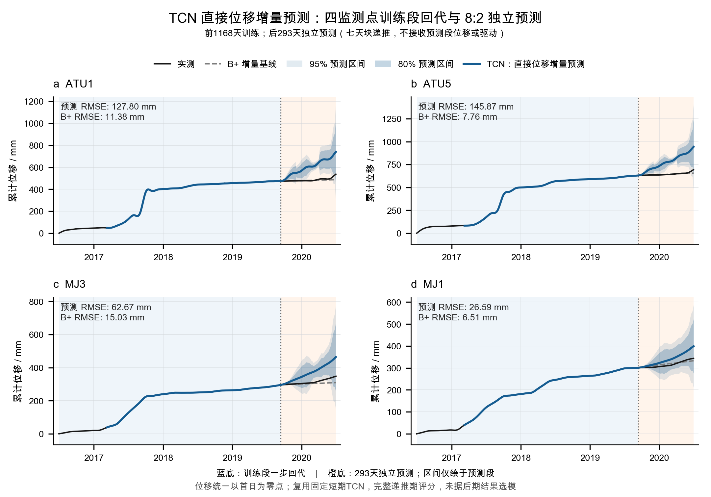
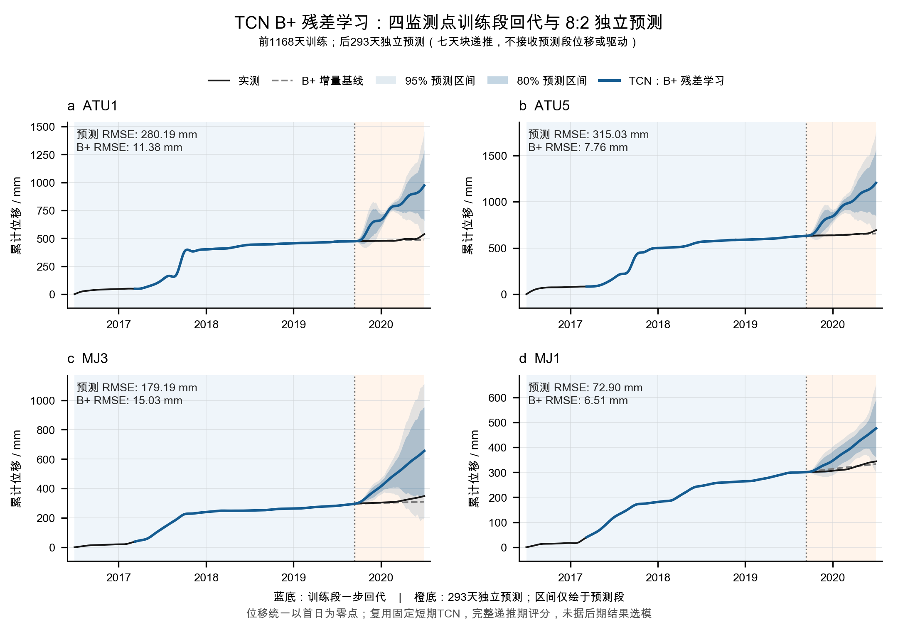

# 8:2 独立预测：导师汇报图

最终交付为下列两张四点图，PNG 2161×1511、300 dpi；SVG 保留可编辑文字。两图使用同一实验、同一版式，全部293天预测及80%/95%预测区间均保留。

| 方法 | 直接查看 | 编辑或放大 |
| --- | --- | --- |
| TCN 直接位移增量预测 | [PNG](v3/TCN_DIRECT.png) | [SVG](v3/TCN_DIRECT.svg) |
| TCN B+ 残差学习 | [PNG](v3/TCN_BRES.png) | [SVG](v3/TCN_BRES.svg) |

前1168天为训练期（2016-07-01—2019-09-11），后293天为独立预测期（2019-09-12—2020-06-30）。灰虚线是同信息条件的 B_ANCHOR：起点观测位移加连续 B+ 增量；蓝线是三个固定种子完整轨迹的等权均值。预测期按7天块递推自身输出，实测位移、降雨和水位均不再反馈。降雨固定为起点前7日均值，水位保持最后观测值。

蓝底的一步回代使用真实历史，不是独立验证；前252天只显示实测，没有补造网络曲线。位移统一减去各点原始首日值，仅平移纵轴。区间来自训练期内每点、每预测距离90条已兑现独立回放误差，属于经验高斯边际区间，不是种子置信带或联合覆盖保证。两版TCN在完整预测段均明显落后B+；图形相似不代表复现了参考图的QRF方法或精度。

[简短报告](../../../docs/ootang_tcn_independent_results.v1.0.md)／[五方法指标](../../../results/ootang_tcn_independent_v1/20260914/score/summary.csv)／[逐点指标](../../../results/ootang_tcn_independent_v1/20260914/score/metrics_by_point.csv)／[绘图源码](../../../code/tcn_independent/figures.py)／[导出核验](../../../results/ootang_tcn_independent_v1/20260914/verification/delivery_receipt.json)／[目视核验](../../../results/ootang_tcn_independent_v1/20260914/verification/figure_visual_review.json)。

参考图原件只作为构图依据保存在 `reference_style.jpg`；没有从图中复制数据。`v3` 指最终排版次数，不是新模型版本。`v1` 保留分界线与注释重叠的历史排版，`v2` 因无合适注释位置而中止，均不作为汇报入口；详情及通用静态审计的PDF不适用项见目视核验。未制作PDF。
